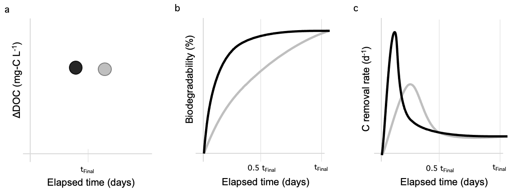
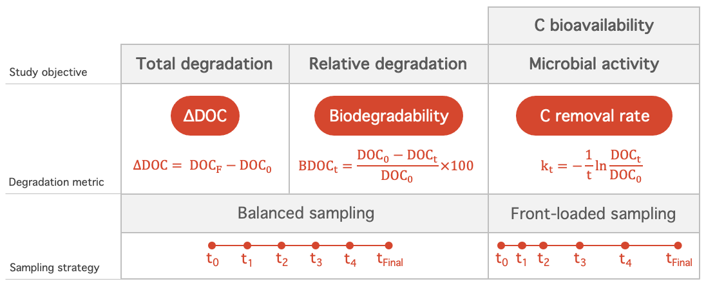
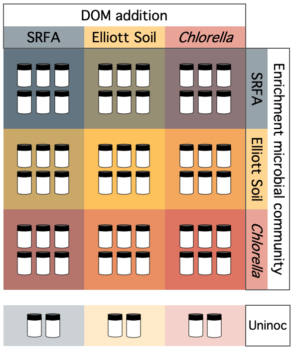

\thispagestyle{fancy}

```{r setup, include=FALSE}
# Set chunk options
knitr::opts_chunk$set(echo = FALSE, warning = FALSE, message = FALSE)

# Load libraries
library(tidyverse)
library(lubridate)
library(gridExtra)
library(ggpubr)
library(ggridges)
library(kableExtra)
```

# Main manuscript

```{r stats, eval = FALSE}
# Filter to 1, 3, 7, 10 days
biodegrad_crossing_filt <- 
  biodegrad_crossing_interp %>%
  filter(Time_d %in% c(1, 3, 7, 10) &
           Enrichment != "CTRL\nmicrobes") 
# Summary statistics ###########################################################
# Mean biodegradability, removal rate for treatments through time
biodegrad_crossing_filt %>%
  ungroup() %>% group_by(DOMSource, Time_hrs) %>%
  summarise(biodegrad_perc = mean(biodegrad_perc, na.rm = TRUE),
            k_C_d = mean(k_C_d, na.rm = TRUE))

# Mean change in DOC
deltaDOC %>% 
  group_by(DOMSource, Enrichment) %>%
  arrange(DOMSource, Enrichment) %>%
  summarise_if(is.numeric, mean, na.rm = T)

# Maximum co2 accumulation rates
maxRate <-
  biodegrad_crossing %>% 
  ungroup() %>%
  group_by(DOMSource, Enrichment) %>%
  summarize(maxCO2Rate_mgCLmin = max(CO2Rate_mgCLmin, na.rm = T))

# Get the mean peak CO2 rates per DOM source
biodegrad_crossing %>% 
  ungroup() %>%
  group_by(DOMSource, Enrichment) %>%
  summarize(maxCO2Rate_mgCLmin = max(CO2Rate_mgCLmin, na.rm = T)) %>%
  ungroup() %>%
  group_by(DOMSource) %>%
  summarise(mean(maxCO2Rate_mgCLmin))

# Get timing of max rate
maxTime <-
  biodegrad_crossing %>% 
  ungroup() %>%
  group_by(Experiment, DOMSource, Enrichment, Replicate) %>%
  filter(CO2Rate_mgCLmin == max(CO2Rate_mgCLmin, na.rm = T))
sum(maxTime$Time_d < 1)
length(maxTime$Time_d)
summary(maxTime$Time_hrs)
summary(maxTime$CO2Rate_mgCLmin)

mod <- lm(log(CO2Rate_mgCLmin) ~ log(Time_hrs), data = maxTime)
summary(mod)

# Convert NaNs to NAs before summarizing
biodegradFilt <- 
  biodegrad_crossing_interp %>% 
  filter(Time_hrs %in% c(24, 72, 24*7, 24*10))
biodegradFilt %>%
  ungroup() %>%
  group_by(DOMSource, Time_hrs) %>%
  summarise(mean(biodegrad_perc, na.rm = TRUE)) %>%
  arrange(Time_hrs)

# What is determining differences in CO2 accumulation rate?
kruskal.test(CO2Accum_mgCL ~ Enrichment, data = biodegradFilt)
kruskal.test(CO2Accum_mgCL ~ DOMSource, data = biodegradFilt)

# Statistical testing ##########################################################
#install.packages("moments")
library(moments)
# delta DOC
deltaDOC_filt <- deltaDOC %>% filter(Enrichment != "CTRL\nmicrobes")
# Data: check for normality
ggplot(data = deltaDOC_filt) +
  geom_histogram(aes(x = deltaDOC_mgCL), bins = 20) 
skewness(deltaDOC_filt$deltaDOC_mgCL) # fine

# Run anova
modl <- aov(deltaDOC_mgCL ~ DOMSource * Enrichment, 
            data = deltaDOC_filt)
summary(modl)
# Avg, sd deltaDOC
mean(deltaDOC_filt$deltaDOC_perc)
sd(deltaDOC_filt$deltaDOC_perc)
deltaDOC_filt %>% 
  filter(DOMSource == "CHLOR") %>%
  summarise(mean(deltaDOC_percChange), mean(initial_DOC_mgCL), mean(final_DOC_mgCL))
deltaDOC_filt %>% 
  filter(DOMSource == "SRFA" & Enrichment == "SRFA microbes") %>%
  summarise(mean(deltaDOC_percChange), mean(initial_DOC_mgCL), mean(final_DOC_mgCL))

# co2 accumulation rate
ggplot(data = biodegrad_crossing_filt) +
  geom_histogram(aes(x = CO2Rate_mgCLmin)) 
skewness(biodegrad_crossing_filt$CO2Rate_mgCLmin) # 1.80, positive skew
ggplot(data = biodegrad_crossing_filt) +
  geom_histogram(aes(x = log10(CO2Rate_mgCLmin + abs(1.05*min(CO2Rate_mgCLmin))))) 
biodegrad_crossing_filt$CO2Rate_mgCLmin_log10 <-
  log10(biodegrad_crossing_filt$CO2Rate_mgCLmin +
               (abs(1.05 * min(biodegrad_crossing_filt$CO2Rate_mgCLmin))))

skewness(biodegrad_crossing_filt$CO2Rate_mgCLmin_log10) # 0.12
# run anova
modl <- aov(CO2Rate_mgCLmin_log10 ~ DOMSource * Enrichment * Time_d, 
            data = biodegrad_crossing_filt)
summary(modl)

# co2 accumulation (total)
ggplot(data = biodegrad_crossing_filt) +
  geom_histogram(aes(x = CO2Accum_mgCL)) 
skewness(biodegrad_crossing_filt$CO2Accum_mgCL) # good
modl <- aov(CO2Accum_mgCL ~ DOMSource * Enrichment * Time_d, 
            data = biodegrad_crossing_filt)
summary(modl)

# biodegradability
ggplot(data = biodegrad_crossing_filt) +
  geom_histogram(aes(x = biodegrad_perc)) 
skewness(biodegrad_crossing_filt$biodegrad_perc)
biodegrad_crossing_filt$biodegrad_perc_log10 <-
  log10(biodegrad_crossing_filt$biodegrad_perc_log10 +
          1.1*abs(min(biodegrad_crossing_filt$biodegrad_perc_log10)))
skewness(biodegrad_crossing_filt$biodegrad_perc_log10)
modl <- aov(biodegrad_perc_log10 ~ DOMSource * Enrichment * Time_d, 
            data = biodegrad_crossing_filt)
summary(modl)
TukeyHSD(modl)
modl <- aov(biodegrad_perc_log10 ~ DOMSource * as.factor(Time_d), 
            data = biodegrad_crossing_filt)
summary(modl)
TukeyHSD(modl)

# C removal
ggplot(data = biodegrad_crossing_filt) +
  geom_histogram(aes(x = k_C_d)) 
skewness(biodegrad_crossing_filt$k_C_d)
biodegrad_crossing_filt$k_C_d_log10 <-
  log10(biodegrad_crossing_filt$k_C_d +
          1.1*abs(min(biodegrad_crossing_filt$k_C_d)))
ggplot(data = biodegrad_crossing_filt) +
  geom_histogram(aes(x = k_C_d_log10)) 
skewness(biodegrad_crossing_filt$k_C_d_log10)
modl <- aov(k_C_d_log10 ~ DOMSource * Enrichment * Time_d, 
            data = biodegrad_crossing_filt)
summary(modl)
TukeyHSD(modl)
modl <- aov(k_C_d_log10 ~ DOMSource * as.factor(Time_d), 
            data = biodegrad_crossing_filt)
summary(modl)
TukeyHSD(modl)
```

## Figure 1

```{r Fig1, out.width="100%"}

```

## Figure 2

```{r Fig2 analysis}
# Initial mass spec data #######################################################
# Chlorella
massSpec_CHLOR_Control <- 
  read_csv("data/CHLOR Control_100-800_Assigned.csv") %>%
  mutate(DOMSource = "CHLOR")

# Elliott soil 
massSpec_ES_Control <- 
  read_csv("data/ES Control_100-800_Assigned.csv") %>%
  mutate(DOMSource = "ES")

# SRFA
massSpec_SRFA_Control <- 
  read_csv("data/SRFA Control_100-800_2_Assigned.csv") %>%
  mutate(DOMSource = "SRFA")

# Merge into single dataframe
massSpec <- 
  massSpec_CHLOR_Control %>%
  full_join(massSpec_ES_Control) %>%
  full_join(massSpec_SRFA_Control) %>%
  relocate(DOMSource, .before = abundance)

# Factorize DOM
massSpec$DOMSource <- 
  factor(massSpec$DOMSource, 
         level = c("SRFA", "ES", "CHLOR"))

# Take out the trash
rm(massSpec_CHLOR_Control)
rm(massSpec_ES_Control)
rm(massSpec_SRFA_Control)

# EEMs data ####################################################################
# Load data
eem <- read_csv(file = "./data/EEMS_EnrichmentExperiment.csv")

# Format date
eem$CollectionDate <- mdy(eem$CollectionDate)
eem$DOMSource[eem$DOMSource == "Chlorella"] <- "CHLOR"

# Factorize DOM
eem$DOMSource <- 
  factor(eem$DOMSource, 
         level = c("SRFA", "ES", "CHLOR"))

# Filter to samples collected on 12 July or after
eem_exp2 <-
  eem %>%
  filter(CollectionDate >= ymd("2022-07-12"))
```

```{r Fig2plot, fig.height=5, fig.width=7}
# a. Plot O:C mass spec data
a <- 
  ggplot(data = massSpec, aes(x = O_C, y = DOMSource, color = DOMSource)) +
  geom_density_ridges2(aes(fill = DOMSource), scale = 0.8, color = NA) +
  geom_boxplot(width = 0.15, outlier.shape = NA, coef = 0) +
  scale_fill_manual(values = c("CHLOR" = "#D84727", "ES" = "#FFB000",
                               "SRFA"="#2E4756")) +
  scale_color_manual(values = c("CHLOR" = "#D84727", "ES" = "#FFB000",
                               "SRFA"="#2E4756")) +
  # Theme adjustments
  theme_minimal() + labs(tag = "a") +
  xlab("Oxygen:Carbon") + 
  ylab(expression("DOM Source")) +
  theme(axis.text = element_text(color = "black", size = 8),
        axis.title = element_text(color = "black", size = 10),
        plot.background = element_rect(fill = "white", color = NA),
        legend.position = "none")

# b. Plot H:C mass spec data 
b <- 
  ggplot(data = massSpec, aes(x = H_C, y = DOMSource, color = DOMSource)) +
  geom_density_ridges2(aes(fill = DOMSource), scale = 0.8, color = NA) +
  geom_boxplot(width = 0.15, outlier.shape = NA, coef = 0) +
   scale_fill_manual(values = c("CHLOR" = "#D84727", "ES" = "#FFB000",
                               "SRFA"="#2E4756")) +
  scale_color_manual(values = c("CHLOR" = "#D84727", "ES" = "#FFB000",
                               "SRFA"="#2E4756")) +
  # Theme adjustments
  theme_minimal() + labs(tag = "b") +
  xlab("Hydrogen:Carbon") + 
  ylab(expression("DOM Source")) +
  theme(axis.text = element_text(color = "black", size = 8),
        axis.title = element_text(color = "black", size = 10),
        plot.background = element_rect(fill = "white", color = NA),
        legend.position = "none")

# c. Plot HIX by DOM source
c <- 
  ggplot(data = eem_exp2 %>% 
         filter(BlankOrSample %in% c("T0") &
                  DayOfExperiment == 0),
       aes(x = DOMSource, y = HIX)) +
  geom_point(aes(color = DOMSource), shape = 16, size = 3) +
  scale_fill_manual(values = c("CHLOR" = "#D84727", "ES" = "#FFB000",
                               "SRFA"="#2E4756"),  guide = "none") +
  scale_color_manual(values = c("CHLOR" = "#D84727", "ES" = "#FFB000",
                               "SRFA"="#2E4756"), guide = "none") +
  # Theme adjustments
  theme_minimal() + labs(tag = "c") +
  xlab("DOM Source") + ylab(expression("Humification index (HIX)")) +
  scale_shape_manual(values = c(21, 24)) + coord_cartesian(ylim = c(0, 8)) +
  theme(axis.text = element_text(color = "black", size = 8),
        axis.title = element_text(color = "black", size = 10),
        plot.background = element_rect(fill = "white", color = NA),
        legend.position = "none")
# BIX
d <- 
  ggplot(data = eem_exp2 %>% 
         filter(BlankOrSample %in% c("T0") &
                  DayOfExperiment == 0),
       aes(x = DOMSource, y = BIX)) +
  geom_point(aes(color = DOMSource), shape = 16, size = 3) +
  scale_fill_manual(values = c("CHLOR" = "#D84727", "ES" = "#FFB000",
                               "SRFA"="#2E4756"),  guide = "none") +
  scale_color_manual(values = c("CHLOR" = "#D84727", "ES" = "#FFB000",
                               "SRFA"="#2E4756"), guide = "none") +
  # Theme adjustments
  theme_minimal() + labs(tag = "d") + coord_cartesian(ylim = c(0, 1)) +
  xlab("DOM Source") + ylab(expression("Freshness index (BIX)")) +
  scale_shape_manual(values = c(21, 24)) +
  theme(axis.text = element_text(color = "black", size = 8),
        axis.title = element_text(color = "black", size = 10),
        plot.background = element_rect(fill = "white", color = NA),
        legend.position = "none")


lay <- rbind(c(1,1,3),
             c(2,2,4))
grob <- grid.arrange(a, b, c, d, layout_matrix = lay)

# Save plot
ggsave(grob, file = "figures/Figure_2.png", 
       width = 7, height = 5, 
       units = "in", dpi = 300)
```

## Figure 3

```{r Fig3 analysis}
# Delta DOM ####################################################################
# Load nutrient analysis data
nutrient <- 
  read_csv(file = "data/waterChemistry.csv")

# If concentration is less than detection, set to 0
nutrient$Concentration[nutrient$Concentration == "<LOD"] <- 0
nutrient$Concentration[nutrient$Concentration == "< LOD"] <- 0

# Format columns
nutrient <- 
  nutrient %>%
  mutate(CollectionDate = mdy(CollectionDate),
         Concentration = as.numeric(Concentration),
         DayOfExperiment = as.factor(DayOfExperiment))

# Initial samples for DOM source SRFA and Enrichment ES weren't analyzed 
# because vials did not have enough sample volume. Replace missing values
# with average of other ES enrichment initials
# Get DOC value
meanInit_DOC <- mean(nutrient[nutrient$Experiment == "DOM Crossing Experiment 1" &
                                nutrient$DayOfExperiment == 0 &
                                nutrient$Enrichment == "ES" & 
                                nutrient$Analysis == "DOC",]$Concentration, 
                     na.rm = T)
# Set value
nutrient[nutrient$Experiment == "DOM Crossing Experiment 1" &
           nutrient$DayOfExperiment == 0 &
           nutrient$Enrichment == "ES" & 
           nutrient$DOMSource == "SRFA" &
           nutrient$Analysis == "DOC",]$Concentration <- meanInit_DOC

# Get TDN value
meanInit_TDN <- mean(nutrient[nutrient$Experiment == "DOM Crossing Experiment 1" &
                                nutrient$DayOfExperiment == 0 &
                                nutrient$Enrichment == "ES" & 
                                nutrient$Analysis == "TDN",]$Concentration, 
                     na.rm = T)
# Set value
nutrient[nutrient$Experiment == "DOM Crossing Experiment 1" &
           nutrient$DayOfExperiment == 0 &
           nutrient$Enrichment == "ES" & 
           nutrient$DOMSource == "SRFA" &
           nutrient$Analysis == "TDN",]$Concentration <- meanInit_TDN

# Take out trash
rm(meanInit_DOC)
rm(meanInit_TDN)

# Select crossing nutrient data
nut_crossing <-
  nutrient %>%
  filter(Experiment %in% c("DOM Crossing Experiment 1",
                           "DOM Crossing Experiment 2")) %>%
  mutate(DayOfExperiment = as.numeric(as.character(DayOfExperiment)), 
         DayOfExperiment = case_when(DayOfExperiment == 0 ~ "initial", 
                                     DayOfExperiment == 14 ~ "final"),
         units = gsub(" |/", "", units),
         Analysis = paste0(Analysis, "_", units)) 

# Pivot data to have nutrient concentrations in separate columns
nut_crossingWide <- 
  nut_crossing %>%
  select(-c(FilteredOrUnfiltered, BottleNum, units, notes, 
            sourceDatasheet)) %>%
  pivot_wider(names_from = Analysis,
              values_from = Concentration)

# Separate out the initial samples so you can merge these in line-by-line
nutInits <- 
  nut_crossingWide %>%
  filter(DayOfExperiment == "initial") %>%
  select(-c(Replicate, DayOfExperiment, CollectionDate)) %>%
  rename(initial_DOC_mgCL = DOC_mgCL, initial_TDN_mgNL = TDN_mgNL)

# Merge
nutDelta_crossing <- 
  nut_crossingWide %>%
  filter(DayOfExperiment != "initial") %>%
  rename(final_DOC_mgCL = DOC_mgCL,
         final_TDN_mgNL = TDN_mgNL) %>%
  select(-DayOfExperiment) %>%
  left_join(nutInits) %>%
  mutate(delta_DOC_mgCL = final_DOC_mgCL-initial_DOC_mgCL,
         delta_DOC_perc = delta_DOC_mgCL/initial_DOC_mgCL*100,
         delta_TDN_mgNL = final_TDN_mgNL-initial_TDN_mgNL,
         delta_TDN_perc = delta_TDN_mgNL/initial_TDN_mgNL*100,
         Experiment = str_extract(Experiment, "[\\d]"),
         DOMSource = paste0(DOMSource, "\nDOM source"), 
         DOMSource = factor(DOMSource, 
                            levels = c(paste0(c("SRFA","ES", "CHLOR"), 
                                              "\nDOM source"))),
         Enrichment = paste0(Enrichment, "\nmicrobes"),
         Enrichment = factor(Enrichment, 
                            levels = c(paste0(c("CTRL","SRFA","ES", "CHLOR"), 
                                              "\nmicrobes"))))

# Take out trash
rm(nut_crossingWide)

# Get mean initial DOC for treatment
nut_initial_crossing <- 
  nut_crossing %>%
  filter(BlankOrSample == "sample" & DayOfExperiment == "initial" &
           Analysis == "DOC_mgCL") %>%
  select(Experiment, DOMSource, Enrichment, Concentration) %>%
  group_by(Experiment, DOMSource, Enrichment) %>%
  summarise(initial_DOC_mgCL = mean(Concentration)) %>%
  mutate(Enrichment = paste0(Enrichment, "\nmicrobes"),
         DOMSource = paste0(DOMSource, "\nDOM source"))

# Get mean final DOC for treatment
nut_final_crossing <- 
  nut_crossing %>%
  filter(BlankOrSample == "sample" & DayOfExperiment == "final" &
           Analysis == "DOC_mgCL") %>%
  # Recode replicates so replicate numbers 1-3 refer only to 
         # DOM Crossing Experiment 1, and those from Experiment 2 are numbered as 4-6
  mutate(Replicate = case_when(Experiment == "DOM Crossing Experiment 2" ~
                                 as.numeric(Replicate) + 3, 
                               Experiment != "DOM Crossing Experiment 2" ~
                                 as.numeric(Replicate))) %>%
  select(Experiment, DOMSource, Enrichment, Replicate, Concentration) %>%
  rename(final_DOC_mgCL = Concentration) %>%
  mutate(Enrichment = paste0(Enrichment, "\nmicrobes"),
         DOMSource = paste0(DOMSource, "\nDOM source"))

# Biodegradability #############################################################
# Load gas data
gas <- read_csv(file =  "data/gasConcentrations.csv")

# Select crossing experiment data
gas_crossing <-
  gas %>% 
  filter(Experiment %in% c("DOM Crossing Experiment 1", 
                           "DOM Crossing Experiment 2")) %>%
  mutate(Experiment = as.factor(Experiment),
         CO2Accum_mg = CO2Accum_ug/1000, # convert ug to mg
         # Recode replicates so replicate numbers 1-3 refer only to 
         # DOM Crossing Experiment 1, and those from Experiment 2 are numbered as 4-6
         Replicate = case_when(Experiment == "DOM Crossing Experiment 2" ~
                                 Replicate + 3, 
                               Experiment != "DOM Crossing Experiment 2" ~
                                 Replicate),
         Replicate = as.factor(Replicate),
         DOMSource = paste0(DOMSource, "\nDOM source"), 
         DOMSource = factor(DOMSource, 
                            levels = c(paste0(c("SRFA","ES", "CHLOR"), 
                                              "\nDOM source"))),
         Enrichment = paste0(Enrichment, "\nmicrobes"),
         Enrichment = factor(Enrichment, 
                            levels = c(paste0(c("CTRL","SRFA","ES", "CHLOR"), 
                                              "\nmicrobes"))))

# Biodegradability (%) = CO2 accumulation (mg L-1) / DOCinitial (mg L-1)
# k (day-1) = -ln(CO2 at time t / CO2 at time 0) / elapsed time (d)

# Divide CO2 accumulation (ug) by headspace volume (L) and convert to mg/L
biodegrad_crossing <- 
  gas_crossing %>%
  group_by(Experiment, Enrichment, DOMSource, Replicate, Time_hrs) %>%
  mutate(CO2Rate_mgmin = CO2Rate_ugmin/1000,
         CO2Accum_mg = CO2Accum_ug/1000, 
         Volume_L = Volume_mL/1000,
         CO2Accum_mgL = CO2Accum_mg/Volume_L,
         CO2Rate_mgminL = CO2Rate_mgmin/Volume_L) %>%
  transmute(Time_d = Time_hrs/24,
            CO2Accum_mgCL = CO2Accum_mgL/1000/44*12*1000,
            CO2Rate_mgCLmin = CO2Rate_mgminL/1000/44*12*1000)

# Loop through replicates to calculate biodegradability at each timestep
# Initialize vector
initDOC <- vector(mode = "numeric", length = nrow(biodegrad_crossing))
finDOC <- vector(mode = "numeric", length = nrow(biodegrad_crossing))
i <- 1

for(i in 1:nrow(biodegrad_crossing)){
  # Grab experiment, enrichment, dom source to match up with intitial samples
  exp <- biodegrad_crossing$Experiment[i]
  enr <- biodegrad_crossing$Enrichment[i]
  dom <- biodegrad_crossing$DOMSource[i]
  rep <- biodegrad_crossing$Replicate[i]
  
  # Pull initial DOM for sample
  initiDOM <- 
    nut_initial_crossing[nut_initial_crossing$Experiment == exp &
                         nut_initial_crossing$Enrichment == enr &
                         nut_initial_crossing$DOMSource == dom,]
  finiDOM <- 
    nut_final_crossing[nut_final_crossing$Experiment == exp &
                         nut_final_crossing$Enrichment == enr &
                         nut_final_crossing$DOMSource == dom &
                   nut_final_crossing$Replicate == rep,]
  
   initDOC[i] <- initiDOM$initial_DOC_mgCL
   finDOC[i] <- finiDOM$final_DOC_mgCL
}

# Enter string of initial doc concentrations into dataframe
biodegrad_crossing$initial_DOC_mgCL <- initDOC
biodegrad_crossing$final_DOC_mgCL <- finDOC

# Calc biodegradability, 
# biodegradability (%) = CO2 accumulation (mg/L) / DOC initial (mg/L) * 100
biodegrad_crossing$biodegrad_perc <- biodegrad_crossing$CO2Accum_mgCL /
  biodegrad_crossing$initial_DOC_mgCL * 100

# Removal rate #################################################################
# Calc C removal rate
# k (d-1) = -ln(CO2 at time t / CO2 initial) / elapsed time (d)
biodegrad_crossing$k_C_d <- 
  (-1 / biodegrad_crossing$Time_d) * 
  log((biodegrad_crossing$initial_DOC_mgCL - biodegrad_crossing$CO2Accum_mgCL)/
        biodegrad_crossing$initial_DOC_mgCL)

# Calculate change in DOC from initial to final
biodegrad_crossing$deltaDOC_mgCL <- 
  biodegrad_crossing$final_DOC_mgCL - 
  biodegrad_crossing$initial_DOC_mgCL

# Arrange
biodegrad_crossing <- 
  biodegrad_crossing %>%
  arrange(Experiment, Enrichment, DOMSource, Replicate, Time_hrs)

# Interpolate ##################################################################
# Get unique replicate info
vials_crossing <-
  biodegrad_crossing %>%
  ungroup() %>%
  select(Experiment, Enrichment, DOMSource, Replicate) %>%
  distinct()

# Use for loop to seperate into replicate-specific chunks
# Initialize storage
vialList <- c()
i <- 1
for (i in 1:nrow(vials_crossing)){
  exp <- vials_crossing$Experiment[i]
  enr <- vials_crossing$Enrichment[i]
  sor <- vials_crossing$DOMSource[i]
  reps <- vials_crossing$Replicate[i]
  
  # Subset chunk of interest from the dataset
  chunk <- 
    biodegrad_crossing[biodegrad_crossing$Experiment == exp &
                       biodegrad_crossing$Enrichment == enr &
                       biodegrad_crossing$DOMSource == sor &
                       biodegrad_crossing$Replicate == reps,]
  
  # Add in the times of interest wanted
  timeAdd <- c(24, 72, 7*24, 10*24)
  timeMerge <- data.frame(chunk[1,1:4], 
                          Time_hrs = timeAdd)
  # Join times of interest with the data chunk
  chunk <- 
    merge(chunk, timeMerge, all = TRUE) %>%
    mutate(Time_d = Time_hrs/24)
  chunk <- chunk[order(chunk$Time_hrs),]
  # Fill initial & final DOC
  chunk$initial_DOC_mgCL <- unique(chunk$initial_DOC_mgCL)[1]
  chunk$final_DOC_mgCL <- unique(chunk$final_DOC_mgCL)[1]
  
  # Use linear interpolation to fill gaps
  # for loop through the timeAdd list
  j <- 1
  for (j in 1:length(timeAdd)){
    # Grab row number of missing time row
    index <- which(chunk$Time_hrs == timeAdd[j])
    # Interpolate value for row
    # CO2 accumulation
    chunk$CO2Accum_mgCL[chunk$Time_hrs == timeAdd[j]] <-
      ((chunk$Time_hrs[index+1] - timeAdd[j])*chunk$CO2Accum_mgCL[index-1] +
         (timeAdd[j] - chunk$Time_hrs[index-1])*chunk$CO2Accum_mgCL[index+1])/
      (chunk$Time_hrs[index+1]-chunk$Time_hrs[index-1])
    # CO2 accumulation rate
    chunk$CO2Rate_mgCLmin[chunk$Time_hrs == timeAdd[j]] <-
      ((chunk$Time_hrs[index+1] - timeAdd[j])*chunk$CO2Rate_mgCLmin[index-1] +
         (timeAdd[j] - chunk$Time_hrs[index-1])*chunk$CO2Rate_mgCLmin[index+1])/
      (chunk$Time_hrs[index+1]-chunk$Time_hrs[index-1])
    # biodegradability
    chunk$biodegrad_perc[chunk$Time_hrs == timeAdd[j]] <-
      ((chunk$Time_hrs[index+1] - timeAdd[j])*chunk$biodegrad_perc[index-1] +
         (timeAdd[j] - chunk$Time_hrs[index-1])*chunk$biodegrad_perc[index+1])/
      (chunk$Time_hrs[index+1]-chunk$Time_hrs[index-1])
    # C removal rate
    chunk$k_C_d[chunk$Time_hrs == timeAdd[j]] <-
      ((chunk$Time_hrs[index+1] - timeAdd[j])*chunk$k_C_d[index-1] +
         (timeAdd[j] - chunk$Time_hrs[index-1])*chunk$k_C_d[index+1])/
      (chunk$Time_hrs[index+1]-chunk$Time_hrs[index-1])
  }
  
  # Save vial chunk in list
  vialList[[i]] <- chunk
}

# Concatenate the chunk list into a single dataframe
biodegrad_crossing_interp <- 
  bind_rows(vialList)

# The first value in k will be Inf, because we're doing ln(0) as no accumulation
# has happened yet. Correct this:
biodegrad_crossing_interp$k_C_d[is.infinite(biodegrad_crossing_interp$k_C_d)] <-
  NA
# Filter to 1, 3, 7, 10 days
biodegrad_crossing_filt <- 
  biodegrad_crossing_interp %>%
  filter(Time_d %in% c(1, 3, 7, 10) &
           Enrichment != "CTRL\nmicrobes") 

# Calculate change in DOC
deltaDOC <- 
  biodegrad_crossing_interp %>%
  select(Experiment, Enrichment, DOMSource, Replicate, initial_DOC_mgCL,
         final_DOC_mgCL) %>%
  filter(Enrichment != "CTRL\nmicrobes") %>%
  distinct() %>% 
  mutate(deltaDOC_mgCL = final_DOC_mgCL - initial_DOC_mgCL,
         deltaDOC_percChange = (final_DOC_mgCL - initial_DOC_mgCL)/
           initial_DOC_mgCL*100)
deltaDOC_CTRL <- 
  biodegrad_crossing_interp %>%
  select(Experiment, Enrichment, DOMSource, Replicate, initial_DOC_mgCL,
         final_DOC_mgCL) %>%
  filter(Enrichment == "CTRL\nmicrobes") %>%
  distinct() %>% 
  mutate(deltaDOC_mgCL = final_DOC_mgCL - initial_DOC_mgCL,
         deltaDOC_percChange = (final_DOC_mgCL - initial_DOC_mgCL)/
           initial_DOC_mgCL*100)

```

```{r Fig3plot, fig.height=6, fig.width=7.5}
# delta DOC ####################################################################
# Simplify label to just read "SRFA", "ES" etc
deltaDOC$DOMSource <- str_extract(deltaDOC$DOMSource, 
                                  pattern = "(.+)\nDOM source", 1)
deltaDOC$DOMSource <- factor(deltaDOC$DOMSource, 
                             levels = c("SRFA", "ES", "CHLOR"))
# Remove line break in microbes labels
deltaDOC$Enrichment <- paste0(str_extract(deltaDOC$Enrichment, 
                                  pattern = "(.+)\nmicrobes", 1), 
                              " microbes")
deltaDOC$Enrichment <- factor(deltaDOC$Enrichment, 
                             levels = paste0(c("SRFA", "ES", "CHLOR"), 
                                             " microbes"))

a <-
  ggplot(data = deltaDOC %>% filter(Enrichment != "CTRL\nmicrobes"), 
       aes(x = DOMSource, y = deltaDOC_mgCL)) +
  # Overlay points
  geom_jitter(aes(shape = Enrichment, fill = DOMSource, color = DOMSource), 
              size = 2.5, width = 0.25, alpha = 0.5) +
  stat_summary(aes(fill = DOMSource), geom = "pointrange", fun.data = mean_se,
               size = 0.75, shape = 23) +
  # Shape and color scales
  scale_fill_manual(values = c("CHLOR microbes" = "#D84727", "CHLOR" = "#D84727",
                               "ES microbes" = "#FFB000", "ES" = "#FFB000",
                               "SRFA microbes"="#2E4756", "SRFA"="#2E4756"), 
                    guide = "none") +
  scale_color_manual(values = c("CHLOR" = "#D84727", "ES" = "#FFB000",
                               "SRFA"="#2E4756"), 
                    guide = "none") +
  # Theme adjustments
  theme_minimal() + labs(tag = "a") +
  xlab("DOM source") + ylab(expression(Delta*"DOC (mg-C"~L^{-1}*")")) +
  scale_shape_manual(values = c(c(21, 24, 22))) +
  guides(shape = guide_legend(theme = theme(legend.title = 
                                              element_text(hjust = 0.5)))) +
  theme(axis.text = element_text(color = "black", size = 10),
        legend.key.size = unit(0.3, "cm"),
        legend.title = element_text(size = 10),
        strip.text = element_text(size = 10),
        legend.text = element_text(size = 8),
        legend.position = c(0.75,0.9), 
        legend.direction = "vertical",
        legend.justification = c(0.5,0.5))

# Biodegradability #############################################################
# Change DOMSource column to just "CHLOR", "ES" etc
biodegrad_crossing_interp$DOMSource <- 
  str_extract(biodegrad_crossing_interp$DOMSource, 
              pattern = "(.+)\nDOM source", 1)
# Factorize
biodegrad_crossing_interp$DOMSource <- 
  factor(biodegrad_crossing_interp$DOMSource, 
         levels = c("SRFA", "ES", "CHLOR"))

b <-
  ggplot(data = biodegrad_crossing_interp %>% 
         filter(Time_hrs %in% c(24, 72, 7*24, 10*24) &
                  Enrichment != "CTRL\nmicrobes"),
       aes(y = biodegrad_perc, x = DOMSource)) +
  # Facet based on DOM source and microbe addition
  facet_grid(cols = vars(factor(paste0(Time_hrs/24, " day(s)"),
                                levels = c("1 day(s)", "3 day(s)",
                                           "7 day(s)", "10 day(s)")))) +
  # Add lines for concentrations
  geom_jitter(aes(shape = Enrichment, fill = DOMSource, color = DOMSource), 
              size = 2.5, width = 0.25, alpha = 0.5) +
  stat_summary(aes(fill = DOMSource), geom = "pointrange", fun.data = mean_se,
               size = 0.75, shape = 23) +
  # Shape and color scales
  scale_fill_manual(values = c("CHLOR" = "#D84727", "ES" = "#FFB000",
                               "SRFA"="#2E4756", "CHLOR\nmicrobes" = "#D84727",
                               "ES\nmicrobes" = "#FFB000", 
                               "SRFA\nmicrobes"="#2E4756")) +
  scale_color_manual(values = c("CHLOR" = "#D84727", "ES" = "#FFB000",
                               "SRFA"="#2E4756", "CHLOR\nmicrobes" = "#D84727",
                               "ES\nmicrobes" = "#FFB000", 
                               "SRFA\nmicrobes"="#2E4756")) +
  scale_shape_manual(values = c(c(21, 24, 22))) +
  # Theme adjustments
  labs(tag = "b") + theme_minimal() +  
  xlab("DOM source") +
  ylab("C biodegradability (%)") +
  theme(axis.text = element_text(color = "black", size = 8),
        panel.spacing = unit(1, "lines"), legend.position = "none",
        strip.text = element_text(size = 10))

# Removal rate #################################################################
c <-
  ggplot(data = biodegrad_crossing_interp %>% 
         filter(Time_hrs %in% c(24, 72, 7*24, 10*24) &
                  Enrichment != "CTRL\nmicrobes"),
       aes(y = k_C_d, x = DOMSource)) +
  # Facet based on DOM source and microbe addition
  facet_grid(cols = vars(factor(paste0(Time_hrs/24, " day(s)"),
                                levels = c("1 day(s)", "3 day(s)",
                                           "7 day(s)", "10 day(s)")))) +
  # Add lines for concentrations
  geom_jitter(aes(shape = Enrichment, fill = DOMSource, color = DOMSource), 
              size = 2.5, width = 0.25, alpha = 0.5) +
  stat_summary(aes(fill = DOMSource), geom = "pointrange", fun.data = mean_se,
               size = 0.75, shape = 23) +
  # Shape and color scales
  scale_fill_manual(values = c("CHLOR" = "#D84727", "ES" = "#FFB000",
                               "SRFA"="#2E4756", "CHLOR\nmicrobes" = "#D84727",
                               "ES\nmicrobes" = "#FFB000", 
                               "SRFA\nmicrobes"="#2E4756")) +
    scale_color_manual(values = c("CHLOR" = "#D84727", "ES" = "#FFB000",
                               "SRFA"="#2E4756", "CHLOR\nmicrobes" = "#D84727",
                               "ES\nmicrobes" = "#FFB000",
                               "SRFA\nmicrobes"="#2E4756")) +
  scale_shape_manual(values = c(c(21, 24, 22))) +
  # Theme adjustments
  labs(tag = "c") + theme_minimal() +  
  guides(fill = guide_legend(override.aes = list(shape=21))) +
  xlab("DOM source") +
  ylab(expression("C removal rate ("~d^{-1}*")")) +
  theme(axis.text = element_text(color = "black", size = 8),
        panel.spacing = unit(1, "lines"), legend.position = "none",
        strip.text = element_text(size = 10),
        legend.background = element_rect(color = "black"))

layoutGrid <- rbind(c(1,1,2,2,2,2),
                    c(1,1,3,3,3,3))
grob <- grid.arrange(a, b, c, layout_matrix = layoutGrid)
ggsave(grob, file = "figures/Figure_3.png", 
       height = 6, width = 7.5, units = "in", dpi = 300)
```

## Figure 4

```{r Fig4plot, fig.width=8, fig.height=8}
# Grid shading
shadingNut <- data.frame(Enrichment = rep(paste0(c("CHLOR", "CTRL", "ES", "SRFA"),
                                                 "\nmicrobes"), 3),
                         DOMSource = rep(paste0(c("CHLOR", "ES", "SRFA"), 
                                                "\nDOM source"), 4))
shadingNut$DOMSource <- factor(shadingNut$DOMSource, 
                               levels = c("SRFA\nDOM source","ES\nDOM source", 
                                          "CHLOR\nDOM source"))
shadingNut$Enrichment <- factor(shadingNut$Enrichment, 
                               levels = c("CTRL\nmicrobes", "SRFA\nmicrobes",
                                          "ES\nmicrobes", "CHLOR\nmicrobes"))

# Plot C removal rate
ggplot(data = biodegrad_crossing %>% filter(Enrichment != "CTRL\nmicrobes")) +
  # Facet based on DOM source and microbe addition
  facet_grid(cols = vars(DOMSource),
             rows = vars(Enrichment)) +
  # Add color shading based on DOM identity
  geom_rect(data = shadingNut %>% filter(Enrichment != "CTRL\nmicrobes"), 
            aes(xmin = -Inf, xmax =  Inf, ymin = -Inf,
                ymax = Inf, fill =  DOMSource), alpha = 0.5, 
            color = NA) + 
  geom_rect(data = shadingNut %>% filter(Enrichment != "CTRL\nmicrobes"), 
            aes(xmin = -Inf, xmax =  Inf, ymin = -Inf,
                ymax = Inf, fill =  Enrichment), alpha = 0.5, 
            color = NA) + 
  # Add horizontal line at 0
  geom_vline(xintercept = 0, color = "white", alpha = 0.4) +
  geom_hline(yintercept = 0, color = "white", alpha = 0.4) +
  geom_vline(xintercept = 1, color = "white", linetype = 2, alpha = 0.4) +
  geom_vline(xintercept = 3, color = "white", linetype = 2, alpha = 0.4) +
  geom_vline(xintercept = 7, color = "white", linetype = 2, alpha = 0.4) +
  geom_vline(xintercept = 10, color = "white", linetype = 2, alpha = 0.4) +
  # Add lines for concentrations
  geom_line(aes(y = k_C_d, x = Time_d, group = Replicate),
            alpha = 0.75, color = "white") +
  #geom_smooth(aes(y = CO2Rate_mgCLmin, x = Time_d), method = "gam", color = "black") +
  # Shape and color scales
  scale_fill_manual(values = c("CHLOR\nmicrobes" = "#D84727",
                               "CHLOR\nDOM source" = "#D84727",
                               "ES\nmicrobes" = "#FFB000",
                               "ES\nDOM source" = "#FFB000",
                               "SRFA\nmicrobes"="#2E4756", 
                               "SRFA\nDOM source"="#2E4756"), 
                    guide = "none") +
  scale_x_continuous(breaks = c(0, 1, 3, 7, 10)) +
  #coord_cartesian(ylim = c(0, 100)) +
  # Theme adjustments
  theme_minimal() +  
  #guides(fill = guide_legend(override.aes = list(shape=21))) +
  xlab("Elapsed time (days)") + 
  ylab(expression("C removal rate ("*d^{-1}*")")) +
  scale_shape_manual(values = c(21, 24)) +
  theme(axis.text = element_text(color = "black", size = 8),
        panel.spacing = unit(0, "lines"), 
        plot.background = element_rect(fill = "white", color = NA),
        legend.position = "none", 
        legend.title = element_text(size = 8), legend.key.size = unit(0.4, "cm"),
        legend.direction = "vertical", 
        legend.background = element_rect(color = "black"))

ggsave(file = "figures/Figure_4.png", width = 8, height = 8, 
       dpi = 300, units = "in")
```

## Figure 5

```{r Fig5 analysis}
# Synthesis rules: excluded experiments, microbial community must be sourced 
# from the natural waters
synthesis <- read_csv(file = "data/DOCDecay_bioassays_synthesis.csv")

# Calc BDOC and k
synthesis <- 
  synthesis %>%
  mutate(BDOC_perc = (DOCi_mgL - DOCf_mgL) / DOCi_mgL * 100,
         k_day = (-1 / incubationTime_d) * log(DOCf_mgL / DOCi_mgL))

# Clean data: we want experiments that show C decomposition, not C gain 
synthesis_filt <- 
  synthesis %>%
  group_by(Citation, System, Site, Sample) %>%
  # Filter out observations that show C gain rather than C decomp (BDOC_perc < 0)
  # Filter out observations that show no C change (BDOC_perc = 0)
  filter(BDOC_perc > 0)
# Identify and remove samples that now only have one observation
dropSynth <- 
  synthesis_filt %>%
  count(Sample) %>%
  filter(n == 1) %>%
  select(-n)
synthesis_filt <- 
  anti_join(synthesis_filt, dropSynth)

# Filter to just lakes and rivers
synthesis_fw <-
  synthesis_filt %>% 
  filter(System %in% c("Lake", "River"))

# Calculate change in DOC
synth_deltaDOC <- 
  synthesis_fw %>%
  group_by(Citation, System, Site, Sample) %>%
  filter(incubationTime_d == max(incubationTime_d)) %>%
  transmute(incubationTime_d = incubationTime_d,
            deltaDOC_mgCL = DOCf_mgL - DOCi_mgL)

# Take out the trash
rm(synthesis)
rm(dropSynth)
rm(synthesis_filt)
```

```{r Fig5plot, fig.width=7.25, fig.height = 4.75}
# a. Time of sample collection #################################################
a <- 
  ggplot(data = synthesis_fw %>% filter(incubationTime_d > 0),
         aes(x = incubationTime_d)) +
  geom_vline(xintercept = 0, color = "lightgrey", alpha = 0.4) +
  geom_hline(yintercept = 0, color = "lightgrey", alpha = 0.4) +
  geom_vline(xintercept = 1, color = "lightgrey", linetype = 2, alpha = 0.4) +
  geom_vline(xintercept = 3, color = "lightgrey", linetype = 2, alpha = 0.4) +
  geom_vline(xintercept = 7, color = "lightgrey", linetype = 2, alpha = 0.4) +
  geom_vline(xintercept = 14, color = "lightgrey", linetype = 2, alpha = 0.4) +
  geom_density(aes(color = System, fill = System), alpha = 0.25) +
  labs(tag = "a") + theme_minimal() + 
  xlab("Elapsed time (days)") +
  ylab("Proportion") +
  scale_fill_manual(values = c("#D84727","#2E4756"),
                    name = "Habitat") +
  scale_color_manual(values = c("#D84727","#2E4756"),
                     name = "Habitat") +
  theme(axis.text = element_text(color = "black", size = 8),
        axis.title = element_text(color = "black", size = 10),
        legend.position = c(0.85,0.7), 
        plot.margin = unit(rep(0.05, 4), "cm"))

# b. Maximum incubation time ###################################################
b <- 
  ggplot(data = synthesis_fw %>% 
         group_by(Citation, System, Site, Sample) %>% 
         mutate(maxTime = max(incubationTime_d)),
         aes(x = maxTime)) +
  geom_vline(xintercept = 0, color = "lightgrey", alpha = 0.4) +
  geom_hline(yintercept = 0, color = "lightgrey", alpha = 0.4) +
  geom_vline(xintercept = 1, color = "lightgrey", linetype = 2, alpha = 0.4) +
  geom_vline(xintercept = 3, color = "lightgrey", linetype = 2, alpha = 0.4) +
  geom_vline(xintercept = 7, color = "lightgrey", linetype = 2, alpha = 0.4) +
  geom_vline(xintercept = 14, color = "lightgrey", linetype = 2, alpha = 0.4) +
  geom_density(aes(color = System, fill = System), alpha = 0.25) +
  labs(tag = "b") + theme_minimal() + 
  xlab("Maximum incubation time (days)") +
  ylab("Proportion") +
  scale_fill_manual(values = c("#D84727","#2E4756"),
                    name = "Habitat") +
  scale_color_manual(values = c("#D84727","#2E4756"),
                     name = "Habitat") +
  theme(axis.text = element_text(color = "black", size = 8),
        axis.title = element_text(color = "black", size = 10),
        legend.position = "none", 
        plot.margin = unit(rep(0.05, 4), "cm"))

# c. Delta DOC #################################################################
c <- 
  ggplot(data = synth_deltaDOC, aes(x = System, y = deltaDOC_mgCL)) +
  # Overlay points
  geom_jitter(aes(color = System), width = 0.25, shape = 21, alpha = 0.75) +
  stat_summary(aes(fill = System), geom = "pointrange", fun.data = mean_se,
               size = 0.75, shape = 23) +
  # Add stats tests
  stat_compare_means(label.y =3, method = "anova", label.x = 1, size = 2.5) +
  scale_fill_manual(values = c("#D84727","#2E4756")) +
  scale_color_manual(values = c("#D84727","#2E4756")) +
  labs(tag = "c") + theme_minimal() +  
  xlab("Habitat") + ylab(expression(Delta*"DOC (mg-C"~L^{-1}*")")) +
  theme(axis.text = element_text(color = "black", size = 10),
        plot.margin = unit(c(0.05,0.05,0.05,0.05), "cm"),
        legend.key.size = unit(0.5, "cm"),
        legend.title = element_text(size = 10),
        strip.text = element_text(size = 10),
        legend.text = element_text(size = 8),
        legend.position = "none", legend.direction = "vertical",
        legend.justification = c(0.5,0.5))

# d. Biodegradability ##########################################################
d <- 
  ggplot(data = synthesis_fw, aes(x = incubationTime_d, y = BDOC_perc)) +
  geom_point(aes(color = System), alpha = 0.75, shape = 21) +
  # Trend line
  geom_smooth(aes(group = System, color = System, fill = System), 
              method = "lm", fullrange = TRUE, alpha = 0.25) +
  stat_regline_equation(aes(color = System), size = 2.5, label.x = log10(0.3), 
                        label.y = c(log10(225), log10(135))) +
  stat_cor(aes(color = System, label = paste(after_stat(rr.label), 
                                             after_stat(p.label), 
                                             sep = "~`,`~")), size = 2.5, 
           label.x = log10(0.3), label.y = c(log10(180), log10(110)),
           p.accuracy = 0.001, r.accuracy = 0.001) +
  scale_y_log10() + scale_x_log10() +
  scale_fill_manual(values = c("#D84727","#2E4756")) +
  scale_color_manual(values = c("#D84727","#2E4756")) +
  coord_cartesian(ylim = c(0.5, 200)) +
  labs(tag = "d") + theme_minimal() +  
  xlab("Elapsed time (days)") +
  ylab(expression("Biodegradability (%)")) +
  theme(axis.text = element_text(color = "black", size = 8),
        axis.title = element_text(color = "black", size = 10),
        plot.margin = unit(rep(0.05, 4), "cm"),
        legend.position = "none", 
        legend.key.size = unit(0.5, units = "cm"))

# e. Removal rate ##############################################################
e <- 
  ggplot(data = synthesis_fw, aes(x = incubationTime_d, y = k_day)) +
  geom_point(aes(color = System), alpha = 0.75, shape = 21) +
  # Trend line
  geom_smooth(data = synthesis_fw %>% filter(System == "River"),
                aes(group = System, color = System), fill = "#2E4756", 
              method = "lm", fullrange = TRUE) +
  stat_regline_equation(size = 2.5, label.x = log10(3.5), 
                        label.y = c(log10(100), log10(3)),
                        aes(group = System, color = System)) +
  stat_cor(aes(color = System, label = paste(after_stat(rr.label), 
                                             after_stat(p.label), 
                                             sep = "~`,`~")),
           size = 2.5, label.x = log10(3.5), 
           label.y = c(log10(4.75), log10(2)),
           p.accuracy = 0.001, r.accuracy = 0.001) +
  
  scale_fill_manual(values = c("#D84727","#2E4756")) +
  scale_color_manual(values = c("#D84727","#2E4756")) +
  scale_y_log10() + scale_x_log10() +
  coord_cartesian(ylim = c(0.0005, 6)) +
  labs(tag = "e") + theme_minimal() +  
  xlab("Elapsed time (days)") +
  ylab(expression("Removal rate ("~d^{-1}*")")) +
  theme(axis.text = element_text(color = "black", size = 8),
        axis.title = element_text(color = "black", size = 10),
        plot.margin = unit(rep(0.05, 4), "cm"),
        legend.position = "none")

lay <- rbind(c(1,1,1,1,2,2,2,2),
             c(3,3,4,4,4,5,5,5),
             c(3,3,4,4,4,5,5,5))
grob <- grid.arrange(a, b, c, d, e, layout_matrix = lay)
ggsave(grob, file = "figures/Figure_5.png", width = 7.25, height = 4.75, 
       units = "in", dpi = 300)
```

```{r Fig5 stats, eval=FALSE}
# How many studies
length(unique(synthesis_fw$Citation))
# How many unique experiment units/bioassays
synthesis_fw %>% 
  group_by(Citation, System, Site, Sample) %>%
  count()
synthesis_fw %>% 
  group_by(System) %>%
  count()
# Avg # of DOC measurements per experiment unit/bioassay
synthesis_fw %>% 
  group_by(Citation, System, Site, Sample) %>%
  count() %>%
  ungroup() %>% 
  summarise(mean(n), sd(n)) 

# Number of measurements collected within 24 hours of start
synthesis_fw %>% 
  ungroup() %>% 
  count(incubationTime_d) %>%
  filter(incubationTime_d <= 1) %>%
  summarise(sum(n))
# Avg maximum duration
synthesis_fw %>% 
  group_by(Citation, System, Site, Sample) %>% 
  mutate(maxTime = max(incubationTime_d)) %>%
  ungroup() %>% 
  group_by(System) %>%
  summarise(mean(maxTime))

# polynomial regression w/ biodegradability
modl <- lm(BDOC_perc ~ log10(incubationTime_d), 
           data = synthesis %>% 
             filter(BDOC_perc >= 0 & incubationTime_d <= 42
                    )
           )
bdocmod <- summary(modl)
# polynomial regression w/ removal rate
modl <- lm(k_day ~ log10(incubationTime_d), 
           data = synthesis %>% 
             filter(k_day >= 0 & incubationTime_d <= 42
                    )
           )
kmod <- summary(modl)

# Most common time points for measurement: different between groups?
t.test(incubationTime_d ~ System, data = synthesis_fw)

# Avg maximum duration
durat <- 
  synthesis_fw %>% 
  group_by(Citation, System, Site, Sample) %>% 
  mutate(maxTime = max(incubationTime_d)) 
durat %>%
  ungroup() %>% 
  group_by(System) %>%
  summarise(mean(maxTime), sd(maxTime))
t.test(maxTime ~ System, data = durat)

# calc slopes after groupuing by Citation, System, Sample
# NOTE: left off trying to figure out how to calc a linear model for each incubation and extract slope from each lm
# Model to fit for each site
BDOCModel <- function(dataset){
  lm(log10(BDOC_perc+1E-5) ~ log10(incubationTime_d+1E-5), data = dataset)
}
kModel <- function(dataset){
  lm(log10(k_day+1E-5) ~ log10(incubationTime_d+1E-5), data = dataset)
}

synthesisModels_BDOC <- 
  synthesis_filt %>%
  filter(incubationTime_d > 0 & BDOC_perc > 0 & 
           System %in% c("Lake", "River", "Ocean")) %>%
  group_by(Citation, System, Site, Sample) %>%
  nest() %>%
  mutate(BDOClm = map(data, BDOCModel),
         tidy = map(BDOClm, broom::tidy)) %>%
  unnest(tidy) %>%
  filter(term == "log10(incubationTime_d + 1e-05)")

synthesisModels_k <- 
  synthesis_filt %>%
  filter(incubationTime_d > 0 & BDOC_perc > 0 & 
           System %in% c("Lake", "River", "Ocean")) %>%
  group_by(Citation, System, Site, Sample) %>%
  nest() %>%
  mutate(klm = map(data, kModel),
         tidy = map(klm, broom::tidy)) %>%
  unnest(tidy) %>%
  filter(term == "log10(incubationTime_d + 1e-05)")

t.test(deltaDOC_mgCL ~ System, data = synth_deltaDOC)
mean(synth_deltaDOC$deltaDOC_mgCL)
sd(synth_deltaDOC$deltaDOC_mgCL)

nrow(synthesis) # number of measurements
length(unique(synthesis$SiteName)) # Number of total bioassays
# Number of bioassays where DOC is measured at more than one time point
length(unique(synthesis_siteCodes$SiteName))
# Number of studies
length(unique(synthesis$Citation))
# Min incubation length
min(synthesis$incubationTime_d)
max(synthesis$incubationTime_d)
# Common incubation lengths
synthesis %>%
  group_by(incubationTime_d) %>%
  summarise(count = length(incubationTime_d)) %>%
  arrange(desc(count))

## Rate of change analysis ####################################################
# BDOC fit
bdocmod
# squared residual standard error
bdocmod$sigma^2
# C decay
kmod
# squared residual standard error
kmod$sigma^2

## Table 3
times <- c(1, 3, 7, 14, 21, 28)
## BDOC derivative
round(15 / (times * log(10)), 3)
## k derivative
round(-0.0217/times, 3)

# Variability
synthesis_timeSeries %>% 
  ungroup() %>%
  # Plotting criteria
  filter(incubationTime_d <= 42 & (BDOC_perc >= 0 & k_day >- 0)) %>%
  summarise(CV_BDOC = sd(BDOC_perc, na.rm = T)/mean(BDOC_perc, na.rm = T), 
            CV_k = sd(k_day, na.rm = T)/mean(k_day, na.rm = T))

# Plot the residuals
# bdoc model
residuals_bdoc <- 
  synthesis %>% 
  filter(BDOC_perc >= 0 & incubationTime_d <= 42) %>%
  select(-c(DOCf_mgL, DOCi_mgL, k_day))
residuals_bdoc$residuals <- bdocmod$residuals
# k model
residuals_k <- 
  synthesis %>% 
  filter(k_day >= 0 & incubationTime_d <= 42) %>%
  select(-c(DOCf_mgL, DOCi_mgL, BDOC_perc))
residuals_k$residuals <- kmod$residuals

ggplot(data = residuals_bdoc, aes(x = incubationTime_d, y = residuals)) +
  geom_hline(yintercept = 0, linetype = 2, color = "darkgrey") +
  geom_point(shape = 21) +
  stat_cor() +
  labs(tag = "a") + 
  xlab("Incubation time (days)") +
  ylab("Residuals of biodegradability model") +
  theme_minimal() +  
  theme(axis.text = element_text(color = "black", size = 8),
        panel.grid.major.x = element_blank(),
        axis.title = element_text(color = "black", size = 10),
        axis.text.x = element_blank(),
        plot.margin = unit(rep(0.05, 4), "cm"))

qqnorm(residuals_bdoc$BDOC_perc)

ggplot(data = residuals_k, aes(x = incubationTime_d, y = residuals)) +
  geom_hline(yintercept = 0, linetype = 2, color = "darkgrey") +
  geom_point(shape = 21) +
  stat_cor() +
  stat_regline_equation() +
  labs(tag = "b") + 
  xlab("Incubation time (days)") +
  ylab("Residuals of C removal rate model") +
  theme_minimal() +  
  theme(axis.text = element_text(color = "black", size = 8),
        panel.grid.major.x = element_blank(),
        axis.title = element_text(color = "black", size = 10),
        axis.text.x = element_blank(),
        plot.margin = unit(rep(0.05, 4), "cm"))

qqnorm(residuals_k$k_day)

ggplot(residuals_bdoc, aes(sample = BDOC_perc)) +
  stat_qq_line(linetype = 2) +
  stat_qq(shape = 1) +
  xlab("Normal theoretical quantiles") +
  ylab("Sample quantiles of biodegradability") +
  theme_minimal() 
ggplot(residuals_k, aes(sample = k_day)) +
  stat_qq_line(linetype = 2) +
  stat_qq(shape = 1) +
  xlab("Normal theoretical quantiles") +
  ylab("Sample quantiles of C removal rate") +
  theme_minimal() 

```

## Figure 6

```{r Fig6, out.width="100%"}

```

# Supplemental

## Figure S1

```{r FigS1, out.width="100%"}

```

## Figure S2

```{r FigS2, fig.width=8, fig.height=8}
### Plot #######################################################################
ggplot(data = biodegrad_crossing %>% filter(Enrichment != "CTRL\nmicrobes")) +
  # Facet based on DOM source and microbe addition
  facet_grid(cols = vars(DOMSource),
             rows = vars(Enrichment)) +
  # Add color shading based on DOM identity
  geom_rect(data = shadingNut %>% filter(Enrichment != "CTRL\nmicrobes"), 
            aes(xmin = -Inf, xmax =  Inf, ymin = -Inf,
                ymax = Inf, fill =  DOMSource), alpha = 0.5, 
            color = NA) + 
  geom_rect(data = shadingNut %>% filter(Enrichment != "CTRL\nmicrobes"), 
            aes(xmin = -Inf, xmax =  Inf, ymin = -Inf,
                ymax = Inf, fill =  Enrichment), alpha = 0.5, 
            color = NA) + 
  # Add horizontal line at 0
  geom_vline(xintercept = 0, color = "white", alpha = 0.4) +
  geom_hline(yintercept = 0, color = "white", alpha = 0.4) +
  geom_vline(xintercept = 1, color = "white", linetype = 2, alpha = 0.4) +
  geom_vline(xintercept = 3, color = "white", linetype = 2, alpha = 0.4) +
  geom_vline(xintercept = 7, color = "white", linetype = 2, alpha = 0.4) +
  geom_vline(xintercept = 10, color = "white", linetype = 2, alpha = 0.4) +
  # Add lines for concentrations
  geom_line(aes(y = CO2Rate_mgCLmin, x = Time_d, group = Replicate),
            alpha = 0.75, color = "white") +
  # Shape and color scales
  scale_fill_manual(values = c("CHLOR\nmicrobes" = "#D84727",
                               "CHLOR\nDOM source" = "#D84727",
                               "ES\nmicrobes" = "#FFB000",
                               "ES\nDOM source" = "#FFB000",
                               "SRFA\nmicrobes"="#2E4756", 
                               "SRFA\nDOM source"="#2E4756"), 
                    guide = "none") +
  scale_x_continuous(breaks = c(0, 1, 3, 7, 10)) +
  # Theme adjustments
  theme_minimal() + 
  xlab("Elapsed time (days)") +
   ylab(expression("C"*O[2]~"accumulation rate (mg-C "*L^{-1}~min^{-1}*")")) +
  scale_shape_manual(values = c(21, 24)) +
  theme(axis.text = element_text(color = "black", size = 8),
        panel.spacing = unit(0, "lines"), 
        plot.background = element_rect(fill = "white", color = NA),
        legend.position = "none", 
        legend.title = element_text(size = 8), legend.key.size = unit(0.4, "cm"),
        legend.direction = "vertical", 
        legend.background = element_rect(color = "black"))

ggsave(file = "figures/Crossing_CO2accumulationRate.png", width = 5, height = 5, 
       dpi = 300, units = "in")
```

## Figure S3

```{r FigS3, fig.width=8, fig.height=8}
ggplot(data = biodegrad_crossing %>% filter(Enrichment != "CTRL\nmicrobes")) +
  # Facet based on DOM source and microbe addition
  facet_grid(cols = vars(DOMSource),
             rows = vars(Enrichment)) +
  # Add color shading based on DOM identity
  geom_rect(data = shadingNut %>% filter(Enrichment != "CTRL\nmicrobes"), 
            aes(xmin = -Inf, xmax =  Inf, ymin = -Inf,
                ymax = Inf, fill =  DOMSource), alpha = 0.5, 
            color = NA) + 
  geom_rect(data = shadingNut %>% filter(Enrichment != "CTRL\nmicrobes"), 
            aes(xmin = -Inf, xmax =  Inf, ymin = -Inf,
                ymax = Inf, fill =  Enrichment), alpha = 0.5, 
            color = NA) + 
  # Add horizontal line at 0
  geom_vline(xintercept = 0, color = "white", alpha = 0.4) +
  geom_hline(yintercept = 0, color = "white", alpha = 0.4) +
  geom_vline(xintercept = 1, color = "white", linetype = 2, alpha = 0.4) +
  geom_vline(xintercept = 3, color = "white", linetype = 2, alpha = 0.4) +
  geom_vline(xintercept = 7, color = "white", linetype = 2, alpha = 0.4) +
  geom_vline(xintercept = 10, color = "white", linetype = 2, alpha = 0.4) +
  # Add lines for concentrations
  geom_line(aes(y = CO2Accum_mgCL, x = Time_d, group = Replicate),
            alpha = 0.75, color = "white") +
  #geom_smooth(aes(y = CO2Rate_mgCLmin, x = Time_d), method = "gam", color = "black") +
  # Shape and color scales
  scale_fill_manual(values = c("CHLOR\nmicrobes" = "#D84727",
                               "CHLOR\nDOM source" = "#D84727",
                               "ES\nmicrobes" = "#FFB000",
                               "ES\nDOM source" = "#FFB000",
                               "SRFA\nmicrobes"="#2E4756", 
                               "SRFA\nDOM source"="#2E4756"), 
                    guide = "none") +
  scale_x_continuous(breaks = c(0, 1, 3, 7, 10)) +
  #coord_cartesian(ylim = c(0, 100)) +
  # Theme adjustments
  theme_minimal() +  
  #guides(fill = guide_legend(override.aes = list(shape=21))) +
  xlab("Elapsed time (days)") +
  ylab(expression("C"*O[2]~"accumulation (mg-C "*L^{-1}*")")) +
  scale_shape_manual(values = c(21, 24)) +
  theme(axis.text = element_text(color = "black", size = 8),
        panel.spacing = unit(0, "lines"), 
        plot.background = element_rect(fill = "white", color = NA),
        legend.position = "none", 
        legend.title = element_text(size = 8), legend.key.size = unit(0.4, "cm"),
        legend.direction = "vertical", 
        legend.background = element_rect(color = "black"))

ggsave(file = "figures/Crossing_CO2accumulation.png", width = 5, height = 5, 
       dpi = 300, units = "in")
```

## Figure S4

```{r FigS4, fig.width=8, fig.height=8}
## Plot ########################################################################
# Flannel plot of biodegradability measurements
ggplot(data = biodegrad_crossing %>% filter(Enrichment != "CTRL\nmicrobes")) +
  # Facet based on DOM source and microbe addition
  facet_grid(cols = vars(DOMSource),
             rows = vars(Enrichment)) +
  # Add color shading based on DOM identity
  geom_rect(data = shadingNut %>% filter(Enrichment != "CTRL\nmicrobes"), 
            aes(xmin = -Inf, xmax =  Inf, ymin = -Inf,
                ymax = Inf, fill =  DOMSource), alpha = 0.5, 
            color = NA) + 
  geom_rect(data = shadingNut %>% filter(Enrichment != "CTRL\nmicrobes"), 
            aes(xmin = -Inf, xmax =  Inf, ymin = -Inf,
                ymax = Inf, fill =  Enrichment), alpha = 0.5, 
            color = NA) + 
  # Add horizontal line at 0
  geom_vline(xintercept = 0, color = "white", alpha = 0.4) +
  geom_hline(yintercept = 0, color = "white", alpha = 0.4) +
  geom_vline(xintercept = 1, color = "white", linetype = 2, alpha = 0.4) +
  geom_vline(xintercept = 3, color = "white", linetype = 2, alpha = 0.4) +
  geom_vline(xintercept = 7, color = "white", linetype = 2, alpha = 0.4) +
  geom_vline(xintercept = 10, color = "white", linetype = 2, alpha = 0.4) +
  # Add lines for concentrations
  geom_line(aes(y = biodegrad_perc, x = Time_d, group = Replicate),
            alpha = 0.75, color = "white") +
  #geom_smooth(aes(y = CO2Rate_mgCLmin, x = Time_d), method = "gam", color = "black") +
  # Shape and color scales
  scale_fill_manual(values = c("CHLOR\nmicrobes" = "#D84727",
                               "CHLOR\nDOM source" = "#D84727",
                               "ES\nmicrobes" = "#FFB000",
                               "ES\nDOM source" = "#FFB000",
                               "SRFA\nmicrobes"="#2E4756", 
                               "SRFA\nDOM source"="#2E4756"), 
                    guide = "none") +
  scale_x_continuous(breaks = c(0, 1, 3, 7, 10)) +
  #coord_cartesian(ylim = c(0, 100)) +
  # Theme adjustments
  theme_minimal() +  
  #guides(fill = guide_legend(override.aes = list(shape=21))) +
  xlab("Elapsed time (days)") + ylab("C biodegradability (%)") +
  scale_shape_manual(values = c(21, 24)) +
  theme(axis.text = element_text(color = "black", size = 8),
        panel.spacing = unit(0, "lines"), 
        plot.background = element_rect(fill = "white", color = NA),
        legend.position = "none", 
        legend.title = element_text(size = 8), legend.key.size = unit(0.4, "cm"),
        legend.direction = "vertical", 
        legend.background = element_rect(color = "black"))

ggsave(file = "figures/Crossing_Cbiodegradability.png", width =5, height = 5, 
       dpi = 300, units = "in")
```

## Figure S5

```{r FigS5, fig.height=6, fig.width=7.5}
# delta DOC ####################################################################
a <-
  ggplot(data = deltaDOC_CTRL, 
       aes(x = DOMSource, y = deltaDOC_mgCL)) +
  # Overlay points
  geom_jitter(aes(shape = Enrichment, fill = DOMSource, color = DOMSource), 
              size = 2.5, width = 0.25) +
  # Shape and color scales
  scale_fill_manual(values = c("CHLOR microbes" = "#D84727", "CHLOR" = "#D84727",
                               "ES microbes" = "#FFB000", "ES" = "#FFB000",
                               "SRFA microbes"="#2E4756", "SRFA"="#2E4756"), 
                    guide = "none") +
  scale_color_manual(values = c("CHLOR" = "#D84727", "ES" = "#FFB000",
                               "SRFA"="#2E4756"), 
                    guide = "none") +
  # Theme adjustments
  theme_minimal() + labs(tag = "a") +
  coord_cartesian(ylim = c(-15, 2)) +
  xlab("DOM source") + ylab(expression(Delta*"DOC (mg-C"~L^{-1}*")")) +
  scale_shape_manual(values = c(c(21, 24, 22))) +
  guides(shape = guide_legend(theme = theme(legend.title = 
                                              element_text(hjust = 0.5)))) +
  theme(axis.text = element_text(color = "black", size = 10),
        legend.position = "none")

# Biodegradability #############################################################
b <-
  ggplot(data = biodegrad_crossing_interp %>% 
         filter(Time_hrs %in% c(24, 72, 7*24, 10*24) &
                  Enrichment == "CTRL\nmicrobes"),
       aes(y = biodegrad_perc, x = DOMSource)) +
  # Facet based on DOM source and microbe addition
  facet_grid(cols = vars(factor(paste0(Time_hrs/24, " day(s)"),
                                levels = c("1 day(s)", "3 day(s)",
                                           "7 day(s)", "10 day(s)")))) +
  # Add lines for concentrations
  geom_jitter(aes(shape = Enrichment, fill = DOMSource, color = DOMSource), 
              size = 2.5, width = 0.25) +
  coord_cartesian(ylim = c(0, 50)) +
  # Shape and color scales
  scale_fill_manual(values = c("CHLOR" = "#D84727", "ES" = "#FFB000",
                               "SRFA"="#2E4756", "CHLOR\nmicrobes" = "#D84727",
                               "ES\nmicrobes" = "#FFB000", 
                               "SRFA\nmicrobes"="#2E4756")) +
  scale_color_manual(values = c("CHLOR" = "#D84727", "ES" = "#FFB000",
                               "SRFA"="#2E4756", "CHLOR\nmicrobes" = "#D84727",
                               "ES\nmicrobes" = "#FFB000", 
                               "SRFA\nmicrobes"="#2E4756")) +
  scale_shape_manual(values = c(c(21, 24, 22))) +
  # Theme adjustments
  labs(tag = "b") + theme_minimal() +  
  xlab("DOM source") +
  ylab("C biodegradability (%)") +
  theme(axis.text = element_text(color = "black", size = 8),
        panel.spacing = unit(1, "lines"), legend.position = "none",
        strip.text = element_text(size = 10))

# Removal rate #################################################################
c <-
  ggplot(data = biodegrad_crossing_interp %>% 
         filter(Time_hrs %in% c(24, 72, 7*24, 10*24) &
                  Enrichment == "CTRL\nmicrobes"),
       aes(y = k_C_d, x = DOMSource)) +
  # Facet based on DOM source and microbe addition
  facet_grid(cols = vars(factor(paste0(Time_hrs/24, " day(s)"),
                                levels = c("1 day(s)", "3 day(s)",
                                           "7 day(s)", "10 day(s)")))) +
  # Add lines for concentrations
  geom_jitter(aes(shape = Enrichment, fill = DOMSource, color = DOMSource), 
              size = 2.5, width = 0.25) +
  # Shape and color scales
  scale_fill_manual(values = c("CHLOR" = "#D84727", "ES" = "#FFB000",
                               "SRFA"="#2E4756", "CHLOR\nmicrobes" = "#D84727",
                               "ES\nmicrobes" = "#FFB000", 
                               "SRFA\nmicrobes"="#2E4756")) +
    scale_color_manual(values = c("CHLOR" = "#D84727", "ES" = "#FFB000",
                               "SRFA"="#2E4756", "CHLOR\nmicrobes" = "#D84727",
                               "ES\nmicrobes" = "#FFB000",
                               "SRFA\nmicrobes"="#2E4756")) +
  scale_shape_manual(values = c(c(21, 24, 22))) +
  # Theme adjustments
  labs(tag = "c") + theme_minimal() +  
  coord_cartesian(ylim = c(0, 0.15)) +
  guides(fill = guide_legend(override.aes = list(shape=21))) +
  xlab("DOM source") +
  ylab(expression("C removal rate ("~d^{-1}*")")) +
  theme(axis.text = element_text(color = "black", size = 8),
        panel.spacing = unit(1, "lines"), legend.position = "none",
        strip.text = element_text(size = 10),
        legend.background = element_rect(color = "black"))

layoutGrid <- rbind(c(1,1,2,2,2,2),
                    c(1,1,3,3,3,3))
grob <- grid.arrange(a, b, c, layout_matrix = layoutGrid)
ggsave(grob, file = "figures/Figure_S5.png", 
       height = 6, width = 7.5, units = "in", dpi = 300)
```

## Table S1

```{r TableS1}
# Filter to 1, 3, 7, 10 days
biodegrad_crossing_filt <- 
  biodegrad_crossing_interp %>%
  filter(Time_d %in% c(1, 3, 7, 10) &
           Enrichment != "CTRL\nmicrobes") 

library(moments)
# delta DOC
deltaDOC_filt <- deltaDOC %>% filter(Enrichment != "CTRL\nmicrobes")
# Data: check for normality
#skewness(deltaDOC_filt$deltaDOC_mgCL) # fine

# deltaDOC ANOVA
modl <- aov(deltaDOC_mgCL ~ DOMSource * Enrichment, 
            data = deltaDOC_filt)
output <- summary(modl)
kable(output[[1]], digits = 3)
```

## Table S2

```{r TableS2}
co2acc <- 
  biodegrad_crossing_interp %>% 
  ungroup() %>%
  group_by(DOMSource, Enrichment, Time_d) %>%
  filter(Time_d %in% c(1, 3, 7, 10)) %>%
  summarise(CO2_mgCL = mean(CO2Accum_mgCL, na.rm = T),
            sdCO2 = sd(CO2Accum_mgCL, na.rm = T)) %>%
  mutate(CO2_mgCL = paste0(round(CO2_mgCL, digits = 2), " (", 
                           round(sdCO2, digits = 2), ")"),
         Enrichment = str_extract(Enrichment, "(.+)\\nmicrobes", group = 1)) %>%
  select(-sdCO2) %>%
  pivot_wider(names_from = Time_d, values_from = CO2_mgCL)

# initial DOC values
init <-
  nut_initial_crossing %>%
  ungroup() %>% group_by(DOMSource, Enrichment) %>%
  summarise(initialDOC = mean(initial_DOC_mgCL), sd = sd(initial_DOC_mgCL)) %>%
  mutate(initialDOC = paste0(round(initialDOC, digits = 2), " (", 
                           round(sd, digits = 2), ")"),
         DOMSource = str_extract(DOMSource, "(.+)\\nDOM source", group = 1),
         Enrichment = str_extract(Enrichment, "(.+)\\nmicrobes", group = 1)) %>%
  select(-sd)

# final DOC values
fin <-
  nut_final_crossing %>%
  ungroup() %>% group_by(DOMSource, Enrichment) %>%
  summarise(finalDOC = mean(final_DOC_mgCL), sd = sd(final_DOC_mgCL)) %>%
  mutate(finalDOC = paste0(round(finalDOC, digits = 2), " (", 
                           round(sd, digits = 2), ")"),
         DOMSource = str_extract(DOMSource, "(.+)\\nDOM source", group = 1),
         Enrichment = str_extract(Enrichment, "(.+)\\nmicrobes", group = 1)) %>%
  select(-sd)

tableS2 <- 
  full_join(co2acc, init) %>%
  full_join(fin) %>%
  relocate(initialDOC, finalDOC, .after = Enrichment)

kable(tableS2)
```

## Table S3

Log accumulation rate 

```{r TableS3}
# co2 accumulation rate
#ggplot(data = biodegrad_crossing_filt) +
# geom_histogram(aes(x = CO2Rate_mgCLmin)) 
#skewness(biodegrad_crossing_filt$CO2Rate_mgCLmin) # 1.80, positive skew
#ggplot(data = biodegrad_crossing_filt) +
 # geom_histogram(aes(x = log10(CO2Rate_mgCLmin + abs(1.05*min(CO2Rate_mgCLmin))))) 
biodegrad_crossing_filt$CO2Rate_mgCLmin_log10 <-
  log10(biodegrad_crossing_filt$CO2Rate_mgCLmin +
               (abs(1.05 * min(biodegrad_crossing_filt$CO2Rate_mgCLmin))))

#skewness(biodegrad_crossing_filt$CO2Rate_mgCLmin_log10) # 0.12
# run anova
modl <- aov(CO2Rate_mgCLmin_log10 ~ DOMSource * Enrichment * Time_d, 
            data = biodegrad_crossing_filt)
output <- summary(modl)
kable(output[[1]], digits = 3)
```

Log total CO2 accumulation

```{r TableS3b}
# co2 accumulation (total)
#ggplot(data = biodegrad_crossing_filt) +
#  geom_histogram(aes(x = CO2Accum_mgCL)) 
#skewness(biodegrad_crossing_filt$CO2Accum_mgCL) # good
modl <- aov(CO2Accum_mgCL ~ DOMSource * Enrichment * Time_d, 
            data = biodegrad_crossing_filt)
output <- summary(modl)
kable(output[[1]], digits = 3)
```

## Table S4

Log biodegradability 

```{r TableS4a}
# biodegradability
#ggplot(data = biodegrad_crossing_filt) +
 # geom_histogram(aes(x = biodegrad_perc)) 
#skewness(biodegrad_crossing_filt$biodegrad_perc)
biodegrad_crossing_filt$biodegrad_perc_log10 <-
  log10(biodegrad_crossing_filt$biodegrad_perc +
          1.1*abs(min(biodegrad_crossing_filt$biodegrad_perc)))
#skewness(biodegrad_crossing_filt$biodegrad_perc_log10)
modl <- aov(biodegrad_perc_log10 ~ DOMSource * Enrichment * Time_d, 
            data = biodegrad_crossing_filt)
output <- summary(modl)

kable(output[[1]], digits = 3)
```

Log C removal

```{r TableS4b}
# C removal
#ggplot(data = biodegrad_crossing_filt) +
 # geom_histogram(aes(x = k_C_d)) 
#skewness(biodegrad_crossing_filt$k_C_d)
biodegrad_crossing_filt$k_C_d_log10 <-
  log10(biodegrad_crossing_filt$k_C_d +
          1.1*abs(min(biodegrad_crossing_filt$k_C_d)))
#ggplot(data = biodegrad_crossing_filt) +
 # geom_histogram(aes(x = k_C_d_log10)) 
#skewness(biodegrad_crossing_filt$k_C_d_log10)
modl <- aov(k_C_d_log10 ~ DOMSource * Enrichment * Time_d, 
            data = biodegrad_crossing_filt)
output <- summary(modl)

kable(output[[1]], digits = 3)
```

```{r peak accumulation stats, eval=FALSE}
### Peak Rates #################################################################
# Peak CO2 accumulation rate (avg by treatment type)
avgPeakRate <- 
  biodegrad_crossing_interp %>%
  filter(Enrichment != "CTRL\nmicrobes") %>%
  group_by(DOMSource, Enrichment, Replicate) %>%
  # Find peak CO2 rate
  mutate(maxAccumRate = max(CO2Rate_mgCLmin, na.rm = TRUE)) %>%
  filter(maxAccumRate == CO2Rate_mgCLmin) %>%
  ungroup() %>% group_by(DOMSource, Enrichment) %>%
  summarise_if(is.numeric, mean, na.rm = TRUE) %>%
  arrange(Time_hrs)
summary(avgPeakRate$Time_hrs)
sum(avgPeakRate$Time_hrs < 24)

# CO2 accumulation related to DOM source and/or microbial inoc?
mod <- aov(CO2Accum_mgCL ~ DOMSource * Enrichment, 
             data = biodegrad_crossing_filt)
summary(mod)
TukeyHSD(mod)

# CO2 rate related to DOM source and/or microbial inoc?
mod <- aov(CO2Rate_mgCLmin ~ DOMSource * Enrichment, 
             data = biodegrad_crossing_interp)
summary(mod)
tableS1 <- TukeyHSD(mod)
a <- tableS1$`DOMSource:Enrichment`
biodegrad_crossing_interp %>%
  ungroup() %>%
  group_by(DOMSource) %>%
  summarise(mean(CO2Accum_mgCL, na.rm = T))
biodegrad_crossing_interp %>%
  ungroup() %>%
  group_by(Enrichment) %>%
  summarise(mean(CO2Accum_mgCL, na.rm = T))

### Rates at 1, 3, 7, 10 days ##################################################
biodegrad_crossing_treatmentMeans <- 
  biodegrad_crossing_interp %>%
  filter(Enrichment != "CTRL\nmicrobes",
         # Grab major timesteps
         Time_d %in% c(1,3,7,10)) %>%
  ungroup() %>% group_by(DOMSource, Enrichment, Time_d) %>%
  # Get treatment means on each major timestep
  summarise_if(is.numeric, mean, na.rm = TRUE) 

summary(avgPeakRate$Time_hrs)
sum(avgPeakRate$Time_hrs < 24)

# Create df with peak CO2 rates and CO2 rates at various timesteps
percOfPeakRate <- 
  avgPeakRate %>%
  select(DOMSource, Enrichment, CO2Rate_mgCLmin) %>%
  rename(peakCO2Rate = CO2Rate_mgCLmin) %>%
  full_join(biodegrad_crossing_treatmentMeans) %>%
  select(DOMSource, Enrichment, peakCO2Rate, Time_d, CO2Rate_mgCLmin) %>%
  mutate(CO2Rate_percOfPeak = CO2Rate_mgCLmin / peakCO2Rate * 100) %>%
  pivot_wider(names_from = Time_d, 
              values_from = c(CO2Rate_mgCLmin, CO2Rate_percOfPeak)) 
mean(percOfPeakRate$CO2Rate_percOfPeak_1)
mean(percOfPeakRate$CO2Rate_percOfPeak_3)
mean(percOfPeakRate$CO2Rate_percOfPeak_7)
mean(percOfPeakRate$CO2Rate_percOfPeak_10)

# Mean accumulation rates : chlorella
biodegrad_crossing_interp %>%
  filter(Enrichment != "CTRL\nmicrobes") %>%
  ungroup() %>% group_by(DOMSource) %>%
  summarise(mean(CO2Rate_mgCLmin, na.rm = TRUE))
```

```{r CO2 rate stats, eval=FALSE}
# Calculate the CO2 accumulation as a percentage of final (day 13) accumulation
percOfAccum <- 
  biodegrad_crossing_treatmentMeans %>%
  select(DOMSource, Enrichment, Time_d, CO2Accum_mgCL) %>%
  ungroup() %>% group_by(DOMSource, Enrichment) %>%
  mutate(CO2Accum_d10 = CO2Accum_mgCL[Time_d == max(Time_d)],
         CO2Accum_percOfTotal = CO2Accum_mgCL / CO2Accum_d10 * 100) %>%
  pivot_wider(names_from = Time_d, 
              values_from = c(CO2Accum_mgCL, CO2Accum_percOfTotal))
# Exclude SFRA/SFRA (these samples lost CO2)
mean(percOfAccum$CO2Accum_percOfTotal_1[percOfAccum$CO2Accum_percOfTotal_1 < 100])
mean(percOfAccum$CO2Accum_percOfTotal_3[percOfAccum$CO2Accum_percOfTotal_1 < 100])
mean(percOfAccum$CO2Accum_percOfTotal_7[percOfAccum$CO2Accum_percOfTotal_1 < 100])

biodegrad_crossing_treatmentMeans %>%
  select(DOMSource, Enrichment, Time_d, CO2Accum_mgCL) %>%
  ungroup() %>% group_by(DOMSource) %>%
  summarise(mean(CO2Accum_mgCL))
```

```{r supplemental figure CTRL results, eval=FALSE}
# CTRL for supplemental
a <-
  ggplot(data = biodegrad_crossing %>% filter(Enrichment == "CTRL\nmicrobes")) +
  # Facet based on DOM source and microbe addition
  facet_grid(cols = vars(DOMSource),
             rows = vars(Enrichment)) +
  # Add color shading based on DOM identity
  geom_vline(xintercept = 0) +
  geom_hline(yintercept = 0) +
  geom_vline(xintercept = 1, linetype = 2) +
  geom_vline(xintercept = 3, linetype = 2) +
  geom_vline(xintercept = 7, linetype = 2) +
  geom_vline(xintercept = 13, linetype = 2) +
  geom_rect(data = shadingNut %>% filter(Enrichment == "CTRL\nmicrobes"), 
            aes(xmin = -Inf, xmax =  Inf, ymin = -Inf,
                ymax = Inf, fill =  DOMSource), alpha = 0.5, 
            color = NA) + 
  geom_rect(data = shadingNut %>% filter(Enrichment == "CTRL\nmicrobes"), 
            aes(xmin = -Inf, xmax =  Inf, ymin = -Inf,
                ymax = Inf, fill =  Enrichment), alpha = 0.5, 
            color = NA) + 
  # Add lines for concentrations
  geom_line(aes(y = CO2Rate_mgCLmin, x = Time_d, group = Replicate),
            alpha = 0.75, color = "black") +
  #geom_smooth(aes(y = CO2Rate_mgCLmin, x = Time_d), method = "gam", color = "black") +
  # Shape and color scales
  scale_fill_manual(values = c("CTRL\nmicrobes" = "white",
                               "CHLOR\nDOM source" = "#D84727",
                               "ES\nmicrobes" = "#FFB000",
                               "ES\nDOM source" = "#FFB000",
                               "SRFA\nmicrobes"="#2E4756", 
                               "SRFA\nDOM source"="#2E4756"), 
                    guide = "none") +
  scale_x_continuous(breaks = c(0, 1, 3, 7, 13)) +
  #coord_cartesian(ylim = c(0, 100)) +
  # Theme adjustments
  theme_minimal() + labs(tag = "a") +
  xlab("Elapsed time (days)") +
   ylab(expression("C"*O[2]~"accumulation rate (mg-C "*L^{-1}~min^{-1}*")")) +
  scale_shape_manual(values = c(21, 24)) +
  theme(axis.text = element_text(color = "black", size = 8),
        panel.spacing = unit(0, "lines"), 
        plot.background = element_rect(fill = "white", color = NA),
        legend.position = "none", 
        legend.title = element_text(size = 8), legend.key.size = unit(0.4, "cm"),
        legend.direction = "vertical", 
        legend.background = element_rect(color = "black"))
b <-
  ggplot(data = biodegrad_crossing %>% filter(Enrichment == "CTRL\nmicrobes")) +
  # Facet based on DOM source and microbe addition
  facet_grid(cols = vars(DOMSource),
             rows = vars(Enrichment)) +
  geom_vline(xintercept = 0) +
  geom_hline(yintercept = 0) +
  geom_vline(xintercept = 1, linetype = 2) +
  geom_vline(xintercept = 3, linetype = 2) +
  geom_vline(xintercept = 7, linetype = 2) +
  geom_vline(xintercept = 13, linetype = 2) +
  # Add color shading based on DOM identity
  geom_rect(data = shadingNut %>% filter(Enrichment == "CTRL\nmicrobes"), 
            aes(xmin = -Inf, xmax =  Inf, ymin = -Inf,
                ymax = Inf, fill =  DOMSource), alpha = 0.5, 
            color = NA) + 
  geom_rect(data = shadingNut %>% filter(Enrichment == "CTRL\nmicrobes"), 
            aes(xmin = -Inf, xmax =  Inf, ymin = -Inf,
                ymax = Inf, fill =  Enrichment), alpha = 0.5, 
            color = NA) + 
  # Add lines for concentrations
  geom_line(aes(y = biodegrad_perc, x = Time_d, group = Replicate),
            alpha = 0.75, color = "black") +
  #geom_smooth(aes(y = CO2Rate_mgCLmin, x = Time_d), method = "gam", color = "black") +
  # Shape and color scales
  scale_fill_manual(values = c("CTRL\nmicrobes" = "white",
                               "CHLOR\nDOM source" = "#D84727",
                               "ES\nmicrobes" = "#FFB000",
                               "ES\nDOM source" = "#FFB000",
                               "SRFA\nmicrobes"="#2E4756", 
                               "SRFA\nDOM source"="#2E4756"), 
                    guide = "none") +
  scale_x_continuous(breaks = c(0, 1, 3, 7, 13)) +
  # Theme adjustments
  theme_minimal() + labs(tag = "b") +
  xlab("Elapsed time (days)") + ylab("C biodegradability (%)") +
  scale_shape_manual(values = c(21, 24)) +
  theme(axis.text = element_text(color = "black", size = 8),
        panel.spacing = unit(0, "lines"), 
        plot.background = element_rect(fill = "white", color = NA),
        legend.position = "none", 
        legend.title = element_text(size = 8), legend.key.size = unit(0.4, "cm"),
        legend.direction = "vertical", 
        legend.background = element_rect(color = "black"))
c <-
  ggplot(data = biodegrad_crossing %>% filter(Enrichment == "CTRL\nmicrobes")) +
  # Facet based on DOM source and microbe addition
  facet_grid(cols = vars(DOMSource),
             rows = vars(Enrichment)) +
  geom_vline(xintercept = 0) +
  geom_hline(yintercept = 0) +
  geom_vline(xintercept = 1, linetype = 2) +
  geom_vline(xintercept = 3, linetype = 2) +
  geom_vline(xintercept = 7, linetype = 2) +
  geom_vline(xintercept = 13, linetype = 2) +
  # Add color shading based on DOM identity
  geom_rect(data = shadingNut %>% filter(Enrichment == "CTRL\nmicrobes"), 
            aes(xmin = -Inf, xmax =  Inf, ymin = -Inf,
                ymax = Inf, fill =  DOMSource), alpha = 0.5, 
            color = NA) + 
  geom_rect(data = shadingNut %>% filter(Enrichment == "CTRL\nmicrobes"), 
            aes(xmin = -Inf, xmax =  Inf, ymin = -Inf,
                ymax = Inf, fill =  Enrichment), alpha = 0.5, 
            color = NA) + 
  # Add lines for concentrations
  geom_line(aes(y = k_C_d, x = Time_d, group = Replicate),
            alpha = 0.75, color = "black") +
  #geom_smooth(aes(y = CO2Rate_mgCLmin, x = Time_d), method = "gam", color = "black") +
  # Shape and color scales
  scale_fill_manual(values = c("CTRL\nmicrobes" = "white",
                               "CHLOR\nDOM source" = "#D84727",
                               "ES\nmicrobes" = "#FFB000",
                               "ES\nDOM source" = "#FFB000",
                               "SRFA\nmicrobes"="#2E4756", 
                               "SRFA\nDOM source"="#2E4756"), 
                    guide = "none") +
  scale_x_continuous(breaks = c(0, 1, 3, 7, 13)) +
  # Theme adjustments
  theme_minimal() + labs(tag = "c") +
  xlab("Elapsed time (days)") + 
  ylab(expression("C removal rate ("*d^{-1}*")")) +
  scale_shape_manual(values = c(21, 24)) +
  theme(axis.text = element_text(color = "black", size = 8),
        panel.spacing = unit(0, "lines"), 
        plot.background = element_rect(fill = "white", color = NA),
        legend.position = "none", 
        legend.title = element_text(size = 8), legend.key.size = unit(0.4, "cm"),
        legend.direction = "vertical", 
        legend.background = element_rect(color = "black"))

# Glue together
grid.arrange(a, b, c)
```

```{r biodegradability stats, eval=FALSE}
## Rates at 1, 3, 7, 10 days ###################################################
# What was BDOC impacted by?
modl <- aov(biodegrad_perc ~ DOMSource * Enrichment * Time_d, 
            data = biodegrad_crossing_filt)
summary(modl)
TukeyHSD(modl)
# Significant interaction between dom source, time & biodeg
modl <- aov(biodegrad_perc ~ DOMSource * as.factor(Time_d), 
            data = biodegrad_crossing_filt)
summary(modl)
TukeyHSD(modl)


# Calc biodegradability at time points as a % of final biodegradability
percOfBDOC <- 
  biodegrad_crossing_treatmentMeans %>%
  select(DOMSource, Enrichment, Time_d, biodegrad_perc) %>%
  ungroup() %>% group_by(DOMSource, Enrichment) %>%
  mutate(biodegrad_perc_d10 = biodegrad_perc[Time_d == max(Time_d)],
         biodegrad_percOfTotal = biodegrad_perc / biodegrad_perc_d10 * 100) %>%
  pivot_wider(names_from = Time_d, 
              values_from = c(biodegrad_perc, biodegrad_percOfTotal))
# Get data for SFRA/SFRA
percOfBDOC[1,]$biodegrad_perc_1
percOfBDOC[1,]$biodegrad_perc_7
percOfBDOC[1,]$biodegrad_perc_10

# Exclude SFRA/SFRA (these samples lost CO2)
mean(percOfBDOC$biodegrad_perc_1[percOfBDOC$biodegrad_percOfTotal_1 < 100])
mean(percOfBDOC$biodegrad_perc_3[percOfBDOC$biodegrad_percOfTotal_1 < 100])
mean(percOfBDOC$biodegrad_perc_7[percOfBDOC$biodegrad_percOfTotal_1 < 100])
mean(percOfBDOC$biodegrad_perc_10[percOfBDOC$biodegrad_percOfTotal_1 < 100])

mean(percOfBDOC$biodegrad_percOfTotal_1[percOfBDOC$biodegrad_percOfTotal_1 < 100])
mean(percOfBDOC$biodegrad_percOfTotal_3[percOfBDOC$biodegrad_percOfTotal_1 < 100])
mean(percOfBDOC$biodegrad_percOfTotal_7[percOfBDOC$biodegrad_percOfTotal_1 < 100])
mean(percOfBDOC$biodegrad_percOfTotal_13[percOfBDOC$biodegrad_percOfTotal_1 < 100])

### Mean biodegradability in each sort of DOM treatment ###############################
biodegrad_crossing_interp %>%
  filter(Enrichment != "CTRL\nmicrobes") %>%
  ungroup() %>% group_by(DOMSource) %>%
  summarise(mean(biodegrad_perc, na.rm = TRUE))
```

```{r decay rate stats, eval = FALSE}
## mean biodegradability across all treatments on each day #####################
biodegrad_crossing_treatmentMeans %>%
  filter(Enrichment != "CTRL\nmicrobes") %>%
  ungroup() %>% group_by(Time_d) %>%
  summarise(mean(k_C_d, na.rm = TRUE))

# max
maxk <- 
  biodegrad_crossing %>% 
  filter(Enrichment != "CTRL\nmicrobes") %>% ungroup() %>%
  group_by(DOMSource, Enrichment, Replicate) %>%
  mutate(maxk_day = max(k_C_d, na.rm = T)) %>%
  filter(maxk_day == k_C_d) 
mean(maxk$k_C_d)

biodegrad_crossing_treatmentMeans %>%
  filter(Enrichment != "CTRL\nmicrobes" & Time_d == 1)

maxk %>% 
  ungroup() %>% group_by(DOMSource, Enrichment) %>%
  summarise(mean(maxk_day))

### Mean biodegradability in each sort of DOM treatment ########################
biodegrad_crossing_interp %>%
  filter(Enrichment != "CTRL\nmicrobes") %>%
  ungroup() %>% group_by(DOMSource) %>%
  summarise(mean(k_C_d, na.rm = TRUE))

ggplot(data = biodegrad_crossing_filt %>%
  filter(Enrichment != "CTRL\nmicrobes") %>%
  ungroup() %>% group_by(Enrichment, Time_d) %>%
  summarise(k = mean(k_C_d, na.rm = TRUE))) +
  geom_point(aes(x = Time_d, y = k)) +
  facet_grid(rows = vars(Enrichment))

ggplot(data = biodegrad_crossing_filt %>%
  filter(Enrichment != "CTRL\nmicrobes")) +
  geom_point(aes(x = Time_d, y = k_C_d)) +
  facet_grid(rows = vars(Enrichment), scales = "free_y")

ggplot(data = biodegrad_crossing_filt %>%
  filter(Enrichment != "CTRL\nmicrobes")) +
  geom_point(aes(x = Time_d, y = biodegrad_perc)) +
  facet_grid(rows = vars(Enrichment), scales = "free_y")
```
