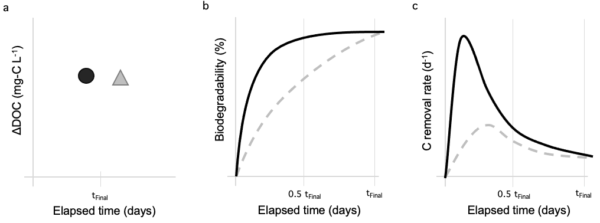
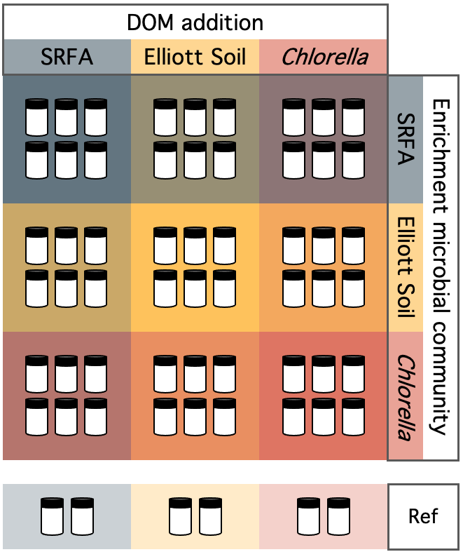

\thispagestyle{fancy}

```{r setup, include=FALSE}
# Set chunk options
knitr::opts_chunk$set(echo = FALSE, warning = FALSE, message = FALSE)

# Load libraries
library(tidyverse)
library(lubridate)
library(gridExtra)
library(ggpubr)
library(ggridges)
library(kableExtra)
```

# Main manuscript

## Figure 1

```{r Fig1example, eval=FALSE}
# Establish what curves in figure 1 should look like

# Make some dummy data, biodegrad values based on our dataset
dummyData <- 
  data_frame(incubat = c(rep("A", 6), rep("B", 6)),
             incubationTime_d = c(rep(c(0, 0.1, 1, 3, 7, 10), 2)),
             biodegrad_perc = c(0, 1, 10, 25, 40, 45,
                                0, 1, 5, 10, 17, 20)) %>%
  # Back calculate DOCf
  mutate(DOCi_mgL = 20,
         DOCf_mgL = -biodegrad_perc/100 * DOCi_mgL + DOCi_mgL,
         k_C_d = -1/incubationTime_d * log(DOCf_mgL / DOCi_mgL))

dummyData <- 
  data_frame(incubat = c(rep("A", 7), rep("B", 7)),
             incubationTime_d = c(rep(c(0, 0.1, 1, 3, 5, 7, 10), 2)),
             biodegrad_perc = c(0, 1, 10, 20, 20.5, 21, 21,
                                0, 0.1, 3, 11, 15, 18, 20)) %>%
  # Back calculate DOCf
  mutate(DOCi_mgL = 20,
         DOCt_mgL = -biodegrad_perc/100 * DOCi_mgL + DOCi_mgL,
         DOCt_DOC0 = DOCt_mgL/DOCi_mgL)

# Fit k
RCM <- function(t, alpha, v){
  (alpha / (alpha + t)) ^ v
}

fit_RCM <- function(df){
    nls_multstart(DOCt_DOC0 ~ RCM(incubationTime_d, alpha, v),
                  data = df,
                  start_lower = c(alpha = 0, v = 0),
                  start_upper = c(alpha = 30, v = 5),
                  iter = 500)
}

kFit <- 
  dummyData %>%
  group_by(incubat) %>%
  group_modify(~ broom::tidy(fit_RCM(df = .x)))
dummyData <- 
  kFit %>%
  select(incubat, term, estimate) %>%
  pivot_wider(names_from = term, values_from = estimate) %>%
  full_join(dummyData) %>%
  mutate(k_d = v / (alpha + incubationTime_d))

# Make plots
ggplot(dummyData, aes(x = incubationTime_d, y = biodegrad_perc)) +
  geom_line(aes(color = incubat))

ggplot(dummyData, aes(x = incubationTime_d, y = k_d)) +
  geom_line(aes(color = incubat))

# Redraw these plots in powerpoint so they'll look nice
```

```{r Fig1, out.width="100%"}

```

## Figure 2

```{r Fig2 analysis}
# Initial mass spec data #######################################################
# Load data
massSpec <- read_csv("data/massSpec_EnrichmentExperiment.csv")

# Factorize DOM
massSpec$DOMSource <- 
  factor(massSpec$DOMSource, 
         level = c("SRFA", "ES", "CHLOR"))

# EEMs data ####################################################################
# Load data
eem <- read_csv(file = "./data/EEMS_EnrichmentExperiment.csv")

# Format date
eem$CollectionDate <- ymd(eem$CollectionDate)
eem$DOMSource[eem$DOMSource == "Chlorella"] <- "CHLOR"

# Factorize DOM
eem$DOMSource <- 
  factor(eem$DOMSource, 
         level = c("SRFA", "ES", "CHLOR"))
```

```{r Fig2 stats, eval=FALSE}
massSpec %>%
  group_by(DOMSource) %>%
  summarise(length(formula), mean(O_C), sd(O_C), mean(H_C), sd(H_C))

# Kruskall-wallis as groups are unbalanced
modl <- kruskal.test(O_C ~ DOMSource, data = massSpec)
modl
# formula for eta squared calculation of effect size, Kruskal-Wallis test
# Tomczak and Tomczak 2014 The need to report effect size estimates revisited. 
# An overview of some recommended measures of effect size
eta2_krusk <- function(Hval, kval, nval){(Hval - kval + 1)/(nval - kval)}

H <- as.numeric(modl$statistic)
k <- length(unique(massSpec$DOMSource))
n <- nrow(massSpec)
# eta squared for O_C vs DOM Source
eta2_krusk(H, k, n)

modl <- kruskal.test(H_C ~ DOMSource, data = massSpec)
modl
H <- as.numeric(modl$statistic)
k <- length(unique(massSpec$DOMSource))
n <- nrow(massSpec)
# eta squared for H_C vs DOM Source
eta2_krusk(H, k, n)


# For later in methods - initial nutrient concentrations
initPlot <-
  nutInits %>%
  filter(BlankOrSample == "sample" & Enrichment != "CTRL")

# Stats test: Were initial DOC conc different between samples?
modl <- aov(initial_DOC_mgCL ~ DOMSource * Enrichment, data = initPlot)
summary(modl)

# Was initial TDN different?
modl <- aov(initial_TDN_mgNL ~ DOMSource * Enrichment, data = initPlot)
summary(modl)

# Average concentrations
initPlot %>%
  summarise(mean(initial_DOC_mgCL), sd(initial_DOC_mgCL),
            mean(initial_TDN_mgNL), sd(initial_TDN_mgNL))
```

```{r Fig2plot, fig.height=5, fig.width=7}
# a. Plot O:C mass spec data
a <- 
  ggplot(data = massSpec, aes(x = O_C, y = DOMSource, color = DOMSource)) +
  geom_density_ridges2(aes(fill = DOMSource), scale = 0.8, color = NA) +
  geom_boxplot(width = 0.2, outlier.shape = NA, coef = 0) +
  scale_fill_manual(values = c("CHLOR" = "#D84727", "ES" = "#FFB000",
                               "SRFA"="#2E4756")) +
  scale_color_manual(values = c("CHLOR" = "#D84727", "ES" = "#FFB000",
                               "SRFA"="#2E4756")) +
  # Theme adjustments
  theme_minimal() + labs(tag = "a") +
  xlab("Oxygen:Carbon") + 
  ylab(expression("DOM Source")) +
  theme(plot.background = element_rect(fill = "white", color = NA),
        legend.position = "none")

# b. Plot H:C mass spec data 
b <- 
  ggplot(data = massSpec, aes(x = H_C, y = DOMSource, color = DOMSource)) +
  geom_density_ridges2(aes(fill = DOMSource), scale = 0.8, color = NA) +
  geom_boxplot(width = 0.2, outlier.shape = NA, coef = 0) +
   scale_fill_manual(values = c("CHLOR" = "#D84727", "ES" = "#FFB000",
                               "SRFA"="#2E4756")) +
  scale_color_manual(values = c("CHLOR" = "#D84727", "ES" = "#FFB000",
                               "SRFA"="#2E4756")) +
  # Theme adjustments
  theme_minimal() + labs(tag = "b") +
  xlab("Hydrogen:Carbon") + 
  ylab(expression("DOM Source")) +
  theme(plot.background = element_rect(fill = "white", color = NA),
        legend.position = "none")

# c. Plot HIX by DOM source
c <- 
  ggplot(data = eem %>% 
         filter(BlankOrSample %in% c("T0") &
                  DayOfExperiment == 0),
       aes(x = DOMSource, y = HIX)) +
  geom_point(aes(color = DOMSource), shape = 16, size = 3) +
  scale_fill_manual(values = c("CHLOR" = "#D84727", "ES" = "#FFB000",
                               "SRFA"="#2E4756"),  guide = "none") +
  scale_color_manual(values = c("CHLOR" = "#D84727", "ES" = "#FFB000",
                               "SRFA"="#2E4756"), guide = "none") +
  # Theme adjustments
  theme_minimal() + labs(tag = "c") +
  xlab("DOM Source") + ylab(expression("HIX")) +
  scale_shape_manual(values = c(21, 24)) + coord_cartesian(ylim = c(0, 8)) +
  theme(plot.background = element_rect(fill = "white", color = NA),
        legend.position = "none")
# BIX
d <- 
  ggplot(data = eem %>% 
         filter(BlankOrSample %in% c("T0") &
                  DayOfExperiment == 0),
       aes(x = DOMSource, y = BIX)) +
  geom_point(aes(color = DOMSource), shape = 16, size = 3) +
  scale_fill_manual(values = c("CHLOR" = "#D84727", "ES" = "#FFB000",
                               "SRFA"="#2E4756"),  guide = "none") +
  scale_color_manual(values = c("CHLOR" = "#D84727", "ES" = "#FFB000",
                               "SRFA"="#2E4756"), guide = "none") +
  # Theme adjustments
  theme_minimal() + labs(tag = "d") + 
  coord_cartesian(ylim = c(0.25, 0.75)) +
  xlab("DOM Source") + ylab(expression("BIX")) +
  scale_shape_manual(values = c(21, 24)) +
  theme(plot.background = element_rect(fill = "white", color = NA),
        legend.position = "none")
# E2:E3
e <- 
  ggplot(data = eem %>% 
         filter(BlankOrSample %in% c("T0") &
                  DayOfExperiment == 0),
       aes(x = DOMSource, y = e2e3)) +
  geom_point(aes(color = DOMSource), shape = 16, size = 3) +
  scale_fill_manual(values = c("CHLOR" = "#D84727", "ES" = "#FFB000",
                               "SRFA"="#2E4756"),  guide = "none") +
  scale_color_manual(values = c("CHLOR" = "#D84727", "ES" = "#FFB000",
                               "SRFA"="#2E4756"), guide = "none") +
  # Theme adjustments
  theme_minimal() + labs(tag = "e") +
  coord_cartesian(ylim = c(0, 125)) +
  xlab("DOM Source") + ylab(expression("E2:E3")) +
  scale_shape_manual(values = c(21, 24)) +
  theme(plot.background = element_rect(fill = "white", color = NA),
        legend.position = "none")


lay <- rbind(c(1,1,1,2,2,2),
             c(1,1,1,2,2,2),
             c(1,1,1,2,2,2),
             c(3,3,4,4,5,5),
             c(3,3,4,4,5,5))
grob <- grid.arrange(a, b, c, d,e, layout_matrix = lay)

# Save plot
ggsave(grob, file = "figures/Figure_2.png", 
       width = 6, height = 5, units = "in", dpi = 300)
```

## Figure 3

```{r Fig3 analysis}
# Delta DOM ####################################################################
# Load nutrient analysis data
nutrient <- 
  read_csv(file = "data/waterChemistry_CrossingExperiment.csv")

# If concentration is less than detection, set to 0
nutrient$Concentration[nutrient$Concentration == "<LOD"] <- 0

# Format columns
nutrient <- 
  nutrient %>%
  mutate(CollectionDate = mdy(CollectionDate),
         Concentration = as.numeric(Concentration),
         DayOfExperiment = as.factor(DayOfExperiment))


# Initial samples for DOM source SRFA and Enrichment ES weren't analyzed 
# because vials did not have enough sample volume. Replace missing values
# with average of other ES enrichment initials
# Get DOC value
meanInit_DOC <- mean(nutrient[nutrient$Experiment == "DOM Crossing Experiment 1" &
                                nutrient$DayOfExperiment == 0 &
                                nutrient$Enrichment == "ES" & 
                                nutrient$Analysis == "DOC",]$Concentration, 
                     na.rm = T)
# Set value
nutrient[nutrient$Experiment == "DOM Crossing Experiment 1" &
           nutrient$DayOfExperiment == 0 &
           nutrient$Enrichment == "ES" & 
           nutrient$DOMSource == "SRFA" &
           nutrient$Analysis == "DOC",]$Concentration <- meanInit_DOC

# Get TDN value
meanInit_TDN <- mean(nutrient[nutrient$Experiment == "DOM Crossing Experiment 1" &
                                nutrient$DayOfExperiment == 0 &
                                nutrient$Enrichment == "ES" & 
                                nutrient$Analysis == "TDN",]$Concentration, 
                     na.rm = T)
# Set value
nutrient[nutrient$Experiment == "DOM Crossing Experiment 1" &
           nutrient$DayOfExperiment == 0 &
           nutrient$Enrichment == "ES" & 
           nutrient$DOMSource == "SRFA" &
           nutrient$Analysis == "TDN",]$Concentration <- meanInit_TDN

# Take out trash
rm(meanInit_DOC)
rm(meanInit_TDN)

# Select crossing nutrient data
nut_crossing <-
  nutrient %>%
  mutate(DayOfExperiment = as.numeric(as.character(DayOfExperiment)), 
         DayOfExperiment = case_when(DayOfExperiment == 0 ~ "initial", 
                                     DayOfExperiment == 14 ~ "final"),
         units = gsub(" |/", "", units),
         Analysis = paste0(Analysis, "_", units)) 

# Pivot data to have nutrient concentrations in separate columns
nut_crossingWide <- 
  nut_crossing %>%
  select(-c(FilteredOrUnfiltered, BottleNum, units, notes, 
            sourceDatasheet)) %>%
  pivot_wider(names_from = Analysis,
              values_from = Concentration, values_fn = mean)

# Separate out the initial samples so you can merge these in line-by-line
nutInits <- 
  nut_crossingWide %>%
  filter(DayOfExperiment == "initial") %>%
  select(-c(Replicate, DayOfExperiment, CollectionDate)) %>%
  rename(initial_DOC_mgCL = DOC_mgCL, initial_TDN_mgNL = TDN_mgNL,
         initial_SRP_mgPL = SRP_mgPL, initial_NH4_mgNL = NH4_mgNL,
         initial_NO3NO2_mgNL = NO3NO2_mgNL)

# Merge
nutDelta_crossing <- 
  nut_crossingWide %>%
  filter(DayOfExperiment != "initial") %>%
  rename(final_DOC_mgCL = DOC_mgCL, final_TDN_mgNL = TDN_mgNL,
         final_SRP_mgPL = SRP_mgPL, final_NH4_mgNL = NH4_mgNL,
         final_NO3NO2_mgNL = NO3NO2_mgNL) %>%
  select(-DayOfExperiment) %>%
  left_join(nutInits) %>%
  mutate(delta_DOC_mgCL = final_DOC_mgCL-initial_DOC_mgCL,
         delta_DOC_perc = delta_DOC_mgCL/initial_DOC_mgCL*100,
         delta_TDN_mgNL = final_TDN_mgNL-initial_TDN_mgNL,
         delta_TDN_perc = delta_TDN_mgNL/initial_TDN_mgNL*100,
         delta_SRP_mgPL = final_SRP_mgPL - initial_SRP_mgPL,
         delta_SRP_perc = delta_SRP_mgPL/initial_SRP_mgPL*100,
         delta_NH4_mgNL = final_NH4_mgNL - initial_NH4_mgNL,
         delta_NH4_perc = delta_NH4_mgNL/initial_NH4_mgNL*100,
         delta_NO3NO2_mgNL = final_NO3NO2_mgNL - initial_NO3NO2_mgNL,
         delta_NO3NO2_perc = delta_NO3NO2_mgNL/initial_NO3NO2_mgNL*100,
         Experiment = str_extract(Experiment, "[\\d]"),
         DOMSource = paste0(DOMSource, "\nDOM source"), 
         DOMSource = factor(DOMSource, 
                            levels = c(paste0(c("SRFA","ES", "CHLOR"), 
                                              "\nDOM source"))),
         Enrichment = paste0(Enrichment, "\nmicrobes"),
         Enrichment = factor(Enrichment, 
                            levels = c(paste0(c("CTRL","SRFA","ES", "CHLOR"), 
                                              "\nmicrobes"))))

# Take out trash
rm(nut_crossingWide)

# Get mean initial DOC for treatment
nut_initial_crossing <- 
  nut_crossing %>%
  filter(BlankOrSample == "sample" & DayOfExperiment == "initial" &
           Analysis == "DOC_mgCL") %>%
  select(Experiment, DOMSource, Enrichment, Concentration) %>%
  group_by(Experiment, DOMSource, Enrichment) %>%
  summarise(initial_DOC_mgCL = mean(Concentration)) %>%
  mutate(Enrichment = paste0(Enrichment, "\nmicrobes"),
         DOMSource = paste0(DOMSource, "\nDOM source"))

# Get mean final DOC for treatment
nut_final_crossing <- 
  nut_crossing %>%
  filter(BlankOrSample == "sample" & DayOfExperiment == "final" &
           Analysis == "DOC_mgCL") %>%
  # Recode replicates so replicate numbers 1-3 refer only to 
         # DOM Crossing Experiment 1, and those from Experiment 2 are numbered as 4-6
  mutate(Replicate = case_when(Experiment == "DOM Crossing Experiment 2" ~
                                 as.numeric(Replicate) + 3, 
                               Experiment != "DOM Crossing Experiment 2" ~
                                 as.numeric(Replicate))) %>%
  select(Experiment, DOMSource, Enrichment, Replicate, Concentration) %>%
  rename(final_DOC_mgCL = Concentration) %>%
  mutate(Enrichment = paste0(Enrichment, "\nmicrobes"),
         DOMSource = paste0(DOMSource, "\nDOM source"))

# Load gas data ################################################################
gas <- read_csv(file =  "data/gasConcentrations_CrossingExperiment.csv")

# Select crossing experiment data
gas_crossing <-
  gas %>% 
  mutate(Experiment = as.factor(Experiment),
         # Recode replicates so replicate numbers 1-3 refer only to 
         # DOM Crossing Experiment 1, and those from Experiment 2 are 
         # numbered as 4-6
         Replicate = case_when(Experiment == "DOM Crossing Experiment 2" ~
                                 Replicate + 3, 
                               Experiment != "DOM Crossing Experiment 2" ~
                                 Replicate),
         Replicate = as.factor(Replicate),
         DOMSource = paste0(DOMSource, "\nDOM source"), 
         DOMSource = factor(DOMSource, 
                            levels = c(paste0(c("SRFA","ES", "CHLOR"), 
                                              "\nDOM source"))),
         Enrichment = paste0(Enrichment, "\nmicrobes"),
         Enrichment = factor(Enrichment, 
                            levels = c(paste0(c("CTRL","SRFA","ES", "CHLOR"), 
                                              "\nmicrobes"))))

# Biodegradability #############################################################
# Get avg temp info
gas_crossing %>%
  group_by(Experiment) %>%
  summarise(meanTemp = mean(Temp_C),
            sdTemp = sd(Temp_C))

# Biodegradability (%) = CO2 accumulation (mg L-1) / DOCinitial (mg L-1)
# k (day-1) = -ln(CO2 at time t / CO2 at time 0) / elapsed time (d)

# Divide CO2 accumulation (ug) by headspace volume (L) and convert to mg/L
biodegrad_crossing <- 
  gas_crossing %>%
  group_by(Experiment, Enrichment, DOMSource, Replicate, Time_hrs) %>%
  mutate(CO2Rate_mgmin = CO2Rate_ugmin/1000,
         O2Rate_mgmin = O2Rate_ugmin/1000,
         CO2Accum_mg = CO2Accum_ug/1000, 
         O2Accum_mg = O2Accum_ug/1000,
         Volume_L = Volume_mL/1000,
         CO2Accum_mgL = CO2Accum_mg/Volume_L,
         O2Accum_mgL = O2Accum_mg/Volume_L,
         CO2Rate_mgminL = CO2Rate_mgmin/Volume_L,
         O2Rate_mgminL = O2Rate_mgmin/Volume_L,
         Time_d = Time_hrs/24,
         CO2Accum_mgCL = CO2Accum_mgL/1000/44*12*1000,
         CO2Rate_mgCLmin = CO2Rate_mgminL/1000/44*12*1000) %>%
  select(Time_hrs, Time_d, CO2Accum_mgCL, CO2Rate_mgCLmin, O2Rate_mgminL,
         O2Accum_mgL)

# Loop through replicates to calculate biodegradability at each timestep
# Initialize vector
initDOC <- vector(mode = "numeric", length = nrow(biodegrad_crossing))
finDOC <- vector(mode = "numeric", length = nrow(biodegrad_crossing))
initCO2 <- vector(mode = "numeric", length = nrow(biodegrad_crossing))
finCO2 <- vector(mode = "numeric", length = nrow(biodegrad_crossing))
i <- 1

for(i in 1:nrow(biodegrad_crossing)){
  # Grab experiment, enrichment, dom source to match up with intitial samples
  exp <- biodegrad_crossing$Experiment[i]
  enr <- biodegrad_crossing$Enrichment[i]
  dom <- biodegrad_crossing$DOMSource[i]
  rep <- biodegrad_crossing$Replicate[i]
  
  # Pull initial DOM for sample
  initiDOM <- 
    nut_initial_crossing[nut_initial_crossing$Experiment == exp &
                         nut_initial_crossing$Enrichment == enr &
                         nut_initial_crossing$DOMSource == dom,]
  finiDOM <- 
    nut_final_crossing[nut_final_crossing$Experiment == exp &
                         nut_final_crossing$Enrichment == enr &
                         nut_final_crossing$DOMSource == dom &
                   nut_final_crossing$Replicate == rep,]
  
   initDOC[i] <- initiDOM$initial_DOC_mgCL
   finDOC[i] <- finiDOM$final_DOC_mgCL
   
   # Pull initial and final DIC for sample
   sampCO2 <- biodegrad_crossing[biodegrad_crossing$Experiment == exp &
                                   biodegrad_crossing$Enrichment == enr &
                                   biodegrad_crossing$DOMSource == dom &
                                   biodegrad_crossing$Replicate == rep,]
   
   # Initial DIC
   initCO2[i] <- sampCO2$CO2Accum_mgCL[sampCO2$Time_hrs == 
                                         min(sampCO2$Time_hrs)]
   # Final DIC
   finCO2[i] <- sampCO2$CO2Accum_mgCL[sampCO2$Time_hrs == 
                                        max(sampCO2$Time_hrs)]
}

# Enter string of initial doc concentrations into dataframe
biodegrad_crossing$initial_DOC_mgCL <- initDOC
biodegrad_crossing$final_DOC_mgCL <- finDOC
biodegrad_crossing$initial_CO2_mgCL <- initCO2
biodegrad_crossing$final_CO2_mgCL <- finCO2

# delta DOC ####################################################################
# Calculate change in DOC from initial to final
biodegrad_crossing$deltaDOC_mgCL <- 
  biodegrad_crossing$final_DOC_mgCL - 
  biodegrad_crossing$initial_DOC_mgCL

# Calculate change in CO2 from initial to final
biodegrad_crossing$deltaCO2_mgCL <- 
  biodegrad_crossing$final_CO2_mgCL - 
  biodegrad_crossing$initial_CO2_mgCL

# Change in CO2 at each timestep is == CO2 accumulation ########################

# Calc biodegradability ########################################################
# BCO2t (%) = (CO2t / DOCi) * 100
biodegrad_crossing$biodegrad_perc <- biodegrad_crossing$CO2Accum_mgCL /
  biodegrad_crossing$initial_DOC_mgCL * 100

# Removal rate (first order) ###################################################
library(nls.multstart)
# Add identification column to mark data for seperate replicates
# Add DOCt / DOC0 column, equal to 
biodegrad_crossing <- 
  mutate(biodegrad_crossing, IDcol = paste0(Enrichment, " ", DOMSource, 
                                            " rep ", Replicate),
         DOCt_DOC0 = (initial_DOC_mgCL - CO2Accum_mgCL) / initial_DOC_mgCL)

firstOrderMod <- function(t, k){
  exp(-k*t)
}

# Set up function for map
fit_1stOrderMod<- function(df){
    nls_multstart(DOCt_DOC0 ~ firstOrderMod(t = Time_d, k),
                  data = df, 
                  start_upper = c(k = -0.00001),
                  start_lower = c(k = -1),
                  iter = 500)
}

## Using entire incubation period ##############################################
#fitStats_1st_avg <- 
 # biodegrad_crossing %>%
  #ungroup() %>% 
  #group_by(IDcol) %>%
  #group_modify(~ broom::tidy(fit_1stOrderMod(df = .x)))

#AIC_1stOrderAvg <- 
 # biodegrad_crossing %>%
#  ungroup() %>%
 # group_by(Experiment, Enrichment, DOMSource, IDcol) %>%
  #group_modify(~ broom::glance(fit_1stOrderMod(df = .x)))

# Where was curve fitting unsuccessful?
#badFit <- fitStats_1st_avg[fitStats_1st_avg$p.value > 0.05,] 

# Avg AIC scores: Overall
#AIC_1stOrderAvg %>%
 # ungroup() %>%
  #filter(Enrichment != "CTRL\nmicrobes") %>%
  #summarise(AIC = mean(AIC),
   #         mean(logLik))
# Avg AIC scores: by treatment
#AIC_1stOrderAvg %>%
 # ungroup() %>%
  #filter(Enrichment == "CTRL\nmicrobes") %>%
  #group_by(Enrichment, DOMSource) %>%
  #summarise(AIC = mean(AIC),
   #         mean(logLik))

## Calculating for each timestep ###############################################
# Initialize list for data slices
sliceList <- vector(mode = "list", 
                    length = length(unique(biodegrad_crossing$IDcol)))
i <- 1
for (i in seq_along(unique(biodegrad_crossing$IDcol))){
  # Seperate out data chunk
  thisID <- unique(biodegrad_crossing$IDcol)[i]
  
  sliceData <- 
    filter(biodegrad_crossing, IDcol == thisID)
  
  # Initalize list for timeLoop
  timeList <- vector(mode = "list", length = length(sliceData$Time_d))
  
  j <- 2
  for(j in 2:length(sliceData$Time_d)){
    currentTime <- 
      sliceData$Time_d[j]
    
    timeSlice <- 
      filter(sliceData, Time_d <= currentTime)
    
    modelFit <- fit_1stOrderMod(timeSlice)
    
    modelStats <- broom::tidy(modelFit)
    modelAIC <- broom::glance(modelFit)
    
    timeOutput <-
      data.frame(IDcol = thisID, 
                 Time_d = currentTime,
                 k_1stOrder = modelStats$estimate,
                 k_SE_1stOrder = modelStats$std.error,
                 k_pval = modelStats$p.value,
                 logLik = modelAIC$logLik,
                 AIC = modelAIC$AIC)
    
    timeList[[j]] <- timeOutput
  }
  # Add timeslice data to list of data slices
  sliceList[[i]] <- bind_rows(timeList)
}

# Bind rows
firstOrderModels <- bind_rows(sliceList)
# What percentage of models weren't great?
sum(firstOrderModels$k_pval > 0.05) / length(firstOrderModels$k_pval) * 100

results_k_firstOrder <-
  firstOrderModels %>%
  filter(k_pval <= 0.05) %>%
  rename(k_d = k_1stOrder,
         k_d_SE = k_SE_1stOrder) %>%
  select(IDcol, Time_d, k_d, k_d_SE, k_pval, logLik, AIC) %>%
  mutate(DOCt_DOC0 = exp(-k_d * Time_d),
         Enrichment = str_extract(IDcol, 
            pattern = "(.+\nmicrobes) (.+\nDOM source) rep (\\d)",
            group = 1),
         DOMSource = str_extract(IDcol, 
            pattern = "(.+\nmicrobes) (.+\nDOM source) rep (\\d)",
            group = 2),
         Replicate = str_extract(IDcol, 
            pattern = "(.+\nmicrobes) (.+\nDOM source) rep (\\d)",
            group = 3)) %>%
  relocate(Enrichment:Replicate)

# Average AIC
mean(results_k_firstOrder$AIC)
mean(results_k_firstOrder$k_pval)

# View predicted k values
ggplot(data = results_k_firstOrder, 
       aes(x = Time_d, y = k_d)) +
  facet_grid(cols = vars(DOMSource),
             rows = vars(Enrichment), scales = "free_x") +
  # Add datapoints
  geom_line(aes(group = IDcol))

# View predicted DOCt/DOC0 values
ggplot(data = results_k_firstOrder, 
        aes(x = Time_d, y = DOCt_DOC0)) +
  facet_grid(cols = vars(DOMSource),
             rows = vars(Enrichment), scales = "free_x") +
  # Add datapoints
  geom_line(aes(group = IDcol))

# Removal rate (continuum model) ###############################################
# Reactivity continuum model, See Koehler et al 2012
RCM <- function(t, alpha, v){
  (alpha / (alpha + t)) ^ v
}

fit_RCM <- function(df){
    nls_multstart(DOCt_DOC0 ~ RCM(Time_d, alpha, v),
                  data = df,
                  start_lower = c(alpha = 0, v = 0),
                  start_upper = c(alpha = 30, v = 5),
                  iter = 500)
}

fitStats_RCM <- 
  biodegrad_crossing %>%
  ungroup() %>%
  group_by(Experiment, IDcol) %>%
  group_modify(~ broom::tidy(fit_RCM(df = .x)))

AIC_RCM <- 
  biodegrad_crossing %>%
  ungroup() %>%
  group_by(Experiment, Enrichment, DOMSource, IDcol) %>%
  group_modify(~ broom::glance(fit_RCM(df = .x)))

# Where was curve fitting unsuccessful?
badFit <- fitStats_RCM[fitStats_RCM$p.value > 0.05,] # A lot of SRFA DOM sources
# Avg AIC scores: Overall
AIC_RCM %>%
  ungroup() %>%
  filter(!(Enrichment == "CTRL\nmicrobes" | IDcol %in% unique(badFit$IDcol))) %>%
  summarise(AIC = mean(AIC),
            mean(logLik))
# Avg AIC scores: by treatment
AIC_RCM %>%
  ungroup() %>%
  filter(!(Enrichment == "CTRL\nmicrobes" | IDcol %in% unique(badFit$IDcol))) %>%
  group_by(Enrichment, DOMSource) %>%
  summarise(AIC = mean(AIC))

results_k_RCM <- 
  fitStats_RCM %>%
  mutate(kModel = "RCM") %>%
  filter(p.value <= 0.05) %>%
  pivot_wider(names_from = c(term, kModel), values_from = estimate:p.value) %>%
  select(IDcol:std.error_v_RCM) 

# Merge k modeling results together ############################################
# Identify which IDcols did not have significant RCM fits
sigRCM <- unique(results_k_RCM$IDcol)
allID <- unique(biodegrad_crossing$IDcol)
notSigRCM <- allID[!(allID %in% sigRCM)] # 9, 6 not including CTRL

# Pull first order k for IDs that didn't have sig RCM fits
firstOrderMerge <-
  results_k_firstOrder %>%
  filter(IDcol %in% notSigRCM) %>%
  mutate(kMethod = "first order") %>%
  rename(DOCt_DOC0_pred = DOCt_DOC0) %>%
  select(IDcol, Time_d, kMethod, k_d, DOCt_DOC0_pred)

# Format RCM df for merging
RCMMerge <- 
  full_join(biodegrad_crossing, results_k_RCM) %>%
  mutate(kMethod = "RCM",
         k_d = estimate_v_RCM / (estimate_alpha_RCM + Time_d),
         DOCt_DOC0_pred = (estimate_alpha_RCM / (estimate_alpha_RCM + Time_d)) ^
           estimate_v_RCM) %>%
  ungroup() %>%
  # Remove IDs that were not significant
  filter(!(IDcol %in% notSigRCM)) %>%
  select(IDcol, Time_d, kMethod, k_d, DOCt_DOC0_pred)

# Merge k data
results_k <-
  full_join(firstOrderMerge, RCMMerge) 
# Merge into full df
biodegrad_crossing_k <-
  full_join(biodegrad_crossing, results_k)

# Interpolate ##################################################################
# Get unique replicate info
vials_crossing <-
  biodegrad_crossing_k %>%
  ungroup() %>%
  select(Experiment, Enrichment, DOMSource, Replicate) %>%
  distinct()

# Use for loop to seperate into replicate-specific chunks
# Initialize storage
vialList <- c()
i <- 1
for (i in 1:nrow(vials_crossing)){
  exp <- vials_crossing$Experiment[i]
  enr <- vials_crossing$Enrichment[i]
  sor <- vials_crossing$DOMSource[i]
  reps <- vials_crossing$Replicate[i]
  
  # Subset chunk of interest from the dataset
  chunk <- 
    biodegrad_crossing_k[biodegrad_crossing$Experiment == exp &
                         biodegrad_crossing$Enrichment == enr &
                         biodegrad_crossing$DOMSource == sor &
                         biodegrad_crossing$Replicate == reps,]
  
  # Add in the times of interest wanted
  timeAdd <- c(24, 72, 7*24, 10*24)
  timeMerge <- data.frame(chunk[1,1:4], 
                          Time_hrs = timeAdd)
  # Join times of interest with the data chunk
  chunk <- 
    merge(chunk, timeMerge, all = TRUE) %>%
    mutate(Time_d = Time_hrs/24)
  chunk <- chunk[order(chunk$Time_hrs),]
  # Fill initial & final DOC
  chunk$initial_DOC_mgCL <- unique(chunk$initial_DOC_mgCL)[1]
  chunk$final_DOC_mgCL <- unique(chunk$final_DOC_mgCL)[1]
  chunk$initial_CO2_mgCL <- unique(chunk$initial_CO2_mgCL)[1]
  chunk$final_CO2_mgCL <- unique(chunk$final_CO2_mgCL)[1]
  
  # Use linear interpolation to fill gaps
  # for loop through the timeAdd list
  j <- 1
  for (j in 1:length(timeAdd)){
    # Grab row number of missing time row
    index <- which(chunk$Time_hrs == timeAdd[j])
    # Interpolate value for row
    chunk$IDcol[chunk$Time_hrs == timeAdd[j]] <- chunk$IDcol[index-1]
    # CO2 accumulation
    chunk$CO2Accum_mgCL[chunk$Time_hrs == timeAdd[j]] <-
      ((chunk$Time_hrs[index+1] - timeAdd[j])*chunk$CO2Accum_mgCL[index-1] +
         (timeAdd[j] - chunk$Time_hrs[index-1])*chunk$CO2Accum_mgCL[index+1])/
      (chunk$Time_hrs[index+1]-chunk$Time_hrs[index-1])
    # CO2 accumulation rate
    chunk$CO2Rate_mgCLmin[chunk$Time_hrs == timeAdd[j]] <-
      ((chunk$Time_hrs[index+1] - timeAdd[j])*chunk$CO2Rate_mgCLmin[index-1] +
         (timeAdd[j] - chunk$Time_hrs[index-1])*chunk$CO2Rate_mgCLmin[index+1])/
      (chunk$Time_hrs[index+1]-chunk$Time_hrs[index-1])
     # DOCt/DOC0
    chunk$DOCt_DOC0[chunk$Time_hrs == timeAdd[j]] <-
      ((chunk$Time_hrs[index+1] - timeAdd[j])*chunk$DOCt_DOC0[index-1] +
         (timeAdd[j] - chunk$Time_hrs[index-1])*chunk$DOCt_DOC0[index+1])/
      (chunk$Time_hrs[index+1]-chunk$Time_hrs[index-1])
    # biodegradability
    chunk$biodegrad_perc[chunk$Time_hrs == timeAdd[j]] <-
      ((chunk$Time_hrs[index+1] - timeAdd[j])*chunk$biodegrad_perc[index-1] +
         (timeAdd[j] - chunk$Time_hrs[index-1])*chunk$biodegrad_perc[index+1])/
      (chunk$Time_hrs[index+1]-chunk$Time_hrs[index-1])
    # C removal rate
    #chunk$k_firstOrder[chunk$Time_hrs == timeAdd[j]] <-
     # ((chunk$Time_hrs[index+1] - timeAdd[j])*chunk$k_firstOrder[index-1] +
      #   (timeAdd[j] - chunk$Time_hrs[index-1])*chunk$k_firstOrder[index+1])/
      #(chunk$Time_hrs[index+1]-chunk$Time_hrs[index-1])
    # Get k method
    chunk$kMethod <- unique(na.omit(chunk$kMethod))
    # Interpolate k
    chunk$k_d[chunk$Time_hrs == timeAdd[j]] <-
      ((chunk$Time_hrs[index+1] - timeAdd[j])*chunk$k_d[index-1] +
         (timeAdd[j] - chunk$Time_hrs[index-1])*chunk$k_d[index+1])/
      (chunk$Time_hrs[index+1]-chunk$Time_hrs[index-1])
    # Interpolate predicted DOCt/DOC0
    chunk$DOCt_DOC0_pred[chunk$Time_hrs == timeAdd[j]] <-
      ((chunk$Time_hrs[index+1] - timeAdd[j])*chunk$DOCt_DOC0_pred[index-1] +
         (timeAdd[j] - chunk$Time_hrs[index-1])*chunk$DOCt_DOC0_pred[index+1])/
      (chunk$Time_hrs[index+1]-chunk$Time_hrs[index-1])
  }
  
  # Save vial chunk in list
  vialList[[i]] <- chunk
}

# Concatenate the chunk list into a single dataframe
biodegrad_crossing_interp <- 
  bind_rows(vialList)

# The first value in k will be Inf, because we're doing ln(0) as no accumulation
# has happened yet. Correct this:
#biodegrad_crossing_interp$k_C_d[is.infinite(biodegrad_crossing_interp$k_C_d)] <-
 # NA
#biodegrad_crossing_interp$k_C_d[is.nan(biodegrad_crossing_interp$k_C_d)] <-
 # NA
# Filter to 1, 3, 7, 10 days
biodegrad_crossing_filt <- 
  biodegrad_crossing_interp %>%
  filter(Time_d %in% c(1, 3, 7, 10) &
           Enrichment != "CTRL\nmicrobes") 

# Calculate change in DOC
deltaDOC <- 
  biodegrad_crossing_interp %>%
  select(Experiment, Enrichment, DOMSource, Replicate, initial_DOC_mgCL,
         final_DOC_mgCL, initial_CO2_mgCL, final_CO2_mgCL) %>%
  #filter(Enrichment != "CTRL\nmicrobes") %>%
  distinct() %>% 
  mutate(deltaDOC_mgCL = final_DOC_mgCL - initial_DOC_mgCL,
         deltaCO2_mgCL = final_CO2_mgCL - initial_CO2_mgCL,
         deltaDOC_percChange = (final_DOC_mgCL - initial_DOC_mgCL)/
           initial_DOC_mgCL*100)
deltaDOC_CTRL <- 
  biodegrad_crossing_interp %>%
  select(Experiment, Enrichment, DOMSource, Replicate, initial_DOC_mgCL,
         final_DOC_mgCL, initial_CO2_mgCL, final_CO2_mgCL) %>%
  filter(Enrichment == "CTRL\nmicrobes") %>%
  distinct() %>% 
  mutate(deltaDOC_mgCL = final_DOC_mgCL - initial_DOC_mgCL,
         deltaDOC_percChange = (final_DOC_mgCL - initial_DOC_mgCL)/
           initial_DOC_mgCL*100)
```

```{r resp quot}
crossing_RQ <- 
  gas_crossing %>%
  mutate(Time_d = Time_hrs/24,
         O2Accum_umolO2 = O2Accum_ug / 32,
         CO2Accum_umolC = CO2Accum_ug / 44,
         O2Rate_umolO2min = O2Rate_ugmin / 32,
         CO2Rate_umolCmin = CO2Rate_ugmin / 44,
         RQ_umolO2.umolC = O2Accum_umolO2 / CO2Accum_umolC,
         RQ_umolO2min.umolCmin = O2Rate_umolO2min / CO2Rate_umolCmin)

# RQ_RER = ratio of respiratory quotient to respiratory exchange ratio
# Photosynthetic/respiratory quotient :
#   RQ = delta O2 (as mol O2) / delta DIC (as mol C)

shadingNut <- data.frame(Enrichment = rep(paste0(c("CHLOR", "CTRL", "ES", "SRFA"),
                                                 "\nmicrobes"), 3),
                         DOMSource = rep(paste0(c("CHLOR", "ES", "SRFA"), 
                                                "\nDOM source"), 4))
shadingNut$DOMSource <- factor(shadingNut$DOMSource, 
                               levels = c("SRFA\nDOM source","ES\nDOM source", 
                                          "CHLOR\nDOM source"))
shadingNut$Enrichment <- factor(shadingNut$Enrichment, 
                               levels = c("CTRL\nmicrobes", "SRFA\nmicrobes",
                                          "ES\nmicrobes", "CHLOR\nmicrobes"))

# Plot C removal rate
ggplot(data = crossing_RQ %>% filter(Enrichment != "CTRL\nmicrobes" &
                                       Time_d <= 1)) +
  # Facet based on DOM source and microbe addition
  facet_grid(cols = vars(DOMSource),
             rows = vars(Enrichment)) +
  # Add color shading based on DOM identity
  geom_rect(data = shadingNut %>% filter(Enrichment != "CTRL\nmicrobes"), 
            aes(xmin = -Inf, xmax =  Inf, ymin = -Inf,
                ymax = Inf, fill =  DOMSource), alpha = 0.5, 
            color = NA) + 
  geom_rect(data = shadingNut %>% filter(Enrichment != "CTRL\nmicrobes"), 
            aes(xmin = -Inf, xmax =  Inf, ymin = -Inf,
                ymax = Inf, fill =  Enrichment), alpha = 0.5, 
            color = NA) + 
  # Add horizontal line at 0
  geom_vline(xintercept = 0, color = "white", alpha = 0.2, linetype = 2) +
  geom_hline(yintercept = 0, color = "white", alpha = 0.2) +
  #geom_vline(xintercept = 1, color = "white", alpha = 0.2, linetype = 2) +
  #geom_vline(xintercept = 3, color = "white", alpha = 0.2, linetype = 2) +
  #geom_vline(xintercept = 7, color = "white", alpha = 0.2, linetype = 2) +
  #geom_vline(xintercept = 10, color = "white", alpha = 0.2, linetype = 2) +
  # Add lines for concentrations
  #geom_ribbon(aes(ymin = k_RCM - k_SE_RCM, ymax = k_RCM + k_SE_RCM, 
   #               x = Time_d, group = Replicate),
    #        alpha = 0.2, fill = "white") +
  geom_point(aes(y =RQ_umolO2min.umolCmin, x = Time_d, group = Replicate),
            alpha = 0.8, color = "white") +
  #geom_smooth(aes(y = CO2Rate_mgCLmin, x = Time_d), method = "gam", color = "black") +
  # Shape and color scales
  scale_fill_manual(values = c("CHLOR\nmicrobes" = "#D84727",
                               "CHLOR\nDOM source" = "#D84727",
                               "ES\nmicrobes" = "#FFB000",
                               "ES\nDOM source" = "#FFB000",
                               "SRFA\nmicrobes"="#2E4756", 
                               "SRFA\nDOM source"="#2E4756"), 
                    guide = "none") +
  #scale_x_continuous(breaks = c(0, 1, 3, 7, 10)) +
  coord_cartesian(ylim = c(-50, 10)) +
  # Theme adjustments
  theme_minimal() +  
  #guides(fill = guide_legend(override.aes = list(shape=21))) +
  xlab("Elapsed time (days)") + 
  ylab(expression("RQ ("*mu*"mol"~O[2]~"/ "*mu*"mol C)")) +
  scale_shape_manual(values = c(21, 24)) +
  theme(axis.text = element_text(color = "black", size = 11),
        axis.title = element_text(color = "black", size = 12),
        panel.spacing = unit(0, "lines"), 
        strip.text = element_text(size = 12),
        panel.grid.major.x = element_blank(),
        panel.grid.minor = element_blank(),
        plot.background = element_rect(fill = "white", color = NA),
        legend.position = c(0.12,0.93),
        legend.title = element_blank(),
        legend.text = element_text(color = "white", size = 10))

ggplot(data = crossing_RQ %>% filter(Enrichment != "CTRL\nmicrobes")) +
  # Facet based on DOM source and microbe addition
  facet_grid(cols = vars(DOMSource),
             rows = vars(Enrichment)) +
  # Add color shading based on DOM identity
  geom_rect(data = shadingNut %>% filter(Enrichment != "CTRL\nmicrobes"), 
            aes(xmin = -Inf, xmax =  Inf, ymin = -Inf,
                ymax = Inf, fill =  DOMSource), alpha = 0.5, 
            color = NA) + 
  geom_rect(data = shadingNut %>% filter(Enrichment != "CTRL\nmicrobes"), 
            aes(xmin = -Inf, xmax =  Inf, ymin = -Inf,
                ymax = Inf, fill =  Enrichment), alpha = 0.5, 
            color = NA) + 
  # Add horizontal line at 0
  geom_vline(xintercept = 0, color = "white", alpha = 0.2, linetype = 2) +
  geom_hline(yintercept = 0, color = "white", alpha = 0.2) +
  #geom_vline(xintercept = 1, color = "white", alpha = 0.2, linetype = 2) +
  #geom_vline(xintercept = 3, color = "white", alpha = 0.2, linetype = 2) +
  #geom_vline(xintercept = 7, color = "white", alpha = 0.2, linetype = 2) +
  #geom_vline(xintercept = 10, color = "white", alpha = 0.2, linetype = 2) +
  # Add lines for concentrations
  #geom_ribbon(aes(ymin = k_RCM - k_SE_RCM, ymax = k_RCM + k_SE_RCM, 
   #               x = Time_d, group = Replicate),
    #        alpha = 0.2, fill = "white") +
  geom_point(aes(y = RQ_umolO2min.umolCmin, 
                 x = Time_d, group = Replicate),
            alpha = 0.8, color = "white") +
  #geom_smooth(aes(y = CO2Rate_mgCLmin, x = Time_d), method = "gam", color = "black") +
  # Shape and color scales
  scale_fill_manual(values = c("CHLOR\nmicrobes" = "#D84727",
                               "CHLOR\nDOM source" = "#D84727",
                               "ES\nmicrobes" = "#FFB000",
                               "ES\nDOM source" = "#FFB000",
                               "SRFA\nmicrobes"="#2E4756", 
                               "SRFA\nDOM source"="#2E4756"), 
                    guide = "none") +
  #scale_x_continuous(breaks = c(0, 1, 3, 7, 10)) +
  #coord_cartesian(ylim = c(-50, 10)) +
  # Theme adjustments
  theme_minimal() +  
  #guides(fill = guide_legend(override.aes = list(shape=21))) +
  #xlab("Elapsed time (days)") + 
  #ylab(expression("RQ ("*mu*"mol"~O[2]~"/ "*mu*"mol C)")) +
  scale_shape_manual(values = c(21, 24)) +
  theme(axis.text = element_text(color = "black", size = 11),
        axis.title = element_text(color = "black", size = 12),
        panel.spacing = unit(0, "lines"), 
        strip.text = element_text(size = 12),
        panel.grid.major.x = element_blank(),
        panel.grid.minor = element_blank(),
        plot.background = element_rect(fill = "white", color = NA),
        legend.title = element_blank(),
        legend.text = element_text(color = "white", size = 10))
ggsave(file = "figures/RQ-Time_allDays.png", width = 8, height = 8, 
       dpi = 300, units = "in")

ggplot(data = crossing_RQ %>% filter(Enrichment != "CTRL\nmicrobes" & 
                                       DOMSource == "CHLOR\nDOM source" &
                                       Enrichment == "CHLOR\nmicrobes" #&
                                       #Experiment == "DOM Crossing Experiment 2"
                                     )) +
  # Facet based on DOM source and microbe addition
  facet_grid(cols = vars(DOMSource),
             rows = vars(Enrichment), scales = "free_y") +
  # Add color shading based on DOM identity
  #geom_rect(data = shadingNut %>% filter(Enrichment != "CTRL\nmicrobes"), 
    #        aes(xmin = -Inf, xmax =  Inf, ymin = -Inf,
     #           ymax = Inf, fill =  DOMSource), alpha = 0.5, 
      #      color = NA) + 
  #geom_rect(data = shadingNut %>% filter(Enrichment != "CTRL\nmicrobes"), 
   #         aes(xmin = -Inf, xmax =  Inf, ymin = -Inf,
    #            ymax = Inf, fill =  Enrichment), alpha = 0.5, 
     #       color = NA) + 
  # Add horizontal line at 0
  geom_vline(xintercept = 0, color = "white", alpha = 0.2, linetype = 2) +
  geom_hline(yintercept = 0, color = "white", alpha = 0.2) +
  #geom_vline(xintercept = 1, color = "white", alpha = 0.2, linetype = 2) +
  #geom_vline(xintercept = 3, color = "white", alpha = 0.2, linetype = 2) +
  #geom_vline(xintercept = 7, color = "white", alpha = 0.2, linetype = 2) +
  #geom_vline(xintercept = 10, color = "white", alpha = 0.2, linetype = 2) +
  # Add lines for concentrations
  #geom_ribbon(aes(ymin = k_RCM - k_SE_RCM, ymax = k_RCM + k_SE_RCM, 
   #               x = Time_d, group = Replicate),
    #        alpha = 0.2, fill = "white") +
  geom_line(aes(y = RQ_umolO2min.umolCmin, 
                 x = Time_d, group = Replicate, color = Experiment),
            alpha = 0.8) +
  #geom_point(aes(y = RQ_umolO2min.umolCmin, 
   #              x = Time_d, group = Replicate),
    #        alpha = 0.8, color = "black") +
  #geom_smooth(aes(y = CO2Rate_mgCLmin, x = Time_d), method = "gam", color = "black") +
  # Shape and color scales
  scale_fill_manual(values = c("CHLOR\nmicrobes" = "#D84727",
                               "CHLOR\nDOM source" = "#D84727",
                               "ES\nmicrobes" = "#FFB000",
                               "ES\nDOM source" = "#FFB000",
                               "SRFA\nmicrobes"="#2E4756", 
                               "SRFA\nDOM source"="#2E4756"), 
                    guide = "none") +
  #scale_x_continuous(breaks = c(0, 1, 3, 7, 10)) +
  #coord_cartesian(ylim = c(-5, 2)) +
  # Theme adjustments
  theme_minimal() +  
  #guides(fill = guide_legend(override.aes = list(shape=21))) +
  #xlab("Elapsed time (days)") + 
  #ylab(expression("RQ ("*mu*"mol"~O[2]~"/ "*mu*"mol C)")) +
  scale_shape_manual(values = c(21, 24)) +
  theme(axis.text = element_text(color = "black", size = 11),
        axis.title = element_text(color = "black", size = 12),
       # panel.spacing = unit(0, "lines"), 
        strip.text = element_text(size = 12),
        #panel.grid.major.x = element_blank(),
        #panel.grid.minor = element_blank(),
        legend.position = c(0.8,0.1),
        plot.background = element_rect(fill = "white", color = NA),
        legend.title = element_blank())
ggsave(file = "figures/RQ-Time_CHLORCHLOR.png", width = 8, height = 5, 
       dpi = 300, units = "in")

nutDelta_crossing

ggplot(data = filter(nutDelta_crossing, 
                     Enrichment != "CTRL\nmicrobes" & 
                       BlankOrSample == "sample")) +
  #facet_grid(cols = vars(DOMSource),rows = vars(Enrichment)) +
  #geom_point(aes(x = initial_NH4_mgNL, y = final_NH4_mgNL, 
   #              color = DOMSource, shape = Enrichment),
    #         size = 2) +
  geom_point(aes(x = "initial", y = initial_NH4_mgNL, 
                 fill = DOMSource, color = DOMSource,shape = Enrichment),
             size = 3) +
  geom_point(aes(x = "final", y = final_NH4_mgNL, 
                 fill = DOMSource, color = DOMSource,shape = Enrichment),
             size = 3) +
  scale_fill_manual(values = c("CHLOR\nmicrobes" = "#D84727",
                               "CHLOR\nDOM source" = "#D84727",
                               "ES\nmicrobes" = "#FFB000",
                               "ES\nDOM source" = "#FFB000",
                               "SRFA\nmicrobes"="#2E4756", 
                               "SRFA\nDOM source"="#2E4756"), 
                    #guide = "none"
                    ) +
  scale_color_manual(values = c("CHLOR\nmicrobes" = "#D84727",
                               "CHLOR\nDOM source" = "#D84727",
                               "ES\nmicrobes" = "#FFB000",
                               "ES\nDOM source" = "#FFB000",
                               "SRFA\nmicrobes"="#2E4756", 
                               "SRFA\nDOM source"="#2E4756"), 
                    #guide = "none"
                    ) +
  #geom_point(aes(x = Experiment, y = , color = "final")) +
  theme_minimal() +
   scale_shape_manual(values = c(c(21, 24, 22))) +
  theme(axis.text = element_text(color = "black", size = 11),
        axis.title = element_text(color = "black", size = 12),
       # panel.spacing = unit(0, "lines"), 
        strip.text = element_text(size = 12),
        #panel.grid.major.x = element_blank(),
        #panel.grid.minor = element_blank(),
        legend.position = c(0.8,0.8),
        plot.background = element_rect(fill = "white", color = NA),
        legend.title = element_blank())

ggplot(data = filter(nutDelta_crossing, 
                     Enrichment != "CTRL\nmicrobes" & 
                       BlankOrSample == "sample")) +
  #facet_grid(cols = vars(DOMSource),rows = vars(Enrichment)) +
  #geom_point(aes(x = initial_NH4_mgNL, y = final_NH4_mgNL, 
   #              color = DOMSource, shape = Enrichment),
    #         size = 2) +
  geom_hline(yintercept = 0, color = "grey") +
  geom_jitter(aes(x = Experiment, y = delta_SRP_mgPL, 
                 fill = DOMSource, color = DOMSource,shape = Enrichment),
             size = 3, width = 0.1) +
  scale_fill_manual(values = c("CHLOR\nmicrobes" = "#D84727",
                               "CHLOR\nDOM source" = "#D84727",
                               "ES\nmicrobes" = "#FFB000",
                               "ES\nDOM source" = "#FFB000",
                               "SRFA\nmicrobes"="#2E4756", 
                               "SRFA\nDOM source"="#2E4756"), 
                    #guide = "none"
                    ) +
  scale_color_manual(values = c("CHLOR\nmicrobes" = "#D84727",
                               "CHLOR\nDOM source" = "#D84727",
                               "ES\nmicrobes" = "#FFB000",
                               "ES\nDOM source" = "#FFB000",
                               "SRFA\nmicrobes"="#2E4756", 
                               "SRFA\nDOM source"="#2E4756"), 
                    #guide = "none"
                    ) +
  #geom_point(aes(x = Experiment, y = , color = "final")) +
  theme_minimal() +
   scale_shape_manual(values = c(c(21, 24, 22))) +
  theme(axis.text = element_text(color = "black", size = 11),
        axis.title = element_text(color = "black", size = 12),
       # panel.spacing = unit(0, "lines"), 
        strip.text = element_text(size = 12),
        #panel.grid.major.x = element_blank(),
        #panel.grid.minor = element_blank(),
        legend.position = "right",
        plot.background = element_rect(fill = "white", color = NA),
        legend.background = element_rect(color = "grey"))
ggsave(file = "figures/deltaSRP.png", width = 5, height = 5, 
       dpi = 300, units = "in")

```

```{r comparison between first-order k and RCM k}
# Compare prediction to actual
a <- 
  ggplot(data = filter(biodegrad_crossing, 
                       Enrichment == "CHLOR\nmicrobes" &
                       DOMSource == "CHLOR\nDOM source" &
                       Replicate == 1), aes(x = Time_d, y = DOCt_DOC0)) +
  facet_grid(cols = vars(DOMSource),
             rows = vars(Enrichment), scales = "free_x") +
  # Add horizontal line at 0
  geom_vline(xintercept = 0, color = "white", alpha = 0.4) +
  #geom_hline(yintercept = 0, color = "white", alpha = 0.4) +
  geom_vline(xintercept = 1, color = "white", linetype = 2, alpha = 0.4) +
  geom_vline(xintercept = 3, color = "white", linetype = 2, alpha = 0.4) +
  geom_vline(xintercept = 7, color = "white", linetype = 2, alpha = 0.4) +
  geom_vline(xintercept = 10, color = "white", linetype = 2, alpha = 0.4) +
  # Add datapoints
  geom_line(aes(color = "Measured values")) +
  geom_line(aes(y = DOCt_DOC0_firstOrder, color = "First order"),
            linetype = 2) + 
  geom_line(aes(y = DOCt_DOC0_RCM, color = "RCM"), 
            linetype = 2) +
  #geom_line(aes(y = log(DOCt_DOC0_RCMPred)), color = "blue") +
  scale_x_continuous(breaks = c(0, 1, 3, 7, 10)) +
 # coord_cartesian(ylim = c(0.6, 1)) +
  # Theme adjustments
  theme_minimal() +  
  labs(tag = "a") +
  xlab("Elapsed time (days)") + 
  ylab(expression("(DO"*C[0]~-Delta*"DI"*C[t]*") /"~"DO"*C[0])) +
  scale_shape_manual(values = c(21, 24)) +
  theme(axis.text = element_text(color = "black"),
        panel.grid.minor = element_blank(),
        panel.spacing = unit(0, "lines"), 
        plot.background = element_rect(fill = "white", color = NA),
        legend.position = c(0.8, 0.8),
        legend.title = element_blank())

b <-
  ggplot(data = filter(biodegrad_crossing, 
                       Enrichment == "CHLOR\nmicrobes" &
                       DOMSource == "CHLOR\nDOM source" &
                       Replicate == 1), aes(x = Time_d, y = DOCt_DOC0)) +
  facet_grid(cols = vars(DOMSource),
             rows = vars(Enrichment), scales = "free_x") +
  # Add horizontal line at 0
  geom_vline(xintercept = 0, color = "white", alpha = 0.4) +
  #geom_hline(yintercept = 0, color = "white", alpha = 0.4) +
  geom_vline(xintercept = 1, color = "white", linetype = 2, alpha = 0.4) +
  geom_vline(xintercept = 3, color = "white", linetype = 2, alpha = 0.4) +
  geom_vline(xintercept = 7, color = "white", linetype = 2, alpha = 0.4) +
  geom_vline(xintercept = 10, color = "white", linetype = 2, alpha = 0.4) +
  # Add datapoints
  geom_line(aes(y = k_firstOrder, color = "First order")) +
  geom_line(aes(y = k_RCM, color = "RCM")) +
  scale_x_continuous(breaks = c(0, 1, 3, 7, 10)) +
 # coord_cartesian(ylim = c(0.6, 1)) +
  # Theme adjustments
  theme_minimal() +  
  xlab("Elapsed time (days)") + 
  ylab(expression("k ("*d^{-1}*")")) +
  labs(tag = "b") +
  scale_shape_manual(values = c(21, 24)) +
  theme(axis.text = element_text(color = "black"),
        panel.grid.minor = element_blank(),
        panel.spacing = unit(0, "lines"), 
        plot.background = element_rect(fill = "white", color = NA),
        legend.position = c(0.8, 0.8),
        legend.title = element_blank())
grob <- grid.arrange(a, b, nrow = 1)
ggsave(grob, file = "kExample.png", width = 7, height = 3.5)
```

```{r Fig3plot, fig.height=6, fig.width=7.5}
# delta DOC ####################################################################
# Simplify label to just read "SRFA", "ES" etc
deltaDOC$DOMSource <- str_extract(deltaDOC$DOMSource, 
                                  pattern = "(.+)\nDOM source", 1)
deltaDOC$DOMSource <- factor(deltaDOC$DOMSource, 
                             levels = c("SRFA", "ES", "CHLOR"))
# Remove line break in microbes labels
deltaDOC$Enrichment <- paste0(str_extract(deltaDOC$Enrichment, 
                                  pattern = "(.+)\nmicrobes", 1), 
                              " microbes")
deltaDOC$Enrichment <- factor(deltaDOC$Enrichment, 
                             levels = paste0(c("CTRL", "SRFA", "ES", "CHLOR"), 
                                             " microbes"))

# Calculate summary statistics
deltaDOC_summary <- 
  deltaDOC %>% 
  filter(Enrichment != "CTRL microbes") %>%
  group_by(DOMSource) %>%
  summarise(deltaDOC_mgCL_mean = mean(deltaDOC_mgCL),
            deltaDOC_mgCL_sd = sd(deltaDOC_mgCL),
            deltaCO2_mgCL_mean = mean(deltaCO2_mgCL),
            deltaCO2_mgCL_sd = sd(deltaCO2_mgCL))

# Delta DOC
a <-
  ggplot() +
  # All points
  geom_jitter(data = deltaDOC %>% filter(Enrichment != "CTRL microbes"), 
              aes(x = DOMSource, y = deltaDOC_mgCL, shape = Enrichment, 
                  color = DOMSource), size = 2.5, width = 0.4, alpha = 0.8) +
  # Summary points
  geom_linerange(data = deltaDOC_summary, 
             aes(x = DOMSource, 
                 ymin = deltaDOC_mgCL_mean - deltaDOC_mgCL_sd,
                 ymax = deltaDOC_mgCL_mean + deltaDOC_mgCL_sd,
                 color = DOMSource),
             linewidth = 1.5) +
  geom_point(data = deltaDOC_summary, 
             aes(x = DOMSource, y = deltaDOC_mgCL_mean, color = DOMSource),
             size = 4, shape = 16) +
  # Shape and color scales
  scale_color_manual(values = c("CHLOR" = "#D84727", "ES" = "#FFB000",
                               "SRFA"="#2E4756"), 
                    guide = "none") +
  scale_fill_manual(values = c("CHLOR" = "#D84727", "ES" = "#FFB000",
                               "SRFA"="#2E4756"), 
                    guide = "none") +
  # Theme adjustments
  theme_minimal() + labs(tag = "a") +
  xlab("DOM source") + 
  ylab(expression(Delta*"DOC (mg-C"~L^{-1}*")")) +
  scale_shape_manual(values = c(c(21, 24, 22))) +
  guides(shape = guide_legend(theme = theme(legend.title = 
                                              element_text(hjust = 0.5)))) +
  theme(axis.text = element_text(color = "black", size = 10),
        legend.key.size = unit(0.4, "cm"),
        legend.title = element_text(size = 10),
        strip.text = element_text(size = 10),
        legend.text = element_text(size = 10),
        legend.position = c(0.4,0.8), 
        legend.direction = "vertical",
       legend.justification = c(0,0),
        panel.grid.minor.y = element_blank())

# delta DIC vs delta CO2 final #################################################
b <- 
  ggplot(data = filter(deltaDOC, Enrichment != "CTRL microbes"), 
       aes(x = deltaDOC_mgCL, y = deltaCO2_mgCL)) +
  geom_smooth(method = "lm", color = "grey", fill = "lightgrey") +
  # Summary points
  geom_linerange(data = deltaDOC_summary, 
             aes(x = deltaDOC_mgCL_mean, y = NULL,
                 ymin = deltaCO2_mgCL_mean - deltaCO2_mgCL_sd,
                 ymax = deltaCO2_mgCL_mean + deltaCO2_mgCL_sd,
                 color = DOMSource),
             linewidth = 1.5) +
  geom_linerange(data = deltaDOC_summary, 
             aes(xmin = deltaDOC_mgCL_mean - deltaDOC_mgCL_sd, 
                 xmax = deltaDOC_mgCL_mean + deltaDOC_mgCL_sd, 
                 y = deltaCO2_mgCL_mean, x = NULL,
                 color = DOMSource),
             linewidth = 1.5) +
   geom_point(data = deltaDOC_summary, 
             aes(x = deltaDOC_mgCL_mean, y = deltaCO2_mgCL_mean, 
                 color = DOMSource),
             size = 4, shape = 16) +
  geom_point(aes(shape = Enrichment, color = DOMSource), size = 2.5) +
  scale_x_reverse() +
  stat_cor(p.accuracy = 0.001, label.y = 7#, label.x.npc =0.4
           ) +
  stat_regline_equation(label.y = 6.5#, label.x.npc = 0.4
                        ) +
  xlab(expression(Delta*"DOC (mg-C"~L^{-1}*")")) +
  ylab(expression(Delta*"DIC (mg-C"~L^{-1}*")")) +
  scale_color_manual(values = c("CHLOR" = "#D84727", "ES" = "#FFB000",
                               "SRFA"="#2E4756"), name = "DOM source") +
  scale_shape_manual(values = c(c(21, 24, 22))) +
  theme_minimal() + labs(tag = "b") +
  guides(shape = guide_legend(theme = theme(legend.title = 
                                              element_text(hjust = 0.5)))) +
  theme(axis.text = element_text(color = "black", size = 10),
        legend.position = "none", 
        plot.background = element_rect(fill = "white", color = NA),
        panel.grid.minor = element_blank())

# Biodegradability #############################################################
# Change DOMSource column to just "CHLOR", "ES" etc
biodegrad_crossing_interp$DOMSource <- 
  str_extract(biodegrad_crossing_interp$DOMSource, 
              pattern = "(.+)\nDOM source", 1)
# Factorize
biodegrad_crossing_interp$DOMSource <- 
  factor(biodegrad_crossing_interp$DOMSource, 
         levels = c("SRFA", "ES", "CHLOR"))

# Calculate summary statistics
biodegrad_crossing_interp_summary <- 
  biodegrad_crossing_interp %>% 
  filter(Time_hrs %in% c(24, 72, 7*24, 
                         10*24) &
           Enrichment != "CTRL\nmicrobes") %>%
  ungroup() %>%
  group_by(DOMSource, Time_hrs) %>%
  summarise(biodegrad_perc_mean = mean(biodegrad_perc),
            biodegrad_perc_sd = sd(biodegrad_perc),
            CO2Accum_mgCL_mean = mean(CO2Accum_mgCL),
            CO2Accum_mgCL_sd = sd(CO2Accum_mgCL),
            k_RCM_mean = mean(k_RCM, na.rm = T),
            k_RCM_sd = sd(k_RCM, na.rm = T)) %>%
  mutate(facetCols = factor(paste0("Day ", Time_hrs/24),
                            levels = c("Day 1", "Day 3",
                                       "Day 7", "Day 10")))
# Add facet columm
biodegrad_crossing_interp <- 
  biodegrad_crossing_interp %>% 
  mutate(facetCols = factor(paste0("Day ", Time_hrs/24),
                            levels = c("Day 1", "Day 3",
                                       "Day 7", "Day 10")))

c <-
  ggplot() +
  # Facet based on DOM source and microbe addition
  facet_grid(cols = vars(facetCols)) +
  # All points
  geom_jitter(data = biodegrad_crossing_interp %>% 
                filter(Time_hrs %in% c(24, 72, 7*24, 
                                       10*24) &
                         Enrichment != "CTRL\nmicrobes"), 
              aes(x = DOMSource, y = biodegrad_perc, 
                  shape = Enrichment, color = DOMSource), 
              size = 2.5, width = 0.4, alpha = 0.8) +
  # Summary points
  geom_linerange(data = biodegrad_crossing_interp_summary, 
             aes(x = DOMSource, 
                 ymin = biodegrad_perc_mean - biodegrad_perc_sd,
                 ymax = biodegrad_perc_mean + biodegrad_perc_sd,
                 color = DOMSource),
             linewidth = 1.5) +
  geom_point(data = biodegrad_crossing_interp_summary, 
             aes(x = DOMSource, y = biodegrad_perc_mean, color = DOMSource),
             size = 4, shape = 16) +
  # Shape and color scales
  scale_color_manual(values = c("CHLOR" = "#D84727", 
                                "ES" = "#FFB000",
                               "SRFA"="#2E4756", 
                               "CHLOR\nmicrobes" = "#D84727",
                               "ES\nmicrobes" = "#FFB000", 
                               "SRFA\nmicrobes"="#2E4756")) +
  scale_shape_manual(values = c(c(21, 24, 22))) +
  # Theme adjustments
  labs(tag = "c") + theme_minimal() +  
  xlab("DOM source") +
  ylab(expression("BDO"*C[t]*" (%)")) +
  theme(axis.text = element_text(color = "black", size = 10),
        axis.title.x = element_blank(),
        panel.spacing = unit(1, "lines"), legend.position = "none",
        strip.text = element_text(size = 12, hjust = 0.5, vjust = 1,
                                  margin = margin(0,0,0,0, "cm")),
        panel.grid.minor.y = element_blank())

# Removal rate #################################################################
d <-
  ggplot() +
  # Facet based on DOM source and microbe addition
  facet_grid(cols = vars(facetCols)) +
  # All points
  geom_jitter(data = biodegrad_crossing_interp %>% 
                filter(Time_hrs %in% c(24, 72, 7*24, 
                                       10*24) &
                         Enrichment != "CTRL\nmicrobes"), 
              aes(x = DOMSource, y = k_RCM, 
                  shape = Enrichment, color = DOMSource), 
              size = 2.5, width = 0.4, alpha = 0.8) +
  # Summary points
  geom_linerange(data = biodegrad_crossing_interp_summary, 
             aes(x = DOMSource, 
                 ymin = k_RCM_mean - k_RCM_sd,
                 ymax = k_RCM_mean + k_RCM_sd,
                 color = DOMSource),
             linewidth = 1.5) +
  geom_point(data = biodegrad_crossing_interp_summary, 
             aes(x = DOMSource, y = k_RCM_mean, color = DOMSource),
             size = 4, shape = 16) +
  # Shape and color scales
  scale_color_manual(values = c("CHLOR" = "#D84727", 
                                "ES" = "#FFB000",
                               "SRFA"="#2E4756", 
                               "CHLOR\nmicrobes" = "#D84727",
                               "ES\nmicrobes" = "#FFB000", 
                               "SRFA\nmicrobes"="#2E4756")) +
  scale_shape_manual(values = c(c(21, 24, 22))) +
  # Theme adjustments
  labs(tag = "d") + theme_minimal() +  
  xlab("DOM source") +
  ylab(expression(k[t]*" ("*d^-1*")")) +
  theme(axis.text = element_text(color = "black", size = 10),
        axis.title.x = element_blank(),
        panel.spacing = unit(1, "lines"), legend.position = "none",
        strip.text = element_text(size = 12, hjust = 0.5, vjust = 1,
                                  margin = margin(0,0,0,0, "cm")),
        panel.grid.minor.y = element_blank())

layoutGrid <- rbind(c(1,3,3),
                    c(2,3,3))

grob1 <- grid.arrange(c, d, bottom = "DOM source")
grob2 <- grid.arrange(a, b, grob1, layout_matrix = layoutGrid)

ggsave(grob2, file = "figures/Figure_3.png", 
       height = 8, width = 10, units = "in", dpi = 300)
```

## Figure 4: k through time

```{r k stats}
# Avg first k estimate 
biodegrad_crossing_k %>%
  filter(Enrichment != "CTRL\nmicrobes") %>%
  ungroup() %>%
  group_by(IDcol, DOMSource, Enrichment) %>%
  mutate(minTime = min(Time_d)) %>%
  filter(Time_d == minTime) %>%
  ungroup() %>%
  summarise(minTime_hr = mean(minTime)*24,
            meank = mean(k_d, na.rm = T),
            sdk = sd(k_d, na.rm = T),
            meanBDOC = mean(biodegrad_perc))

# Avg first k estimate for each treatment
biodegrad_crossing_k %>%
  filter(Enrichment != "CTRL\nmicrobes") %>%
  ungroup() %>%
  group_by(IDcol, DOMSource, Enrichment) %>%
  mutate(minTime = min(Time_d)) %>%
  filter(Time_d == minTime) %>%
  ungroup() %>%
  group_by(DOMSource, Enrichment) %>%
  summarise(minTime_hrs = mean(minTime)*24,
            meank = mean(k_d, na.rm = T),
            sdk = sd(k_d, na.rm = T)) %>%
  arrange(desc(meank))

# When did BDOC become measurable
biodegrad_crossing_k %>%
  filter(Enrichment != "CTRL\nmicrobes") %>%
  ungroup() %>%
  group_by(IDcol, DOMSource, Enrichment) %>%
  filter(biodegrad_perc != 0) %>%
  mutate(minTime = min(Time_d)) %>%
  filter(Time_d == minTime) %>%
  ungroup() %>%
  summarise(minTime_hr = mean(minTime)*24,
            meanBDOC = mean(biodegrad_perc))

biodegrad_crossing_k %>%
  filter(Enrichment != "CTRL\nmicrobes" &
           DOMSource != "SRFA\nDOM source") %>%
  ungroup() %>%
  group_by(IDcol, DOMSource, Enrichment) %>%
  filter(biodegrad_perc >= 1) %>%
  mutate(minTime = min(Time_d)) %>%
  filter(Time_d == minTime) %>%
  ungroup() %>%
  summarise(minTime_hr = mean(minTime)*24,
            meanBDOC = mean(biodegrad_perc))

biodegrad_crossing_k %>%
  filter(Enrichment != "CTRL\nmicrobes" &
           DOMSource == "SRFA\nDOM source") %>%
  ungroup() %>%
  group_by(IDcol, DOMSource, Enrichment) %>%
  filter(biodegrad_perc >= 1) %>%
  mutate(minTime = min(Time_d)) %>%
  filter(Time_d == minTime) %>%
  ungroup() %>%
  summarise(minTime_hr = mean(minTime)*24,
            meanBDOC = mean(biodegrad_perc))
```

```{r Fig4plot, fig.width=8, fig.height=8}
# Grid shading
shadingNut <- data.frame(Enrichment = rep(paste0(c("CHLOR", "CTRL", "ES", "SRFA"),
                                                 "\nmicrobes"), 3),
                         DOMSource = rep(paste0(c("CHLOR", "ES", "SRFA"), 
                                                "\nDOM source"), 4))
shadingNut$DOMSource <- factor(shadingNut$DOMSource, 
                               levels = c("SRFA\nDOM source","ES\nDOM source", 
                                          "CHLOR\nDOM source"))
shadingNut$Enrichment <- factor(shadingNut$Enrichment, 
                               levels = c("CTRL\nmicrobes", "SRFA\nmicrobes",
                                          "ES\nmicrobes", "CHLOR\nmicrobes"))

# Plot C removal rate
ggplot(data = biodegrad_crossing_k %>% filter(Enrichment != "CTRL\nmicrobes")) +
  # Facet based on DOM source and microbe addition
  facet_grid(cols = vars(DOMSource),
             rows = vars(Enrichment)) +
  # Add color shading based on DOM identity
  geom_rect(data = shadingNut %>% filter(Enrichment != "CTRL\nmicrobes"), 
            aes(xmin = -Inf, xmax =  Inf, ymin = -Inf,
                ymax = Inf, fill =  DOMSource), alpha = 0.5, 
            color = NA) + 
  geom_rect(data = shadingNut %>% filter(Enrichment != "CTRL\nmicrobes"), 
            aes(xmin = -Inf, xmax =  Inf, ymin = -Inf,
                ymax = Inf, fill =  Enrichment), alpha = 0.5, 
            color = NA) + 
  # Add horizontal line at 0
  geom_vline(xintercept = 0, color = "white", alpha = 0.2, linetype = 2) +
  geom_hline(yintercept = 0, color = "white", alpha = 0.2) +
  geom_vline(xintercept = 1, color = "white", alpha = 0.2, linetype = 2) +
  geom_vline(xintercept = 3, color = "white", alpha = 0.2, linetype = 2) +
  geom_vline(xintercept = 7, color = "white", alpha = 0.2, linetype = 2) +
  geom_vline(xintercept = 10, color = "white", alpha = 0.2, linetype = 2) +
  # Add lines for concentrations
  #geom_ribbon(aes(ymin = k_RCM - k_SE_RCM, ymax = k_RCM + k_SE_RCM, 
   #               x = Time_d, group = Replicate),
    #        alpha = 0.2, fill = "white") +
  geom_line(aes(y = k_d, x = Time_d, group = Replicate),
            alpha = 0.8, color = "white") +
  #geom_smooth(aes(y = CO2Rate_mgCLmin, x = Time_d), method = "gam", color = "black") +
  # Shape and color scales
  scale_fill_manual(values = c("CHLOR\nmicrobes" = "#D84727",
                               "CHLOR\nDOM source" = "#D84727",
                               "ES\nmicrobes" = "#FFB000",
                               "ES\nDOM source" = "#FFB000",
                               "SRFA\nmicrobes"="#2E4756", 
                               "SRFA\nDOM source"="#2E4756"), 
                    guide = "none") +
  scale_x_continuous(breaks = c(0, 1, 3, 7, 10)) +
  #coord_cartesian(ylim = c(0, 100)) +
  # Theme adjustments
  theme_minimal() +  
  #guides(fill = guide_legend(override.aes = list(shape=21))) +
  xlab("Elapsed time (days)") + 
  ylab(expression(k[t]*" ("*d^-1*")")) +
  scale_shape_manual(values = c(21, 24)) +
  theme(axis.text = element_text(color = "black", size = 11),
        axis.title = element_text(color = "black", size = 12),
        panel.spacing = unit(0, "lines"), 
        strip.text = element_text(size = 12),
        panel.grid.major.x = element_blank(),
        panel.grid.minor = element_blank(),
        plot.background = element_rect(fill = "white", color = NA),
        legend.position = c(0.12,0.93),
        legend.title = element_blank(),
        legend.text = element_text(color = "white", size = 10))

ggsave(file = "figures/Figure_4.png", width = 8, height = 8, 
       dpi = 300, units = "in")
```

## Figure 5

```{r Fig5 loadData}
# Synthesis rules: excluded experiments, microbial community must be sourced 
# from the natural waters
synthesis <- read_csv(file = "data/synthesis.csv")

# Calc BDOC, (DOC0 - DOCt)/DOC0
synthesis <- 
  synthesis %>%
  filter(System %in% c("River", "Lake")) %>%
  mutate(BDOC_perc = (DOCi_mgL - DOCf_mgL) / DOCi_mgL * 100,
         DOCt_DOC0 = DOCf_mgL / DOCi_mgL,
         IDcol = paste0(Citation, "; ", Site, "; ", Sample)) %>%
  # Clean data: we want experiments that show C decomposition, not C gain 
  filter(BDOC_perc > 0) 

ggplot(data = synthesis, 
       aes(x = incubationTime_d, y = DOCt_DOC0, color = System)) +
  facet_grid(cols = vars(System)) +
 # stat_cor() +
  geom_line(aes(group = IDcol)) +
  geom_point()# +
  #scale_y_log10() +
  #scale_x_log10()
```

```{r Fig5 analysis}
# Filter dataframe to samples that have more than one observation
#removeSamps <- 
 # synthesis %>%
  #group_by(IDcol) %>%
  #count() %>%
  #filter(n == 1) %>%
  #pull(IDcol)

# Calc deltaDOC ################################################################
# pull initial DOC for each IDcol
synthesis_initDOC <-
  synthesis %>%
  select(Citation, System, IDcol, DOCi_mgL) %>% 
  distinct()

# pull DOCf at max(incubation time)
synthesis_finalDOC <-
  synthesis %>%
  select(Citation, System, IDcol, incubationTime_d, DOCf_mgL) %>%
  group_by(IDcol) %>%
  filter(incubationTime_d == max(incubationTime_d)) %>%
  rename(DOCfinal_mgL = DOCf_mgL) %>%
  select(-incubationTime_d)

synth_deltaDOC <- 
  full_join(synthesis_initDOC, synthesis_finalDOC) %>%
  mutate(deltaDOC = DOCfinal_mgL - DOCi_mgL)

#synthesis <- filter(synthesis, !(IDcol %in% removeSamps))

# Calc k (first order decay) ###################################################
synthRiver <-
  synthesis %>%
  filter(System == "River")
# Get unique time string for river incubations
timeRiver <- 
  unique(synthRiver$incubationTime_d[order(synthRiver$incubationTime_d)])

synthLake <-
  synthesis %>%
  filter(System == "Lake")
# Get unique time string for lake incubations
timeLake <- 
  unique(synthLake$incubationTime_d[order(synthLake$incubationTime_d)])

# Calc first order decay########################################################
synthFirstOrderDecay <- function(dataframe){
  dataframe <- 
    dataframe %>%
    mutate(IDcol = paste0(Citation, "; ", Site, "; ", Sample))
  
  # Filter dataframe to samples that have more than one observation
  removeSamps <- 
    dataframe %>%
    group_by(IDcol) %>%
    count() %>%
    filter(n == 1) %>%
    pull(IDcol)
  
  dataframe <- filter(dataframe, !(IDcol %in% removeSamps))
  
  # Get unique samples
  sampleList <- unique(dataframe$IDcol)
  # Initalize list to store data
  dataList <- vector(mode = "list",
                     length = length(sampleList))
  i <- 1
  
  for (i in seq_along(dataList)){
    thisSample <- sampleList[i]
    
    currentData <- dataframe[dataframe$IDcol == thisSample,]
    
    # Fit first-order decay model over the full incubation period
    modelFit <- 
      nls_multstart(DOCt_DOC0 ~ firstOrderMod(t = incubationTime_d, k),
                    data = currentData, 
                    start_upper = c(k = -0.00001),
                    start_lower = c(k = -1),
                    iter = 500)
    
    modelStats <- broom::tidy(modelFit)
    modelAIC <- broom::glance(modelFit)
      
    dataOutput <-
      data.frame(Citation = unique(currentData$Citation),
                 System = unique(currentData$System),
                 IDcol = thisSample,
                 max_Time_d = max(currentData$incubationTime_d),
                 k_1stOrder = modelStats$estimate,
                 k_SE_1stOrder = modelStats$std.error,
                 k_pval = modelStats$p.value,
                 converg = modelAIC$isConv,
                 logLik = modelAIC$logLik,
                 AIC = modelAIC$AIC)
      
    dataList[[i]] <- dataOutput
  }
  
  # Bind rows
  firstOrder <- bind_rows(dataList)
  
  # Return data
  return(firstOrder)
}

# Calculate for river samples
synthFirstOrderRiver <- synthFirstOrderDecay(synthRiver)
# Calculate for lake samples
synthFirstOrderLake <- synthFirstOrderDecay(synthLake)
# Merge
firstOrderSynthesis <-
  full_join(synthFirstOrderRiver, synthFirstOrderLake) 

firstOrderSynthesis$k_pval[is.nan(firstOrderSynthesis$k_pval)] <- NA

# What percentage of models weren't great?
sum(firstOrderSynthesis$k_pval > 0.05, na.rm = T) / nrow(firstOrderSynthesis) * 100

k_firstOrder_synthesis <-
  firstOrderSynthesis %>%
  filter(k_pval <= 0.05) %>%
  rename(k_d = k_1stOrder,
         k_d_SE = k_SE_1stOrder) %>%
  select(System, IDcol, max_Time_d, k_d, k_d_SE, converg, logLik, AIC) 

mean(k_firstOrder_synthesis$AIC)

k_firstOrder_synthesis %>%
  group_by(System) %>%
  summarise(mean(AIC))

# Calc RCM #####################################################################
#fit_RCM <- function(df){
 #   nls_multstart(DOCt_DOC0 ~ RCM(Time_d, alpha, v),
  #                data = df,
   #               start_lower = c(alpha = 0, v = 0),
    #              start_upper = c(alpha = 1, v = 5),
     #             iter = 500)
#}

synthRCM <- function(dataframe){
  dataframe <- 
    dataframe %>%
    mutate(IDcol = paste0(Citation, "; ", Site, "; ", Sample))
  
  # Filter dataframe to samples that have more than one observation
  removeSamps <- 
    dataframe %>%
    group_by(IDcol) %>%
    count() %>%
    filter(n == 1) %>%
    pull(IDcol)
  
  dataframe <- filter(dataframe, !(IDcol %in% removeSamps))
  
  # Get unique samples
  sampleList <- unique(dataframe$IDcol)
  # Initalize list to store data
  dataList <- vector(mode = "list",
                     length = length(sampleList))
  i <- 1
  
  for (i in seq_along(dataList)){
    thisSample <- sampleList[i]
    message(paste0(i))
    
    currentData <- dataframe[dataframe$IDcol == thisSample,]
    
    # Fit first-order decay model over the full incubation period
    modelFit <- 
      nls_multstart(DOCt_DOC0 ~ RCM(t = incubationTime_d, alpha, v),
                    data = currentData, 
                    start_lower = c(alpha = 0, v = 0),
                    start_upper = c(alpha = 5, v = 1),
                    iter = 500)
    
    modelStats <- 
      broom::tidy(modelFit) %>%
      pivot_wider(names_from = term, values_from = estimate:p.value)
    modelAIC <- broom::glance(modelFit)
      
    dataOutput <-
      data.frame(Citation = unique(currentData$Citation),
                 System = unique(currentData$System),
                 IDcol = thisSample,
                 max_Time_d = max(currentData$incubationTime_d),
                 alpha = modelStats$estimate_alpha,
                 alpha_SE = modelStats$std.error_alpha,
                 v = modelStats$estimate_v,
                 v_SE = modelStats$std.error_v,
                 alpha_pval = modelStats$p.value_alpha,
                 v_pval = modelStats$p.value_v,
                 converg = modelAIC$isConv,
                 logLik = modelAIC$logLik,
                 AIC = modelAIC$AIC)
      
    dataList[[i]] <- dataOutput
  }
  
  # Bind rows
  output <- bind_rows(dataList)
  
  # Return data
  return(output)
}

synthRCMRiver <- synthRCM(synthRiver)
synthRCMLake <- synthRCM(synthLake)

# Merge
RCMsynthesis <- full_join(synthRCMRiver, synthRCMLake)

# Where was curve fitting unsuccessful?
sum(RCMsynthesis$alpha_pval> 0.05, na.rm = T) / nrow(RCMsynthesis) * 100
sum(RCMsynthesis$v_pval> 0.05, na.rm = T) / nrow(RCMsynthesis) * 100

# Merge k modeling results together ############################################
# Toss models without significant fits
firstOrderSynthesis_sig <-
  firstOrderSynthesis %>%
  filter(k_pval <= 0.05 & 
           converg == TRUE)

RCMsynthesis_sig <- 
  RCMsynthesis %>%
  filter(alpha_pval <= 0.05 &
           v_pval <= 0.05 &
           converg == TRUE)

# Check if any overlaps between sig RCM and first order (if both sig, choose 
# lower AIC)
RCMsynthIDs <- unique(RCMsynthesis_sig$IDcol)
firstOIDs <- unique(firstOrderSynthesis_sig$IDcol)
RCMsynthIDs[(RCMsynthIDs %in% firstOIDs)] # All RCM models also represented in first O
# Which have lower AIC?
RCMsynthesis_sig$AIC
firstOrderSynthesis_sig$AIC[firstOrderSynthesis_sig$IDcol %in% RCMsynthIDs]
# In all cases, RCM models have lower AIC

# Drop RCM IDcols from firstOrdersynth
firstOrderSynth_merge <- 
  firstOrderSynthesis_sig %>%
  filter(!(IDcol %in% RCMsynthIDs)) %>%
  select(IDcol, k_1stOrder) %>%
  mutate(kModel = "firstOrder") %>%
  rename(k_d = k_1stOrder)
firstOrderSynth_merge <- 
  synthesis %>%
  select(IDcol, incubationTime_d) %>%
  filter(IDcol %in% firstOIDs) %>%
  right_join(firstOrderSynth_merge) %>%
  mutate(DOCt_DOC0_pred = exp(-incubationTime_d*k_d))

RCMsynthesis_merge <-
  RCMsynthesis_sig %>%
  select(IDcol, alpha, v) %>%
  mutate(kModel = "RCM") %>%
  left_join(synthesis) %>%
  mutate(k_d = v / (alpha + incubationTime_d),
         DOCt_DOC0_pred = (alpha / (alpha + incubationTime_d))^v) %>%
  select(IDcol, incubationTime_d, kModel, k_d, DOCt_DOC0_pred ) 

synthkmerge <- 
  full_join(RCMsynthesis_merge, firstOrderSynth_merge)
synthesis_k <- full_join(synthesis, synthkmerge)

# View predicted k values: log scale
ggplot(data = synthesis_k, 
       aes(x = incubationTime_d, y = k_d, color = System, fill = System)) +
  #facet_grid(cols = vars(System)) +
  stat_cor() +
  # Add datapoints
  geom_smooth(method = "lm", alpha = 0.25) +
  geom_point() +
  scale_y_log10() +
  scale_x_log10()
```

```{r Fig5 stats, eval = FALSE}
# Number of incubation assay experiments
length(unique(synthesis_k$IDcol))

# number of incubation assay experiments by system
synthesis_k %>%
  group_by(System) %>%
  select(IDcol) %>%
  distinct() %>%
  count()

# range of initial DOC
summary(synthesis_k$DOCi_mgL)
sd(synthesis_k$DOCi_mgL)

# Number of measurements per incubation
synthesis_k %>%
  group_by(IDcol) %>%
  summarise(nMeasures = length(incubationTime_d)) %>%
  ungroup() %>%
  summarise(mean(nMeasures), sd(nMeasures))

# Number of incubations that were measured before 24 hrs
synthesis_k <- 
  synthesis_k %>%
  group_by(IDcol) %>%
  mutate(minTime_d = min(incubationTime_d),
         maxTime_d = max(incubationTime_d))  %>% 
  ungroup()

synthesis_k %>%
  select(IDcol, minTime_d) %>%
  ungroup() %>% distinct() %>%
  filter(minTime_d < 1) # 29

# Initial DOC #########################################################
hist(synthesis_k$DOCi_mgL)
# Skewed: log10 transform
synthesis_k$DOCi_mgL_log10 <-
  log10(synthesis_k$DOCi_mgL +
               (abs(1.05 * min(synthesis_k$DOCi_mgL))))
hist(synthesis_k$DOCi_mgL_log10)
# run t test
modl <- t.test(DOCi_mgL_log10 ~ System, data = synthesis_k)
# calculate cohen's d
rstatix::cohens_d(DOCi_mgL_log10 ~ System, data = synthesis_k)
# Mean of untransformed values
synthesis_k %>%
  group_by(System) %>%
  summarise(mean(DOCi_mgL))

# Initial DIN by habitat #####################################################
hist(na.omit(synthesis_k$DINi_mgNL))
initNutrSynth <- 
  synthesis_k %>%
  select(System, IDcol, addedNutrients, DINi_mgNL) %>%
  drop_na() %>%
  mutate(DINi_mgNL_log10 = log10(DINi_mgNL) +
           (abs(1.05 * min(DINi_mgNL))))
# Skewed: log10 transform
hist(initNutrSynth$DINi_mgNL_log10)
# run t test
modl <- t.test(DINi_mgNL_log10 ~ System, data = initNutrSynth)
# calculate cohen's d
rstatix::cohens_d(DINi_mgNL_log10 ~ System, data = initNutrSynth)
# Mean of untransformed values
initNutrSynth %>%
  group_by(System) %>%
  summarise(mean(DINi_mgNL))

# Initial DIN by nutrients added ##############################################
# run t test
modl <- t.test(DINi_mgNL_log10 ~ addedNutrients, data = initNutrSynth)
# calculate cohen's d
rstatix::cohens_d(DINi_mgNL_log10 ~ addedNutrients, data = initNutrSynth)
# Mean of untransformed values
initNutrSynth %>%
  group_by(addedNutrients) %>%
  summarise(mean(DINi_mgNL))

# Initial TDN by habitat ##############################################
hist(na.omit(synthesis_k$TDNi_mgNL))
initNutrSynth <- 
  synthesis_k %>%
  select(System, IDcol, addedNutrients, TDNi_mgNL) %>%
  drop_na() %>%
  mutate(TDNi_mgNL_log10 = log10(TDNi_mgNL) +
           (abs(1.05 * min(TDNi_mgNL))))
hist(initNutrSynth$TDNi_mgNL_log10)
initNutrSynth %>%
  group_by(System) %>%
  count()

# Initial TDN by nutrients added ##############################################
initNutrSynth %>%
  group_by(addedNutrients) %>%
  count()

# Initial SRP by habitat ######################################################
hist(na.omit(synthesis_k$SRPi_mgPL))
initNutrSynth <- 
  synthesis_k %>%
  select(System, IDcol, addedNutrients, SRPi_mgPL) %>%
  drop_na() %>%
  mutate(SRPi_mgPL_log10 = log10(SRPi_mgPL) +
           (abs(1.05 * min(SRPi_mgPL))))
hist(initNutrSynth$SRPi_mgPL_log10)
# run t test
modl <- t.test(SRPi_mgPL_log10 ~ System, data = initNutrSynth)
# calculate cohen's d
rstatix::cohens_d(SRPi_mgPL_log10 ~ System, data = initNutrSynth)
# Mean of untransformed values
initNutrSynth %>%
  group_by(System) %>%
  summarise(mean(SRPi_mgPL))

# Initial SRP by added nutrients ####################################
# run t test
modl <- t.test(SRPi_mgPL_log10 ~ addedNutrients, data = initNutrSynth)
# calculate cohen's d
rstatix::cohens_d(SRPi_mgPL_log10 ~ addedNutrients, data = initNutrSynth)
# Mean of untransformed values
initNutrSynth %>%
  group_by(addedNutrients) %>%
  summarise(mean(SRPi_mgPL))

# Initial TDP by habitat #####################################################
hist(na.omit(synthesis_k$TDP_mgPL)) # no entries

# Percentage of studies that reported any nutrient concentrations #############
synthesis_k %>%
  select(IDcol, addedNutrients, TDNi_mgNL:TDP_mgPL) %>%
  distinct() %>%
  ungroup() %>% 
  pivot_longer(TDNi_mgNL:TDP_mgPL) %>%
  group_by(name) %>%
  summarise(total_count = length(value),
            notMeasured_count = sum(is.na(value)),
            notMeasured_perc = notMeasured_count / total_count * 100,
            measured_count = sum(!is.na(value)),
            measured_perc = measured_count / total_count * 100)

# How many incubations reported no nutrient concentrations at all
uniqueIncubations <- 
  synthesis_k %>%
  select(IDcol, addedNutrients, TDNi_mgNL:TDP_mgPL) %>%
  distinct() %>%
  ungroup() 

# Number of incubations reporting no nutrient concentrations
sum(rowSums(uniqueIncubations[3:6], na.rm = T) == 0)
nrow(uniqueIncubations)

# How many incubations had added nutrients
synthesis_k$addedNutrients <- synthesis_k$addedNutrients == "Yes"

# How many experiments had added nutrients
synthesis_k %>%
  select(CitationYear:Sample, addedNutrients, TDNi_mgNL:TDP_mgPL) %>%
  distinct() %>%
  ungroup() %>%
  summarise(citations_count = length(unique(Citation)),
            incubations_count = length(unique(paste0(Site, Sample))),
            addedNut_count = sum(addedNutrients),
            addedNut_perc = addedNut_count/incubations_count*100)

# Min incubation time #########################################################
hist(synthesis_k$minTime_d)
# Skewed: log10 transform
synthesis_k$minTime_d_log10 <-
  log10(synthesis_k$minTime_d +
               (abs(1.05 * min(synthesis_k$minTime_d))))
hist(synthesis_k$minTime_d_log10)
# run t test
modl <- t.test(minTime_d_log10 ~ System, data = synthesis_k)
# calculate cohen's d
rstatix::cohens_d(minTime_d_log10 ~ System, data = synthesis_k)
# Mean of untransformed values
synthesis_k %>%
  group_by(System) %>%
  summarise(mean(minTime_d))

# Max incubation time #########################################################
hist(synthesis_k$maxTime_d)
# Skewed: log10 transform
synthesis_k$maxTime_d_log10 <-
  log10(synthesis_k$maxTime_d +
               (abs(1.05 * min(synthesis_k$maxTime_d))))
hist(synthesis_k$maxTime_d_log10)
# run t test
modl <- t.test(maxTime_d_log10 ~ System, data = synthesis_k)
# calculate cohen's d
rstatix::cohens_d(maxTime_d_log10 ~ System, data = synthesis_k)
# Mean of untransformed values
synthesis_k %>%
  group_by(System) %>%
  summarise(mean(maxTime_d))

# delta DOC ###################################################################
hist(synth_deltaDOC$deltaDOC)
# Skewed: log10 transform
synth_deltaDOC$deltaDOC_log10 <-
  log10(synth_deltaDOC$deltaDOC +
               (abs(1.05 * min(synth_deltaDOC$deltaDOC))))
hist(synth_deltaDOC$deltaDOC_log10)
# run t test
modl <- t.test(deltaDOC_log10 ~ System, data = synth_deltaDOC)
# calculate cohen's d
rstatix::cohens_d(deltaDOC_log10 ~ System, data = synth_deltaDOC)
synth_deltaDOC %>%
  group_by(System) %>%
  summarise(mean(deltaDOC))
# Avg deltaDOC
mean(synth_deltaDOC$deltaDOC)
sd(synth_deltaDOC$deltaDOC)

# Biodegradability ############################################################
hist(synthesis_k$BDOC_perc)
# Skewed: log10 transform
synthesis_k$BDOC_perc_log10 <-
  log10(synthesis_k$BDOC_perc +
               (abs(1.05 * min(synthesis_k$BDOC_perc))))
hist(synthesis_k$BDOC_perc_log10)
# run t test
modl <- t.test(BDOC_perc_log10 ~ System, data = synthesis_k)
# calculate cohen's d
rstatix::cohens_d(BDOC_perc_log10 ~ System, data = synthesis_k)
# Mean of untransformed values
synthesis_k %>%
  group_by(System) %>%
  summarise(mean(BDOC_perc))
mean(synthesis_k$BDOC_perc)
sd(synthesis_k$BDOC_perc)

# Through time: biodegradability ##############################################
# River
modl <- lm(log10(BDOC_perc) ~ log10(incubationTime_d), 
           data = filter(synthesis_k, System == "River"))
summary(modl)
# Lake
modl <- lm(log10(BDOC_perc) ~ log10(incubationTime_d), 
           data = filter(synthesis_k, System == "Lake"))
summary(modl)

# Removal rate ################################################################
# What model gave better fit?
synthesis_k %>%
  select(IDcol, kModel) %>%
  distinct() %>%
  count(kModel) # NA = no model fit

# Was there a difference in removal rates between habitats
nonNAk <- 
  synthesis_k %>%
  filter(!is.na(k_d))
hist(nonNAk$k_d)
# Skewed: log10 transform
nonNAk$k_d_log10 <-
  log10(nonNAk$k_d +
               (abs(1.05 * min(nonNAk$k_d, na.rm = T))))
hist(nonNAk$k_d_log10)
# run t test
modl <- t.test(k_d_log10 ~ System, data = nonNAk)
# calculate cohen's d
rstatix::cohens_d(k_d_log10 ~ System, data = nonNAk)
# Mean of untransformed values
nonNAk %>%
  group_by(System) %>%
  summarise(mean(k_d), 
            sd(k_d))

# Through time: removal rate ##############################################
# River
modl <- lm(log10(k_d) ~ log10(incubationTime_d), 
           data = filter(nonNAk, System == "River"))
summary(modl)
# Lake
modl <- lm(log10(k_d) ~ log10(incubationTime_d), 
           data = filter(nonNAk, System == "Lake"))
summary(modl)


# Most common methods
synthesis_fw_metric <- 
  synthesis_fw %>%
  ungroup() %>%
  select(CitationYear:evaluationMetric) %>%
  distinct() %>%
  group_by(evaluationMetric) %>%
  count() 
```

```{r Fig5plot, fig.width=7.25, fig.height = 5}
# a. Time of sample collection #################################################
a <- 
  ggplot(data = synthesis_k %>% filter(incubationTime_d > 0),
         aes(x = incubationTime_d, y = System)) +
  geom_density_ridges2(aes(color = System, fill = System),
                       scale = 0.8) +
  geom_vline(xintercept = 1, color = "white", linetype = 1) +
  geom_vline(xintercept = 3, color = "white", linetype = 1) +
  geom_vline(xintercept = 7, color = "white", linetype = 1) +
  geom_vline(xintercept = 14, color = "white", linetype = 1) +
  labs(tag = "a") + theme_minimal() + 
  xlab("Time of sample collection (days)") +
  ylab("Habitat") +
  scale_fill_manual(values = c("#D84727","#2E4756"),
                    name = "Habitat") +
  scale_color_manual(values = c("#D84727","#2E4756"),
                     name = "Habitat") +
  theme(axis.text = element_text(color = "black", size = 8),
        axis.title = element_text(color = "black", size = 10),
        legend.position = "none")

# b. Maximum incubation time ###################################################
b <- 
  ggplot(data = synthesis_k %>% 
         group_by(Citation, System, Site, Sample) %>% 
         mutate(maxTime = max(incubationTime_d)),
         aes(x = maxTime, y = System)) +
  geom_density_ridges2(aes(color = System, fill = System),
                       scale = 0.8) +
  geom_vline(xintercept = 1, color = "white", linetype = 1) +
  geom_vline(xintercept = 3, color = "white", linetype = 1) +
  geom_vline(xintercept = 7, color = "white", linetype = 1) +
  geom_vline(xintercept = 14, color = "white", linetype = 1) +
  labs(tag = "b") + theme_minimal() + 
  xlab("Maximum incubation time (days)") +
  ylab("Habitat") +
  scale_fill_manual(values = c("#D84727","#2E4756"),
                    name = "Habitat") +
  scale_color_manual(values = c("#D84727","#2E4756"),
                     name = "Habitat") +
  theme(axis.text = element_text(color = "black", size = 8),
        axis.title = element_text(color = "black", size = 10),
        legend.position = "none", 
        plot.margin = unit(rep(0.05, 4), "cm"))

# c. Delta DOC #################################################################
c <- 
  ggplot(data = synth_deltaDOC, aes(x = System, y = deltaDOC)) +
  # Overlay points
  geom_jitter(aes(color = System), width = 0.25, shape = 1, alpha = 0.5) +
  stat_summary(aes(fill = System), geom = "pointrange", fun.data = mean_se,
               size = 0.75, shape = 23, color = "white") +
  # Add stats tests
  #stat_compare_means(label.y =3, method = "kruskal.test", label.x = 1, size = 2.5) +
  scale_fill_manual(values = c("#D84727","#2E4756")) +
  scale_color_manual(values = c("#D84727","#2E4756")) +
  labs(tag = "c") + theme_minimal() +  
  xlab("Habitat") + ylab(expression(Delta*"DOC (mg-C"~L^{-1}*")")) +
  theme(axis.text = element_text(color = "black", size = 10),
        legend.position = "none")

# d. Biodegradability ##########################################################
d <- 
  ggplot(data = synthesis_k, aes(x = incubationTime_d, y = BDOC_perc)) +
  geom_point(aes(color = System), alpha = 0.5, shape = 1) +
  # Trend line
  geom_smooth(data = filter(synthesis_k, System == "River"),
              aes(group = System), 
              method = "lm", fullrange = TRUE, alpha = 0.25,
              color = "#2E4756", fill = "#2E4756") +
  stat_regline_equation(data = filter(synthesis_k, System == "River"),
                        aes(color = System), 
                        size = 2.5, 
                        label.x = log10(0.02), 
                        label.y = log10(0.375)) +
  stat_cor(aes(color = System, label = paste(after_stat(rr.label), 
                                             after_stat(p.label), 
                                             sep = "~`,`~")), size = 2.5, 
           label.x = log10(0.02), 
           label.y = c(log10(0.55), log10(0.275)),
           p.accuracy = 0.001, r.accuracy = 0.001) +
  scale_y_log10() + scale_x_log10() +
  scale_fill_manual(values = c("#D84727","#2E4756")) +
  scale_color_manual(values = c("#D84727","#2E4756")) +
  coord_cartesian(ylim = c(0.25, 100)) +
  labs(tag = "d") + theme_minimal() +  
  xlab("Elapsed time (days)") +
  ylab(expression("BDO"*C[t]*" (%)")) +
  theme(axis.text = element_text(color = "black", size = 8),
        axis.title = element_text(color = "black", size = 10),
        legend.position = "none", 
        legend.key.size = unit(0.5, units = "cm"))

# e. Removal rate ##############################################################
e <- 
  ggplot(data = synthesis_k, aes(x = incubationTime_d, y = k_d)) +
  geom_point(aes(color = System), alpha = 0.5, shape = 1) +
  # Trend line
  geom_smooth(data = synthesis_k,
                aes(color = System, fill = System), 
              method = "lm", fullrange = TRUE) +
  stat_regline_equation(size = 2.5, 
                        label.x = log10(0.02), 
                        label.y = c(log10(0.0006), log10(0.00018)),
                        aes(group = System, color = System)) +
  stat_cor(aes(color = System, label = paste(after_stat(rr.label), 
                                             after_stat(p.label), 
                                             sep = "~`,`~")),
           size = 2.5, 
           label.x = log10(0.02), 
           label.y = c(log10(0.00035), log10(0.0001)),
           p.accuracy = 0.001, r.accuracy = 0.001) +
  scale_fill_manual(values = c("#D84727","#2E4756")) +
  scale_color_manual(values = c("#D84727","#2E4756")) +
  scale_x_log10() +
  scale_y_log10(limits = c(1E-4, 4), 
                breaks = c(1E-3, 1E-2, 1E-1, 1E0, 1E1),
                     labels = c(0.001, 0.01, 0.1, 1, 10)) +
  labs(tag = "e") + theme_minimal() +  
  xlab("Elapsed time (days)") +
  ylab(expression(k[t]*" ("*d^-1*")")) +
  theme(axis.text = element_text(color = "black", size = 8),
        axis.title = element_text(color = "black", size = 10),
        legend.position = "none")

lay <- rbind(c(1,1,1,1,2,2,2,2),
             c(3,3,4,4,4,5,5,5),
             c(3,3,4,4,4,5,5,5))
grob <- grid.arrange(a, b, c, d, e, layout_matrix = lay)
ggsave(grob, file = "figures/Figure_5.png", width = 7.25, height = 5, 
       units = "in", dpi = 300)
```


## Figure 6

```{r Fig6, out.width="100%"}
knitr::include_graphics("images/Figure_6.png")
```

```{r stats, eval = FALSE}
# Filter to 1, 3, 7, 10 days
biodegrad_crossing_filt <- 
  biodegrad_crossing_interp %>%
  filter(Time_d %in% c(1, 3, 7, 10) &
           Enrichment != "CTRL\nmicrobes") 
# Summary statistics ###########################################################
# Mean biodegradability, removal rate for treatments through time
biodegrad_crossing_filt %>%
  ungroup() %>% group_by(DOMSource, Time_hrs) %>%
  summarise(biodegrad_perc = mean(biodegrad_perc, na.rm = TRUE),
            k_C_d = mean(k_C_d, na.rm = TRUE))

# Mean change in DOC
deltaDOC %>% 
  group_by(DOMSource, Enrichment) %>%
  arrange(DOMSource, Enrichment) %>%
  summarise_if(is.numeric, mean, na.rm = T)

# Maximum co2 accumulation rates
maxRate <-
  biodegrad_crossing %>% 
  ungroup() %>%
  group_by(DOMSource, Enrichment) %>%
  summarize(maxCO2Rate_mgCLmin = max(CO2Rate_mgCLmin, na.rm = T))

# Get the mean peak CO2 rates per DOM source
biodegrad_crossing %>% 
  ungroup() %>%
  group_by(DOMSource, Enrichment) %>%
  summarize(maxCO2Rate_mgCLmin = max(CO2Rate_mgCLmin, na.rm = T)) %>%
  ungroup() %>%
  group_by(DOMSource) %>%
  summarise(mean(maxCO2Rate_mgCLmin))

# Get timing of max rate
maxTime <-
  biodegrad_crossing %>% 
  ungroup() %>%
  group_by(Experiment, DOMSource, Enrichment, Replicate) %>%
  filter(CO2Rate_mgCLmin == max(CO2Rate_mgCLmin, na.rm = T))
sum(maxTime$Time_d < 1)
length(maxTime$Time_d)
summary(maxTime$Time_hrs)
summary(maxTime$CO2Rate_mgCLmin)

mod <- lm(log(CO2Rate_mgCLmin) ~ log(Time_hrs), data = maxTime)
summary(mod)

# Convert NaNs to NAs before summarizing
biodegradFilt <- 
  biodegrad_crossing_interp %>% 
  filter(Time_hrs %in% c(24, 72, 24*7, 24*10))
biodegradFilt %>%
  ungroup() %>%
  group_by(DOMSource, Time_hrs) %>%
  summarise(mean(biodegrad_perc, na.rm = TRUE)) %>%
  arrange(Time_hrs)

# What is determining differences in CO2 accumulation rate?
kruskal.test(CO2Accum_mgCL ~ Enrichment, data = biodegradFilt)
kruskal.test(CO2Accum_mgCL ~ DOMSource, data = biodegradFilt)

# Statistical testing ##########################################################
#install.packages("moments")
library(moments)
# delta DOC
deltaDOC_filt <- deltaDOC %>% filter(Enrichment != "CTRL\nmicrobes")
# Data: check for normality
ggplot(data = deltaDOC_filt) +
  geom_histogram(aes(x = deltaDOC_mgCL), bins = 20) 
skewness(deltaDOC_filt$deltaDOC_mgCL) # fine

# Run anova
modl <- aov(deltaDOC_mgCL ~ DOMSource * Enrichment, 
            data = deltaDOC_filt)
summary(modl)
# Avg, sd deltaDOC
mean(deltaDOC_filt$deltaDOC_perc)
sd(deltaDOC_filt$deltaDOC_perc)
deltaDOC_filt %>% 
  filter(DOMSource == "CHLOR") %>%
  summarise(mean(deltaDOC_percChange), mean(initial_DOC_mgCL), mean(final_DOC_mgCL))
deltaDOC_filt %>% 
  filter(DOMSource == "SRFA" & Enrichment == "SRFA microbes") %>%
  summarise(mean(deltaDOC_percChange), mean(initial_DOC_mgCL), mean(final_DOC_mgCL))

# co2 accumulation rate
ggplot(data = biodegrad_crossing_filt) +
  geom_histogram(aes(x = CO2Rate_mgCLmin)) 
skewness(biodegrad_crossing_filt$CO2Rate_mgCLmin) # 1.80, positive skew
ggplot(data = biodegrad_crossing_filt) +
  geom_histogram(aes(x = log10(CO2Rate_mgCLmin + abs(1.05*min(CO2Rate_mgCLmin))))) 
biodegrad_crossing_filt$CO2Rate_mgCLmin_log10 <-
  log10(biodegrad_crossing_filt$CO2Rate_mgCLmin +
               (abs(1.05 * min(biodegrad_crossing_filt$CO2Rate_mgCLmin))))

skewness(biodegrad_crossing_filt$CO2Rate_mgCLmin_log10) # 0.12
# run anova
modl <- aov(CO2Rate_mgCLmin_log10 ~ DOMSource * Enrichment * Time_d, 
            data = biodegrad_crossing_filt)
summary(modl)

# co2 accumulation (total)
ggplot(data = biodegrad_crossing_filt) +
  geom_histogram(aes(x = CO2Accum_mgCL)) 
skewness(biodegrad_crossing_filt$CO2Accum_mgCL) # good
modl <- aov(CO2Accum_mgCL ~ DOMSource * Enrichment * Time_d, 
            data = biodegrad_crossing_filt)
summary(modl)

# biodegradability
ggplot(data = biodegrad_crossing_filt) +
  geom_histogram(aes(x = biodegrad_perc)) 
skewness(biodegrad_crossing_filt$biodegrad_perc)
biodegrad_crossing_filt$biodegrad_perc_log10 <-
  log10(biodegrad_crossing_filt$biodegrad_perc_log10 +
          1.1*abs(min(biodegrad_crossing_filt$biodegrad_perc_log10)))
skewness(biodegrad_crossing_filt$biodegrad_perc_log10)
modl <- aov(biodegrad_perc_log10 ~ DOMSource * Enrichment * Time_d, 
            data = biodegrad_crossing_filt)
summary(modl)
TukeyHSD(modl)
modl <- aov(biodegrad_perc_log10 ~ DOMSource * as.factor(Time_d), 
            data = biodegrad_crossing_filt)
summary(modl)
TukeyHSD(modl)

# C removal
ggplot(data = biodegrad_crossing_filt) +
  geom_histogram(aes(x = k_C_d)) 
skewness(biodegrad_crossing_filt$k_C_d)
biodegrad_crossing_filt$k_C_d_log10 <-
  log10(biodegrad_crossing_filt$k_C_d +
          1.1*abs(min(biodegrad_crossing_filt$k_C_d)))
ggplot(data = biodegrad_crossing_filt) +
  geom_histogram(aes(x = k_C_d_log10)) 
skewness(biodegrad_crossing_filt$k_C_d_log10)
modl <- aov(k_C_d_log10 ~ DOMSource * Enrichment * Time_d, 
            data = biodegrad_crossing_filt)
summary(modl)
TukeyHSD(modl)
modl <- aov(k_C_d_log10 ~ DOMSource * as.factor(Time_d), 
            data = biodegrad_crossing_filt)
summary(modl)
TukeyHSD(modl)
```


# Supplemental

## Figure S1

```{r FigS1, out.width="100%"}

```

## Figure S2
```{r FigS2, fig.width=4, fig.height=5}
# Rename "CTRL"
deltaDOC$Enrichment <- plyr::revalue(deltaDOC$Enrichment, 
                                     c("CTRL microbes" = "Reference"))

ggplot(data = deltaDOC, 
       aes(x = DOMSource, y = deltaDOC_mgCL)) +
  # Overlay points
  geom_jitter(aes(shape = Enrichment, color = DOMSource), 
              size = 2.5, width = 0.25, alpha = 0.5) +
  stat_summary(aes(fill = DOMSource), geom = "pointrange", fun.data = mean_se,
               size = 0.75, shape = 23) +
  scale_color_manual(values = c("CHLOR" = "#D84727", "ES" = "#FFB000",
                               "SRFA"="#2E4756"), 
                    guide = "none") +
  scale_fill_manual(values = c("CHLOR" = "#D84727", "ES" = "#FFB000",
                               "SRFA"="#2E4756"), 
                    guide = "none") +
  # Theme adjustments
  theme_minimal() + labs(tag = "a") +
  xlab("DOM source") + ylab(expression(Delta*"DOC (mg-C"~L^{-1}*")")) +
  scale_shape_manual(values = c(c(3, 16, 17, 15))) +
  guides(shape = guide_legend(theme = theme(legend.title = 
                                              element_text(hjust = 0.5)))) +
  theme(axis.text = element_text(color = "black", size = 10),
        legend.key.size = unit(0.3, "cm"),
        legend.title = element_text(size = 10),
        strip.text = element_text(size = 10),
        legend.text = element_text(size = 8),
        legend.position = c(0.75,0.9), 
        legend.direction = "vertical",
        legend.justification = c(0.5,0.5),
        plot.background = element_rect(fill = "white", color = NA))
ggsave(file = "figures/Figure_S2.png", width = 4, height = 5, 
       dpi = 300, units = "in")

# Revert name
deltaDOC$Enrichment <- plyr::revalue(deltaDOC$Enrichment, 
                                     c("Reference" = "CTRL microbes"))
```

## Figure S3

```{r FigS3, fig.width=5, fig.height=5}
### Plot #######################################################################
ggplot(data = biodegrad_crossing %>% filter(Enrichment != "CTRL\nmicrobes")) +
  # Facet based on DOM source and microbe addition
  facet_grid(cols = vars(DOMSource),
             rows = vars(Enrichment)) +
  # Add color shading based on DOM identity
  geom_rect(data = shadingNut %>% filter(Enrichment != "CTRL\nmicrobes"), 
            aes(xmin = -Inf, xmax =  Inf, ymin = -Inf,
                ymax = Inf, fill =  DOMSource), alpha = 0.5, 
            color = NA) + 
  geom_rect(data = shadingNut %>% filter(Enrichment != "CTRL\nmicrobes"), 
            aes(xmin = -Inf, xmax =  Inf, ymin = -Inf,
                ymax = Inf, fill =  Enrichment), alpha = 0.5, 
            color = NA) + 
  # Add horizontal line at 0
  geom_vline(xintercept = 0, color = "white", alpha = 0.4) +
  geom_hline(yintercept = 0, color = "white", alpha = 0.4) +
  geom_vline(xintercept = 1, color = "white", linetype = 2, alpha = 0.4) +
  geom_vline(xintercept = 3, color = "white", linetype = 2, alpha = 0.4) +
  geom_vline(xintercept = 7, color = "white", linetype = 2, alpha = 0.4) +
  geom_vline(xintercept = 10, color = "white", linetype = 2, alpha = 0.4) +
  # Add lines for concentrations
  geom_line(aes(y = CO2Rate_mgCLmin, x = Time_d, group = Replicate),
            alpha = 0.75, color = "white") +
  # Shape and color scales
  scale_fill_manual(values = c("CHLOR\nmicrobes" = "#D84727",
                               "CHLOR\nDOM source" = "#D84727",
                               "ES\nmicrobes" = "#FFB000",
                               "ES\nDOM source" = "#FFB000",
                               "SRFA\nmicrobes"="#2E4756", 
                               "SRFA\nDOM source"="#2E4756"), 
                    guide = "none") +
  scale_x_continuous(breaks = c(0, 1, 3, 7, 10)) +
  # Theme adjustments
  theme_minimal() + 
  xlab("Elapsed time (days)") +
   ylab(expression("C"*O[2]~"accumulation rate (mg-C "*L^{-1}~min^{-1}*")")) +
  scale_shape_manual(values = c(21, 24)) +
  theme(axis.text = element_text(color = "black", size = 8),
        panel.spacing = unit(0, "lines"), 
        plot.background = element_rect(fill = "white", color = NA),
        legend.position = "none", 
        legend.title = element_text(size = 8), legend.key.size = unit(0.4, "cm"),
        legend.direction = "vertical", 
        legend.background = element_rect(color = "black"))

ggsave(file = "figures/Figure_S3.png", width = 5, height = 5, 
       dpi = 300, units = "in")
```

```{r FigS3 stats, eval=F}
biodegrad_crossing %>%
  filter(Enrichment != "CTRL\nmicrobes") %>%
  group_by(DOMSource) %>%
  summarise(max(CO2Rate_mgCLmin))

biodegrad_crossing %>%
  filter(Enrichment != "CTRL\nmicrobes") %>%
  group_by(Enrichment, DOMSource) %>%
  summarise(max(CO2Rate_mgCLmin))

biodegrad_crossing %>%
  filter(Enrichment != "CTRL\nmicrobes") %>%
  group_by(DOMSource) %>%
  summarise(max(CO2Accum_mgCL))

biodegrad_crossing %>%
  filter(Enrichment != "CTRL\nmicrobes") %>%
  group_by(DOMSource) %>%
  summarise(max(CO2Accum_mgCL))
```

## Figure S4

```{r FigS4, fig.width=8, fig.height=8}
ggplot(data = biodegrad_crossing %>% filter(Enrichment != "CTRL\nmicrobes")) +
  # Facet based on DOM source and microbe addition
  facet_grid(cols = vars(DOMSource),
             rows = vars(Enrichment)) +
  # Add color shading based on DOM identity
  geom_rect(data = shadingNut %>% filter(Enrichment != "CTRL\nmicrobes"), 
            aes(xmin = -Inf, xmax =  Inf, ymin = -Inf,
                ymax = Inf, fill =  DOMSource), alpha = 0.5, 
            color = NA) + 
  geom_rect(data = shadingNut %>% filter(Enrichment != "CTRL\nmicrobes"), 
            aes(xmin = -Inf, xmax =  Inf, ymin = -Inf,
                ymax = Inf, fill =  Enrichment), alpha = 0.5, 
            color = NA) + 
  # Add horizontal line at 0
  geom_vline(xintercept = 0, color = "white", alpha = 0.4) +
  geom_hline(yintercept = 0, color = "white", alpha = 0.4) +
  geom_vline(xintercept = 1, color = "white", linetype = 2, alpha = 0.4) +
  geom_vline(xintercept = 3, color = "white", linetype = 2, alpha = 0.4) +
  geom_vline(xintercept = 7, color = "white", linetype = 2, alpha = 0.4) +
  geom_vline(xintercept = 10, color = "white", linetype = 2, alpha = 0.4) +
  # Add lines for concentrations
  geom_line(aes(y = CO2Accum_mgCL, x = Time_d, group = Replicate),
            alpha = 0.75, color = "white") +
  #geom_smooth(aes(y = CO2Rate_mgCLmin, x = Time_d), method = "gam", color = "black") +
  # Shape and color scales
  scale_fill_manual(values = c("CHLOR\nmicrobes" = "#D84727",
                               "CHLOR\nDOM source" = "#D84727",
                               "ES\nmicrobes" = "#FFB000",
                               "ES\nDOM source" = "#FFB000",
                               "SRFA\nmicrobes"="#2E4756", 
                               "SRFA\nDOM source"="#2E4756"), 
                    guide = "none") +
  scale_x_continuous(breaks = c(0, 1, 3, 7, 10)) +
  #coord_cartesian(ylim = c(0, 100)) +
  # Theme adjustments
  theme_minimal() +  
  #guides(fill = guide_legend(override.aes = list(shape=21))) +
  xlab("Elapsed time (days)") +
  ylab(expression("C"*O[2]~"accumulation (mg-C "*L^{-1}*")")) +
  scale_shape_manual(values = c(21, 24)) +
  theme(axis.text = element_text(color = "black", size = 8),
        panel.spacing = unit(0, "lines"), 
        plot.background = element_rect(fill = "white", color = NA),
        legend.position = "none", 
        legend.title = element_text(size = 8), legend.key.size = unit(0.4, "cm"),
        legend.direction = "vertical", 
        legend.background = element_rect(color = "black"))

ggsave(file = "figures/Figure_S4.png", width = 5, height = 5, 
       dpi = 300, units = "in")
```

## Figure S5

```{r FigS5, fig.width=8, fig.height=8}
ggplot(data = biodegrad_crossing %>% filter(Enrichment != "CTRL\nmicrobes")) +
  # Facet based on DOM source and microbe addition
  facet_grid(cols = vars(DOMSource),
             rows = vars(Enrichment)) +
  # Add color shading based on DOM identity
  geom_rect(data = shadingNut %>% filter(Enrichment != "CTRL\nmicrobes"), 
            aes(xmin = -Inf, xmax =  Inf, ymin = -Inf,
                ymax = Inf, fill =  DOMSource), alpha = 0.5, 
            color = NA) + 
  geom_rect(data = shadingNut %>% filter(Enrichment != "CTRL\nmicrobes"), 
            aes(xmin = -Inf, xmax =  Inf, ymin = -Inf,
                ymax = Inf, fill =  Enrichment), alpha = 0.5, 
            color = NA) + 
  # Add horizontal line at 0
  geom_vline(xintercept = 0, color = "white", alpha = 0.4) +
  geom_hline(yintercept = 0, color = "white", alpha = 0.4) +
  geom_vline(xintercept = 1, color = "white", linetype = 2, alpha = 0.4) +
  geom_vline(xintercept = 3, color = "white", linetype = 2, alpha = 0.4) +
  geom_vline(xintercept = 7, color = "white", linetype = 2, alpha = 0.4) +
  geom_vline(xintercept = 10, color = "white", linetype = 2, alpha = 0.4) +
  # Add lines for concentrations
  geom_line(aes(y = O2Rate_mgminL, x = Time_d, group = Replicate),
            alpha = 0.75, color = "white") +
  #geom_smooth(aes(y = CO2Rate_mgCLmin, x = Time_d), method = "gam", color = "black") +
  # Shape and color scales
  scale_fill_manual(values = c("CHLOR\nmicrobes" = "#D84727",
                               "CHLOR\nDOM source" = "#D84727",
                               "ES\nmicrobes" = "#FFB000",
                               "ES\nDOM source" = "#FFB000",
                               "SRFA\nmicrobes"="#2E4756", 
                               "SRFA\nDOM source"="#2E4756"), 
                    guide = "none") +
  scale_x_continuous(breaks = c(0, 1, 3, 7, 10)) +
  #scale_y_continuous(limits = c(-0.002, 0)) +
  #scale_y_continuous(breaks = c(0, -1E-5, -2E-5), labels = c(0, -0.00001, 0.)) +
  # Theme adjustments
  theme_minimal() +  
  #guides(fill = guide_legend(override.aes = list(shape=21))) +
  xlab("Elapsed time (days)") +
  ylab(expression(O[2]~"accumulation rate (mg"~L^{-1}~min^{-1}*")")) +
  scale_shape_manual(values = c(21, 24)) +
  theme(axis.text = element_text(color = "black"),
        panel.spacing = unit(0, "lines"), 
        plot.background = element_rect(fill = "white", color = NA),
        legend.position = "none")

ggsave(file = "figures/Figure_S5.png", width = 6, height = 6, 
       dpi = 300, units = "in")
```

## Figure S6

```{r FigS6, fig.width=8, fig.height=8}
## Plot ########################################################################
# Flannel plot of biodegradability measurements
ggplot(data = biodegrad_crossing %>% filter(Enrichment != "CTRL\nmicrobes")) +
  # Facet based on DOM source and microbe addition
  facet_grid(cols = vars(DOMSource),
             rows = vars(Enrichment)) +
  # Add color shading based on DOM identity
  geom_rect(data = shadingNut %>% filter(Enrichment != "CTRL\nmicrobes"), 
            aes(xmin = -Inf, xmax =  Inf, ymin = -Inf,
                ymax = Inf, fill =  DOMSource), alpha = 0.5, 
            color = NA) + 
  geom_rect(data = shadingNut %>% filter(Enrichment != "CTRL\nmicrobes"), 
            aes(xmin = -Inf, xmax =  Inf, ymin = -Inf,
                ymax = Inf, fill =  Enrichment), alpha = 0.5, 
            color = NA) + 
  # Add horizontal line at 0
  geom_vline(xintercept = 0, color = "white", alpha = 0.4) +
  geom_hline(yintercept = 0, color = "white", alpha = 0.4) +
  geom_vline(xintercept = 1, color = "white", linetype = 2, alpha = 0.4) +
  geom_vline(xintercept = 3, color = "white", linetype = 2, alpha = 0.4) +
  geom_vline(xintercept = 7, color = "white", linetype = 2, alpha = 0.4) +
  geom_vline(xintercept = 10, color = "white", linetype = 2, alpha = 0.4) +
  # Add lines for concentrations
  geom_line(aes(y = biodegrad_perc, x = Time_d, group = Replicate),
            alpha = 0.75, color = "white") +
  #geom_smooth(aes(y = CO2Rate_mgCLmin, x = Time_d), method = "gam", color = "black") +
  # Shape and color scales
  scale_fill_manual(values = c("CHLOR\nmicrobes" = "#D84727",
                               "CHLOR\nDOM source" = "#D84727",
                               "ES\nmicrobes" = "#FFB000",
                               "ES\nDOM source" = "#FFB000",
                               "SRFA\nmicrobes"="#2E4756", 
                               "SRFA\nDOM source"="#2E4756"), 
                    guide = "none") +
  scale_x_continuous(breaks = c(0, 1, 3, 7, 10)) +
  #coord_cartesian(ylim = c(0, 100)) +
  # Theme adjustments
  theme_minimal() +  
  #guides(fill = guide_legend(override.aes = list(shape=21))) +
  xlab("Elapsed time (days)") + ylab("C biodegradability (%)") +
  scale_shape_manual(values = c(21, 24)) +
  theme(axis.text = element_text(color = "black", size = 8),
        panel.spacing = unit(0, "lines"), 
        plot.background = element_rect(fill = "white", color = NA),
        legend.position = "none", 
        legend.title = element_text(size = 8), legend.key.size = unit(0.4, "cm"),
        legend.direction = "vertical", 
        legend.background = element_rect(color = "black"))

ggsave(file = "figures/Figure_S6.png", width =5, height = 5, 
       dpi = 300, units = "in")
```


## Table S1: means, ANOVAs of nutrients


## Table S2: ANOVAs of metrics

```{r TableS1}
# Filter to 1, 3, 7, 10 days
biodegrad_crossing_filt <- 
  biodegrad_crossing_interp %>%
  filter(Time_d %in% c(1, 3, 7, 10) &
           Enrichment != "CTRL\nmicrobes") 

library(moments)
# CO2 accumulation rate ########################################################
biodegrad_crossing_filt$CO2Rate_mgCLmin_log10 <-
  log10(biodegrad_crossing_filt$CO2Rate_mgCLmin +
               (abs(1.05 * min(biodegrad_crossing_filt$CO2Rate_mgCLmin))))

#skewness(biodegrad_crossing_filt$CO2Rate_mgCLmin_log10) # 0.12
# run anova
modl <- aov(CO2Rate_mgCLmin_log10 ~ DOMSource * Enrichment * Time_d, 
            data = biodegrad_crossing_filt)
output <- summary(modl)
kable(output[[1]], digits = 3)
# DOM source
SSef <- summary(modl)[[1]]["Sum Sq"][[1]][1]
SStot <- sum(summary(modl)[[1]]["Sum Sq"][[1]])
SSef/SStot
# Enrichment
SSef <- summary(modl)[[1]]["Sum Sq"][[1]][2]
# Time_d
SSef <- summary(modl)[[1]]["Sum Sq"][[1]][3]
# DOM x Enrich
SSef <- summary(modl)[[1]]["Sum Sq"][[1]][4]
# DOM x Time
SSef <- summary(modl)[[1]]["Sum Sq"][[1]][5]
# Enrich x Time
SSef <- summary(modl)[[1]]["Sum Sq"][[1]][6]
# DOM x Enrich x Time
SSef <- summary(modl)[[1]]["Sum Sq"][[1]][7]

# CO2 accumulation #############################################################
modl <- aov(CO2Accum_mgCL ~ DOMSource * Enrichment * Time_d, 
            data = biodegrad_crossing_filt)
output <- summary(modl)
kable(output[[1]], digits = 3)
# DOM source
SSef <- summary(modl)[[1]]["Sum Sq"][[1]][1]
SStot <- sum(summary(modl)[[1]]["Sum Sq"][[1]])
SSef/SStot
# Enrichment
SSef <- summary(modl)[[1]]["Sum Sq"][[1]][2]
# Time_d
SSef <- summary(modl)[[1]]["Sum Sq"][[1]][3]
# DOM x Enrich
SSef <- summary(modl)[[1]]["Sum Sq"][[1]][4]
# DOM x Time
SSef <- summary(modl)[[1]]["Sum Sq"][[1]][5]
# Enrich x Time
SSef <- summary(modl)[[1]]["Sum Sq"][[1]][6]
# DOM x Enrich x Time
SSef <- summary(modl)[[1]]["Sum Sq"][[1]][7]

# delta DOC ####################################################################
deltaDOC_filt <- deltaDOC %>% filter(Enrichment != "CTRL\nmicrobes")
# Data: check for normality
#skewness(deltaDOC_filt$deltaDOC_mgCL) # fine

# deltaDOC ANOVA
modl <- aov(deltaDOC_mgCL ~ DOMSource * Enrichment, 
            data = deltaDOC_filt)
output <- summary(modl)
kable(output[[1]], digits = 3)
# DOM source
SSef <- summary(modl)[[1]]["Sum Sq"][[1]][1]
SStot <- sum(summary(modl)[[1]]["Sum Sq"][[1]])
SSef/SStot
# Enrichment 
SSef <- summary(modl)[[1]]["Sum Sq"][[1]][2]
SSef/SStot
# DOM source x enrichment
SSef <- summary(modl)[[1]]["Sum Sq"][[1]][3]
SSef/SStot

# Biodegradability #############################################################
biodegrad_crossing_filt$biodegrad_perc_log10 <-
  log10(biodegrad_crossing_filt$biodegrad_perc +
          1.1*abs(min(biodegrad_crossing_filt$biodegrad_perc)))
#skewness(biodegrad_crossing_filt$biodegrad_perc_log10)
modl <- aov(biodegrad_perc_log10 ~ DOMSource * Enrichment * Time_d, 
            data = biodegrad_crossing_filt)
output <- summary(modl)

kable(output[[1]], digits = 3)

# DOM source
SSef <- summary(modl)[[1]]["Sum Sq"][[1]][1]
SStot <- sum(summary(modl)[[1]]["Sum Sq"][[1]])
SSef/SStot
# Enrichment
SSef <- summary(modl)[[1]]["Sum Sq"][[1]][2]
# Time_d
SSef <- summary(modl)[[1]]["Sum Sq"][[1]][3]
# DOM x Enrich
SSef <- summary(modl)[[1]]["Sum Sq"][[1]][4]
# DOM x Time
SSef <- summary(modl)[[1]]["Sum Sq"][[1]][5]
# Enrich x Time
SSef <- summary(modl)[[1]]["Sum Sq"][[1]][6]
# DOM x Enrich x Time
SSef <- summary(modl)[[1]]["Sum Sq"][[1]][7]

# removal rate #################################################################
# C removal
ggplot(data = biodegrad_crossing_filt) +
  geom_histogram(aes(x = k_d)) 
skewness(na.omit(biodegrad_crossing_filt$k_d))
biodegrad_crossing_filt$k_d_log10 <-
  log10(biodegrad_crossing_filt$k_d +
          1.1*abs(min(na.omit(biodegrad_crossing_filt$k_d))))
#ggplot(data = biodegrad_crossing_filt) +
 # geom_histogram(aes(x = k_C_d_log10)) 
#skewness(biodegrad_crossing_filt$k_C_d_log10)
modl <- aov(k_d_log10 ~ DOMSource * Enrichment * as.factor(Time_d), 
            data = biodegrad_crossing_filt)
output <- summary(modl)
tuk <- TukeyHSD(modl, ordered = T)

kable(output[[1]], digits = 3)

# DOM source
SSef <- summary(modl)[[1]]["Sum Sq"][[1]][1]
SStot <- sum(summary(modl)[[1]]["Sum Sq"][[1]])
SSef/SStot
# Enrichment
SSef <- summary(modl)[[1]]["Sum Sq"][[1]][2]
# Time_d
SSef <- summary(modl)[[1]]["Sum Sq"][[1]][3]
# DOM x Enrich
SSef <- summary(modl)[[1]]["Sum Sq"][[1]][4]
# DOM x Time
SSef <- summary(modl)[[1]]["Sum Sq"][[1]][5]
# Enrich x Time
SSef <- summary(modl)[[1]]["Sum Sq"][[1]][6]
# DOM x Enrich x Time
SSef <- summary(modl)[[1]]["Sum Sq"][[1]][7]
```

## Table S3: AIC scores for k

```{r Table S3}
# First order AIC and p values
results_k_firstOrder %>%
  group_by(Enrichment, DOMSource) %>%
  summarise(mean(AIC),
            mean(k_pval))

fitStats_RCM %>%
  group_by(IDcol) %>%
  summarise(mean(p.value))

# Avg AIC scores: by treatment
AIC_RCM %>%
  ungroup() %>%
  filter(!(Enrichment == "CTRL\nmicrobes")) %>%
  group_by(Enrichment, DOMSource) %>%
  summarise(AIC = mean(AIC))

```


## Table S4: Mean DOC, DIC, BDOC, k

```{r Table S4}
# Overall mean DIC, DOC
biodegrad_crossing_interp %>%
  ungroup() %>%
  filter(Enrichment != "CTRL\nmicrobes") %>%
  drop_na() %>%
  select(final_DOC_mgCL, deltaDOC_mgCL, final_CO2_mgCL) %>%
  summarise(deltaDIC = paste0(round(mean(final_CO2_mgCL), 2),
                          " (", round(sd(final_CO2_mgCL), 2),
                          ")"),
            finalDOC = paste0(round(mean(final_DOC_mgCL), 2),
                          " (", round(sd(final_DOC_mgCL), 2),
                          ")"),
            deltaDOC = paste0(round(mean(deltaDOC_mgCL), 2),
                          " (", round(sd(deltaDOC_mgCL), 2),
                          ")"))

# Final and delta DOC, DIC
TabS4_a <- 
  biodegrad_crossing_interp %>%
  group_by(DOMSource, Enrichment) %>%
  filter(Enrichment != "CTRL\nmicrobes") %>%
  drop_na() %>%
  select(final_DOC_mgCL, deltaDOC_mgCL, final_CO2_mgCL) %>%
  distinct() %>%
  summarise(deltaDIC = paste0(round(mean(final_CO2_mgCL), 2),
                          " (", round(sd(final_CO2_mgCL), 2),
                          ")"),
            finalDOC = paste0(round(mean(final_DOC_mgCL), 2),
                          " (", round(sd(final_DOC_mgCL), 2),
                          ")"),
            deltaDOC = paste0(round(mean(deltaDOC_mgCL), 2),
                          " (", round(sd(deltaDOC_mgCL), 2),
                          ")"))

biodegrad_crossing_interp %>%
  group_by(Time_d) %>%
  filter(Time_d %in% c(1, 3, 7, 10) & Enrichment != "CTRL\nmicrobes") %>%
  transmute(BDOC = paste0(round(mean(biodegrad_perc), 2),
                          " (", round(sd(biodegrad_perc), 2),
                          ")"),
            k = paste0(round(mean(k_d, na.rm = TRUE), 4),
                          " (", round(sd(k_d, na.rm= TRUE), 4),
                          ")")) %>%
  distinct() %>%
  pivot_wider(names_from = Time_d, values_from = c(BDOC, k))

# Avg BDOC and k on each day
TabS4_b <- 
  biodegrad_crossing_interp %>%
  filter(Time_d %in% c(1, 3, 7, 10) & Enrichment != "CTRL\nmicrobes") %>%
  group_by(DOMSource, Enrichment, Time_d) %>%
  transmute(#unique(na.omit(kMethod)),
            BDOC = paste0(round(mean(biodegrad_perc), 2),
                          " (", round(sd(biodegrad_perc), 2),
                          ")"),
            k = paste0(round(mean(k_d, na.rm = TRUE), 4),
                          " (", round(sd(k_d, na.rm= TRUE), 4),
                          ")")) %>%
  distinct() %>%
  pivot_wider(names_from = Time_d, values_from = c(BDOC, k))

```

## Table S5: attributes of lit synthesis

```{r Table S5}
# Grab data for a summary table of incubation/analysis attributes
synthTable <- 
  synthesis %>%
  ungroup() %>%
  group_by(Citation) %>%
  mutate(maximumIncubationTime_d = max(incubationTime_d),
         minIncubationTime_d = min(incubationTime_d),
         # Change nutrient columns to logical: TRUE if entry, FALSE if no entry
         TDNi_mgNL = case_when(!is.na(TDNi_mgNL) ~ TRUE,
                               is.na(TDNi_mgNL) ~ FALSE),
         DINi_mgNL = case_when(!is.na(DINi_mgNL) ~ TRUE,
                                is.na(DINi_mgNL) ~ FALSE),
         SRPi_mgPL = case_when(!is.na(SRPi_mgPL) ~ TRUE,
                               is.na(SRPi_mgPL) ~ FALSE),
         TDP_mgPL = case_when(!is.na(TDP_mgPL) ~ TRUE,
                              is.na(TDP_mgPL) ~ FALSE),
         nutrientsReported = case_when(
           sum(TDNi_mgNL + DINi_mgNL + SRPi_mgPL + TDP_mgPL) >= 1 ~
             "Yes",
           sum(TDNi_mgNL + DINi_mgNL + SRPi_mgPL + TDP_mgPL) == 0 ~
             "No")) %>%
  ungroup() %>%
  select(Citation, evaluationMetric, minIncubationTime_d,
         maximumIncubationTime_d, addedNutrients,
         nutrientsReported) %>%
  distinct() %>%
  arrange(Citation, evaluationMetric,  minIncubationTime_d,
          maximumIncubationTime_d,
          nutrientsReported, addedNutrients)
# Export as CSV for easier manipulation into publication format
write_csv(synthTable, "out2.csv")
```


```{r peak accumulation stats, eval=FALSE}
### Peak Rates #################################################################
# Peak CO2 accumulation rate (avg by treatment type)
avgPeakRate <- 
  biodegrad_crossing_interp %>%
  filter(Enrichment != "CTRL\nmicrobes") %>%
  group_by(DOMSource, Enrichment, Replicate) %>%
  # Find peak CO2 rate
  mutate(maxAccumRate = max(CO2Rate_mgCLmin, na.rm = TRUE)) %>%
  filter(maxAccumRate == CO2Rate_mgCLmin) %>%
  ungroup() %>% group_by(DOMSource, Enrichment) %>%
  summarise_if(is.numeric, mean, na.rm = TRUE) %>%
  arrange(Time_hrs)
summary(avgPeakRate$Time_hrs)
sum(avgPeakRate$Time_hrs < 24)

# CO2 accumulation related to DOM source and/or microbial inoc?
mod <- aov(CO2Accum_mgCL ~ DOMSource * Enrichment, 
             data = biodegrad_crossing_filt)
summary(mod)
TukeyHSD(mod)

# CO2 rate related to DOM source and/or microbial inoc?
mod <- aov(CO2Rate_mgCLmin ~ DOMSource * Enrichment, 
             data = biodegrad_crossing_interp)
summary(mod)
tableS1 <- TukeyHSD(mod)
a <- tableS1$`DOMSource:Enrichment`
biodegrad_crossing_interp %>%
  ungroup() %>%
  group_by(DOMSource) %>%
  summarise(mean(CO2Accum_mgCL, na.rm = T))
biodegrad_crossing_interp %>%
  ungroup() %>%
  group_by(Enrichment) %>%
  summarise(mean(CO2Accum_mgCL, na.rm = T))

### Rates at 1, 3, 7, 10 days ##################################################
biodegrad_crossing_treatmentMeans <- 
  biodegrad_crossing_interp %>%
  filter(Enrichment != "CTRL\nmicrobes",
         # Grab major timesteps
         Time_d %in% c(1,3,7,10)) %>%
  ungroup() %>% group_by(DOMSource, Enrichment, Time_d) %>%
  # Get treatment means on each major timestep
  summarise_if(is.numeric, mean, na.rm = TRUE) 

summary(avgPeakRate$Time_hrs)
sum(avgPeakRate$Time_hrs < 24)

# Create df with peak CO2 rates and CO2 rates at various timesteps
percOfPeakRate <- 
  avgPeakRate %>%
  select(DOMSource, Enrichment, CO2Rate_mgCLmin) %>%
  rename(peakCO2Rate = CO2Rate_mgCLmin) %>%
  full_join(biodegrad_crossing_treatmentMeans) %>%
  select(DOMSource, Enrichment, peakCO2Rate, Time_d, CO2Rate_mgCLmin) %>%
  mutate(CO2Rate_percOfPeak = CO2Rate_mgCLmin / peakCO2Rate * 100) %>%
  pivot_wider(names_from = Time_d, 
              values_from = c(CO2Rate_mgCLmin, CO2Rate_percOfPeak)) 
mean(percOfPeakRate$CO2Rate_percOfPeak_1)
mean(percOfPeakRate$CO2Rate_percOfPeak_3)
mean(percOfPeakRate$CO2Rate_percOfPeak_7)
mean(percOfPeakRate$CO2Rate_percOfPeak_10)

# Mean accumulation rates : chlorella
biodegrad_crossing_interp %>%
  filter(Enrichment != "CTRL\nmicrobes") %>%
  ungroup() %>% group_by(DOMSource) %>%
  summarise(mean(CO2Rate_mgCLmin, na.rm = TRUE))
```

```{r CO2 rate stats, eval=FALSE}
# Calculate the CO2 accumulation as a percentage of final (day 13) accumulation
percOfAccum <- 
  biodegrad_crossing_treatmentMeans %>%
  select(DOMSource, Enrichment, Time_d, CO2Accum_mgCL) %>%
  ungroup() %>% group_by(DOMSource, Enrichment) %>%
  mutate(CO2Accum_d10 = CO2Accum_mgCL[Time_d == max(Time_d)],
         CO2Accum_percOfTotal = CO2Accum_mgCL / CO2Accum_d10 * 100) %>%
  pivot_wider(names_from = Time_d, 
              values_from = c(CO2Accum_mgCL, CO2Accum_percOfTotal))
# Exclude SFRA/SFRA (these samples lost CO2)
mean(percOfAccum$CO2Accum_percOfTotal_1[percOfAccum$CO2Accum_percOfTotal_1 < 100])
mean(percOfAccum$CO2Accum_percOfTotal_3[percOfAccum$CO2Accum_percOfTotal_1 < 100])
mean(percOfAccum$CO2Accum_percOfTotal_7[percOfAccum$CO2Accum_percOfTotal_1 < 100])

biodegrad_crossing_treatmentMeans %>%
  select(DOMSource, Enrichment, Time_d, CO2Accum_mgCL) %>%
  ungroup() %>% group_by(DOMSource) %>%
  summarise(mean(CO2Accum_mgCL))
```

```{r supplemental figure CTRL results, eval=FALSE}
# CTRL for supplemental
a <-
  ggplot(data = biodegrad_crossing %>% filter(Enrichment == "CTRL\nmicrobes")) +
  # Facet based on DOM source and microbe addition
  facet_grid(cols = vars(DOMSource),
             rows = vars(Enrichment)) +
  # Add color shading based on DOM identity
  geom_vline(xintercept = 0) +
  geom_hline(yintercept = 0) +
  geom_vline(xintercept = 1, linetype = 2) +
  geom_vline(xintercept = 3, linetype = 2) +
  geom_vline(xintercept = 7, linetype = 2) +
  geom_vline(xintercept = 13, linetype = 2) +
  geom_rect(data = shadingNut %>% filter(Enrichment == "CTRL\nmicrobes"), 
            aes(xmin = -Inf, xmax =  Inf, ymin = -Inf,
                ymax = Inf, fill =  DOMSource), alpha = 0.5, 
            color = NA) + 
  geom_rect(data = shadingNut %>% filter(Enrichment == "CTRL\nmicrobes"), 
            aes(xmin = -Inf, xmax =  Inf, ymin = -Inf,
                ymax = Inf, fill =  Enrichment), alpha = 0.5, 
            color = NA) + 
  # Add lines for concentrations
  geom_line(aes(y = CO2Rate_mgCLmin, x = Time_d, group = Replicate),
            alpha = 0.75, color = "black") +
  #geom_smooth(aes(y = CO2Rate_mgCLmin, x = Time_d), method = "gam", color = "black") +
  # Shape and color scales
  scale_fill_manual(values = c("CTRL\nmicrobes" = "white",
                               "CHLOR\nDOM source" = "#D84727",
                               "ES\nmicrobes" = "#FFB000",
                               "ES\nDOM source" = "#FFB000",
                               "SRFA\nmicrobes"="#2E4756", 
                               "SRFA\nDOM source"="#2E4756"), 
                    guide = "none") +
  scale_x_continuous(breaks = c(0, 1, 3, 7, 13)) +
  #coord_cartesian(ylim = c(0, 100)) +
  # Theme adjustments
  theme_minimal() + labs(tag = "a") +
  xlab("Elapsed time (days)") +
   ylab(expression("C"*O[2]~"accumulation rate (mg-C "*L^{-1}~min^{-1}*")")) +
  scale_shape_manual(values = c(21, 24)) +
  theme(axis.text = element_text(color = "black", size = 8),
        panel.spacing = unit(0, "lines"), 
        plot.background = element_rect(fill = "white", color = NA),
        legend.position = "none", 
        legend.title = element_text(size = 8), legend.key.size = unit(0.4, "cm"),
        legend.direction = "vertical", 
        legend.background = element_rect(color = "black"))
b <-
  ggplot(data = biodegrad_crossing %>% filter(Enrichment == "CTRL\nmicrobes")) +
  # Facet based on DOM source and microbe addition
  facet_grid(cols = vars(DOMSource),
             rows = vars(Enrichment)) +
  geom_vline(xintercept = 0) +
  geom_hline(yintercept = 0) +
  geom_vline(xintercept = 1, linetype = 2) +
  geom_vline(xintercept = 3, linetype = 2) +
  geom_vline(xintercept = 7, linetype = 2) +
  geom_vline(xintercept = 13, linetype = 2) +
  # Add color shading based on DOM identity
  geom_rect(data = shadingNut %>% filter(Enrichment == "CTRL\nmicrobes"), 
            aes(xmin = -Inf, xmax =  Inf, ymin = -Inf,
                ymax = Inf, fill =  DOMSource), alpha = 0.5, 
            color = NA) + 
  geom_rect(data = shadingNut %>% filter(Enrichment == "CTRL\nmicrobes"), 
            aes(xmin = -Inf, xmax =  Inf, ymin = -Inf,
                ymax = Inf, fill =  Enrichment), alpha = 0.5, 
            color = NA) + 
  # Add lines for concentrations
  geom_line(aes(y = biodegrad_perc, x = Time_d, group = Replicate),
            alpha = 0.75, color = "black") +
  #geom_smooth(aes(y = CO2Rate_mgCLmin, x = Time_d), method = "gam", color = "black") +
  # Shape and color scales
  scale_fill_manual(values = c("CTRL\nmicrobes" = "white",
                               "CHLOR\nDOM source" = "#D84727",
                               "ES\nmicrobes" = "#FFB000",
                               "ES\nDOM source" = "#FFB000",
                               "SRFA\nmicrobes"="#2E4756", 
                               "SRFA\nDOM source"="#2E4756"), 
                    guide = "none") +
  scale_x_continuous(breaks = c(0, 1, 3, 7, 13)) +
  # Theme adjustments
  theme_minimal() + labs(tag = "b") +
  xlab("Elapsed time (days)") + ylab("C biodegradability (%)") +
  scale_shape_manual(values = c(21, 24)) +
  theme(axis.text = element_text(color = "black", size = 8),
        panel.spacing = unit(0, "lines"), 
        plot.background = element_rect(fill = "white", color = NA),
        legend.position = "none", 
        legend.title = element_text(size = 8), legend.key.size = unit(0.4, "cm"),
        legend.direction = "vertical", 
        legend.background = element_rect(color = "black"))
c <-
  ggplot(data = biodegrad_crossing %>% filter(Enrichment == "CTRL\nmicrobes")) +
  # Facet based on DOM source and microbe addition
  facet_grid(cols = vars(DOMSource),
             rows = vars(Enrichment)) +
  geom_vline(xintercept = 0) +
  geom_hline(yintercept = 0) +
  geom_vline(xintercept = 1, linetype = 2) +
  geom_vline(xintercept = 3, linetype = 2) +
  geom_vline(xintercept = 7, linetype = 2) +
  geom_vline(xintercept = 13, linetype = 2) +
  # Add color shading based on DOM identity
  geom_rect(data = shadingNut %>% filter(Enrichment == "CTRL\nmicrobes"), 
            aes(xmin = -Inf, xmax =  Inf, ymin = -Inf,
                ymax = Inf, fill =  DOMSource), alpha = 0.5, 
            color = NA) + 
  geom_rect(data = shadingNut %>% filter(Enrichment == "CTRL\nmicrobes"), 
            aes(xmin = -Inf, xmax =  Inf, ymin = -Inf,
                ymax = Inf, fill =  Enrichment), alpha = 0.5, 
            color = NA) + 
  # Add lines for concentrations
  geom_line(aes(y = k_C_d, x = Time_d, group = Replicate),
            alpha = 0.75, color = "black") +
  #geom_smooth(aes(y = CO2Rate_mgCLmin, x = Time_d), method = "gam", color = "black") +
  # Shape and color scales
  scale_fill_manual(values = c("CTRL\nmicrobes" = "white",
                               "CHLOR\nDOM source" = "#D84727",
                               "ES\nmicrobes" = "#FFB000",
                               "ES\nDOM source" = "#FFB000",
                               "SRFA\nmicrobes"="#2E4756", 
                               "SRFA\nDOM source"="#2E4756"), 
                    guide = "none") +
  scale_x_continuous(breaks = c(0, 1, 3, 7, 13)) +
  # Theme adjustments
  theme_minimal() + labs(tag = "c") +
  xlab("Elapsed time (days)") + 
  ylab(expression("C removal rate ("*d^{-1}*")")) +
  scale_shape_manual(values = c(21, 24)) +
  theme(axis.text = element_text(color = "black", size = 8),
        panel.spacing = unit(0, "lines"), 
        plot.background = element_rect(fill = "white", color = NA),
        legend.position = "none", 
        legend.title = element_text(size = 8), legend.key.size = unit(0.4, "cm"),
        legend.direction = "vertical", 
        legend.background = element_rect(color = "black"))

# Glue together
grid.arrange(a, b, c)
```

```{r biodegradability stats, eval=FALSE}
## Rates at 1, 3, 7, 10 days ###################################################
# What was BDOC impacted by?
modl <- aov(biodegrad_perc ~ DOMSource * Enrichment * Time_d, 
            data = biodegrad_crossing_filt)
summary(modl)
TukeyHSD(modl)
# Significant interaction between dom source, time & biodeg
modl <- aov(biodegrad_perc ~ DOMSource * as.factor(Time_d), 
            data = biodegrad_crossing_filt)
summary(modl)
TukeyHSD(modl)


# Calc biodegradability at time points as a % of final biodegradability
percOfBDOC <- 
  biodegrad_crossing_treatmentMeans %>%
  select(DOMSource, Enrichment, Time_d, biodegrad_perc) %>%
  ungroup() %>% group_by(DOMSource, Enrichment) %>%
  mutate(biodegrad_perc_d10 = biodegrad_perc[Time_d == max(Time_d)],
         biodegrad_percOfTotal = biodegrad_perc / biodegrad_perc_d10 * 100) %>%
  pivot_wider(names_from = Time_d, 
              values_from = c(biodegrad_perc, biodegrad_percOfTotal))
# Get data for SFRA/SFRA
percOfBDOC[1,]$biodegrad_perc_1
percOfBDOC[1,]$biodegrad_perc_7
percOfBDOC[1,]$biodegrad_perc_10

# Exclude SFRA/SFRA (these samples lost CO2)
mean(percOfBDOC$biodegrad_perc_1[percOfBDOC$biodegrad_percOfTotal_1 < 100])
mean(percOfBDOC$biodegrad_perc_3[percOfBDOC$biodegrad_percOfTotal_1 < 100])
mean(percOfBDOC$biodegrad_perc_7[percOfBDOC$biodegrad_percOfTotal_1 < 100])
mean(percOfBDOC$biodegrad_perc_10[percOfBDOC$biodegrad_percOfTotal_1 < 100])

mean(percOfBDOC$biodegrad_percOfTotal_1[percOfBDOC$biodegrad_percOfTotal_1 < 100])
mean(percOfBDOC$biodegrad_percOfTotal_3[percOfBDOC$biodegrad_percOfTotal_1 < 100])
mean(percOfBDOC$biodegrad_percOfTotal_7[percOfBDOC$biodegrad_percOfTotal_1 < 100])
mean(percOfBDOC$biodegrad_percOfTotal_13[percOfBDOC$biodegrad_percOfTotal_1 < 100])

### Mean biodegradability in each sort of DOM treatment ###############################
biodegrad_crossing_interp %>%
  filter(Enrichment != "CTRL\nmicrobes") %>%
  ungroup() %>% group_by(DOMSource) %>%
  summarise(mean(biodegrad_perc, na.rm = TRUE))
```

```{r decay rate stats, eval = FALSE}
## mean biodegradability across all treatments on each day #####################
biodegrad_crossing_treatmentMeans %>%
  filter(Enrichment != "CTRL\nmicrobes") %>%
  ungroup() %>% group_by(Time_d) %>%
  summarise(mean(k_C_d, na.rm = TRUE))

# max
maxk <- 
  biodegrad_crossing %>% 
  filter(Enrichment != "CTRL\nmicrobes") %>% ungroup() %>%
  group_by(DOMSource, Enrichment, Replicate) %>%
  mutate(maxk_day = max(k_C_d, na.rm = T)) %>%
  filter(maxk_day == k_C_d) 
mean(maxk$k_C_d)

biodegrad_crossing_treatmentMeans %>%
  filter(Enrichment != "CTRL\nmicrobes" & Time_d == 1)

maxk %>% 
  ungroup() %>% group_by(DOMSource, Enrichment) %>%
  summarise(mean(maxk_day))

### Mean biodegradability in each sort of DOM treatment ########################
biodegrad_crossing_interp %>%
  filter(Enrichment != "CTRL\nmicrobes") %>%
  ungroup() %>% group_by(DOMSource) %>%
  summarise(mean(k_C_d, na.rm = TRUE))

ggplot(data = biodegrad_crossing_filt %>%
  filter(Enrichment != "CTRL\nmicrobes") %>%
  ungroup() %>% group_by(Enrichment, Time_d) %>%
  summarise(k = mean(k_C_d, na.rm = TRUE))) +
  geom_point(aes(x = Time_d, y = k)) +
  facet_grid(rows = vars(Enrichment))

ggplot(data = biodegrad_crossing_filt %>%
  filter(Enrichment != "CTRL\nmicrobes")) +
  geom_point(aes(x = Time_d, y = k_C_d)) +
  facet_grid(rows = vars(Enrichment), scales = "free_y")

ggplot(data = biodegrad_crossing_filt %>%
  filter(Enrichment != "CTRL\nmicrobes")) +
  geom_point(aes(x = Time_d, y = biodegrad_perc)) +
  facet_grid(rows = vars(Enrichment), scales = "free_y")
```

```{r Figure S2 review: comparison of initial nutrient concentrations}
# Initial conditions
nutInits %>%
  filter(BlankOrSample != "filter blank") %>%
  select(-c(BlankOrSample, Experiment)) %>%
  group_by(Enrichment, DOMSource) %>%
  summarise_all(list(mean = mean, sd = sd), na.rm = TRUE) %>%
  group_by(Enrichment, DOMSource) %>%
  transmute(initial_DOC_mgCL = paste0(round(initial_DOC_mgCL_mean, 2), " +- ",
                                      round(initial_DOC_mgCL_sd, 2)),
            initial_TDN_mgNL = paste0(round(initial_TDN_mgNL_mean, 2), " +- ",
                                      round(initial_TDN_mgNL_sd, 2)),
            initial_SRP_mgPL = paste0(round(initial_SRP_mgPL_mean, 2), " +- ",
                                      round(initial_SRP_mgPL_sd, 2)),
            initial_NH4_mgNL = paste0(round(initial_NH4_mgNL_mean, 2), " +- ",
                                      round(initial_NH4_mgNL_sd, 2)),
            initial_NO3NO2_mgNL = paste0(round(initial_NO3NO2_mgNL_mean, 2), " +- ",
                                         round(initial_NO3NO2_mgNL_sd, 2))) %>%
  relocate(DOMSource) %>% arrange(DOMSource)

nutInits$Enrichment[nutInits$Enrichment == "CTRL"] <- "Reference"

# Overall mean and SDs
nutInits %>%
  filter(BlankOrSample != "filter blank") %>%
  select(-c(BlankOrSample, Experiment)) %>%
  pivot_longer(initial_DOC_mgCL:initial_NO3NO2_mgNL) %>%
  group_by(name) %>%
  summarise(mean = mean(value, na.rm = TRUE), sd = sd(value, na.rm = TRUE))
# Treatment mean and SDs
a <- nutInits %>%
  filter(BlankOrSample != "filter blank") %>%
  select(-c(BlankOrSample, Experiment)) %>%
  pivot_longer(initial_DOC_mgCL:initial_NO3NO2_mgNL) %>%
  group_by(DOMSource, Enrichment, name) %>%
  summarise(mean = mean(value, na.rm = TRUE), sd = sd(value, na.rm = TRUE)) %>%
  pivot_wider(names_from = name, values_from = c(mean, sd))

# ANOVAs
modl <- aov(initial_DOC_mgCL ~ DOMSource * Enrichment, 
            data = filter(nutInits, BlankOrSample != "filter blank"))
summary(modl)
# eta squared for DOMSource
SSef <- summary(modl)[[1]]["Sum Sq"][[1]][1]
SStot <- sum(summary(modl)[[1]]["Sum Sq"][[1]])
SSef/SStot
# eta squared for Enrichment
SSef <- summary(modl)[[1]]["Sum Sq"][[1]][2]
SStot <- sum(summary(modl)[[1]]["Sum Sq"][[1]])
SSef/SStot
# eta squared for DOMSource:Enrichment
SSef <- summary(modl)[[1]]["Sum Sq"][[1]][3]
SStot <- sum(summary(modl)[[1]]["Sum Sq"][[1]])
SSef/SStot

# TDN
modl <- aov(initial_TDN_mgNL ~ DOMSource * Enrichment, 
            data = filter(nutInits, BlankOrSample != "filter blank"))
summary(modl)
# eta squared for DOMSource
SSef <- summary(modl)[[1]]["Sum Sq"][[1]][1]
SStot <- sum(summary(modl)[[1]]["Sum Sq"][[1]])
SSef/SStot
# eta squared for Enrichment
SSef <- summary(modl)[[1]]["Sum Sq"][[1]][2]
SStot <- sum(summary(modl)[[1]]["Sum Sq"][[1]])
SSef/SStot
# eta squared for DOMSource:Enrichment
SSef <- summary(modl)[[1]]["Sum Sq"][[1]][3]
SStot <- sum(summary(modl)[[1]]["Sum Sq"][[1]])
SSef/SStot

# NH4
modl <- aov(initial_NH4_mgNL ~ DOMSource * Enrichment, 
            data = filter(nutInits, BlankOrSample != "filter blank"))
summary(modl)
# eta squared for DOMSource
SSef <- summary(modl)[[1]]["Sum Sq"][[1]][1]
SStot <- sum(summary(modl)[[1]]["Sum Sq"][[1]])
SSef/SStot
# eta squared for Enrichment
SSef <- summary(modl)[[1]]["Sum Sq"][[1]][2]
SStot <- sum(summary(modl)[[1]]["Sum Sq"][[1]])
SSef/SStot
# eta squared for DOMSource:Enrichment
SSef <- summary(modl)[[1]]["Sum Sq"][[1]][3]
SStot <- sum(summary(modl)[[1]]["Sum Sq"][[1]])
SSef/SStot

#NO2NO3
modl <- aov(initial_NO3NO2_mgNL ~ DOMSource * Enrichment, 
            data = filter(nutInits, BlankOrSample != "filter blank"))
summary(modl)
# eta squared for DOMSource
SSef <- summary(modl)[[1]]["Sum Sq"][[1]][1]
SStot <- sum(summary(modl)[[1]]["Sum Sq"][[1]])
SSef/SStot
# eta squared for Enrichment
SSef <- summary(modl)[[1]]["Sum Sq"][[1]][2]
SStot <- sum(summary(modl)[[1]]["Sum Sq"][[1]])
SSef/SStot
# eta squared for DOMSource:Enrichment
SSef <- summary(modl)[[1]]["Sum Sq"][[1]][3]
SStot <- sum(summary(modl)[[1]]["Sum Sq"][[1]])
SSef/SStot

# SRP
modl <- aov(initial_SRP_mgPL ~ DOMSource * Enrichment, 
            data = filter(nutInits, BlankOrSample != "filter blank"))
summary(modl)
# eta squared for DOMSource
SSef <- summary(modl)[[1]]["Sum Sq"][[1]][1]
SStot <- sum(summary(modl)[[1]]["Sum Sq"][[1]])
SSef/SStot
# eta squared for Enrichment
SSef <- summary(modl)[[1]]["Sum Sq"][[1]][2]
SStot <- sum(summary(modl)[[1]]["Sum Sq"][[1]])
SSef/SStot
# eta squared for DOMSource:Enrichment
SSef <- summary(modl)[[1]]["Sum Sq"][[1]][3]
SStot <- sum(summary(modl)[[1]]["Sum Sq"][[1]])
SSef/SStot

## Initial DOC
a <- 
  ggplot(data = filter(nutInits, BlankOrSample != "filter blank"), 
       aes(x = DOMSource, y = initial_DOC_mgCL)) +
  stat_boxplot(geom = "errorbar", width = 0.25) +
  geom_boxplot(aes(fill = DOMSource), outlier.shape = NA) +
  geom_jitter(aes(shape = Enrichment), width = 0.15, fill = "white", 
                          size = 3) +
  # Add stats tests
  stat_compare_means(#comparisons = list(c("CHLOR", "SRFA"),
                      #                  c("CHLOR", "ES"),
                       #                 c("ES", "SRFA")), 
                     #label = "p.signif"
                    method = "anova", label.y = 25) +
  # Add color
  scale_fill_manual(values = c("CHLOR" = "#D84727", 
                               "ES" = "#FFB000", "SRFA"="#2E4756"), 
                    guide = "none") +
  scale_y_continuous(limits = c(10, 25)) +
  # Theme adjustments
  theme_minimal() + labs(tag = "a") +
  xlab("DOM source") + 
  ylab(expression("Initial DOC (mg-C "*L^{-1}*")")) +
  scale_shape_manual(values = c(21:24)) +
  theme(axis.text = element_text(color = "black", size = 10),
        legend.position = "none")

## Initial TDN
b <- 
  ggplot(data = filter(nutInits, BlankOrSample != "filter blank"), 
       aes(x = DOMSource, y = initial_TDN_mgNL)) +
  stat_boxplot(geom = "errorbar", width = 0.25) +
  geom_boxplot(aes(fill = DOMSource), outlier.shape = NA) +
  geom_jitter(aes(shape = Enrichment), width = 0.15, fill = "white", 
                          size = 3) +
  # Add stats tests
  stat_compare_means(#comparisons = list(c("CHLOR", "SRFA"),
                      #                  c("CHLOR", "ES"),
                       #                 c("ES", "SRFA")), 
                     #label = "p.signif"
                    method = "anova", label.y = 350) +
  # Add color
  scale_fill_manual(values = c("CHLOR" = "#D84727", 
                               "ES" = "#FFB000", "SRFA"="#2E4756"), 
                    guide = "none") +
  scale_y_continuous(limits = c(280, 350)) +
  # Theme adjustments
  theme_minimal() + labs(tag = "b") +
  xlab("DOM source") + 
  ylab(expression("Initial TDN (mg-N "*L^{-1}*")")) +
  scale_shape_manual(values = c(21:24)) +
  theme(axis.text = element_text(color = "black", size = 10),
        legend.position = "none")

## Initial SRP
c <- 
  ggplot(data = filter(nutInits, BlankOrSample != "filter blank"), 
       aes(x = DOMSource, y = initial_SRP_mgPL)) +
  stat_boxplot(geom = "errorbar", width = 0.25) +
  geom_boxplot(aes(fill = DOMSource), outlier.shape = NA) +
  geom_jitter(aes(shape = Enrichment), width = 0.15, fill = "white", 
                          size = 3) +
  # Add stats tests
  stat_compare_means(#comparisons = list(c("CHLOR", "SRFA"),
                      #                  c("CHLOR", "ES"),
                       #                 c("ES", "SRFA")), 
                     #label = "p.signif"
                    method = "anova", label.y = 290) +
  # Add color
  scale_fill_manual(values = c("CHLOR" = "#D84727", 
                               "ES" = "#FFB000", "SRFA"="#2E4756"), 
                    guide = "none") +
  scale_y_continuous(limits = c(240, 290)) +
  # Theme adjustments
  theme_minimal() + labs(tag = "c") +
  xlab("DOM source") + 
  ylab(expression("Initial SRP (mg-P "*L^{-1}*")")) +
  scale_shape_manual(values = c(21:24)) +
  theme(axis.text = element_text(color = "black", size = 10),
        legend.position = "none")

## Initial NH4
d <- 
  ggplot(data = filter(nutInits, BlankOrSample != "filter blank"), 
       aes(x = DOMSource, y = initial_NH4_mgNL)) +
  stat_boxplot(geom = "errorbar", width = 0.25) +
  geom_boxplot(aes(fill = DOMSource), outlier.shape = NA) +
  geom_jitter(aes(shape = Enrichment), width = 0.15, fill = "white", 
                          size = 3) +
  # Add stats tests
  stat_compare_means(#comparisons = list(c("CHLOR", "SRFA"),
                      #                  c("CHLOR", "ES"),
                       #                 c("ES", "SRFA")), 
                     #label = "p.signif"
                    method = "anova", label.y = 160) +
  # Add color
  scale_fill_manual(values = c("CHLOR" = "#D84727", 
                               "ES" = "#FFB000", "SRFA"="#2E4756"), 
                    guide = "none") +
  scale_y_continuous(limits = c(120, 160)) +
  # Theme adjustments
  theme_minimal() + labs(tag = "d") +
  xlab("DOM source") + 
  ylab(expression("Initial N"*H[4]^"+"*" (mg-N "*L^{-1}*")")) +
  scale_shape_manual(values = c(21:24)) +
  theme(axis.text = element_text(color = "black", size = 10),
        legend.position = "none")

e <- 
  ggplot(data = filter(nutInits, BlankOrSample != "filter blank"), 
       aes(x = DOMSource, y = initial_NO3NO2_mgNL)) +
  stat_boxplot(geom = "errorbar", width = 0.25) +
  geom_boxplot(aes(fill = DOMSource), outlier.shape = NA) +
  geom_jitter(aes(shape = Enrichment), width = 0.15, fill = "white", 
                          size = 3) +
  # Add stats tests
  stat_compare_means(#comparisons = list(c("CHLOR", "SRFA"),
                      #                  c("CHLOR", "ES"),
                       #                 c("ES", "SRFA")), 
                     #label = "p.signif"
                    method = "anova", label.y = 160) +
  # Add color
  scale_fill_manual(values = c("CHLOR" = "#D84727", 
                               "ES" = "#FFB000", "SRFA"="#2E4756"), 
                    guide = "none") +
  scale_y_continuous(limits = c(120, 160)) +
  theme_minimal() + labs(tag = "e") +
  xlab("DOM source") + 
  ylab(expression("Initial N"*O[3]^"-"~+~NO[2]*" (mg-N "*L^{-1}*")")) +
  scale_shape_manual(values = c(21:24), 
                     guide = guide_legend(override.aes = list(size = 4))) +
  theme(axis.text = element_text(color = "black", size = 10),
        legend.position = "right", legend.key.size = unit(0.25, "in"),
        legend.text = element_text(size = 10),
        plot.margin = unit(c(5.5,130,5.5,5.5), units = "pt"))

lay <- rbind(c(1,2,3),
             c(4,5,5))
  
grob <- grid.arrange(a,b,c,d,e, layout_matrix = lay)
ggsave(grob, filename = "figures/Figure_initialConditions.png", 
       width = 9, height = 7, units = "in")


ggplot(data = nutDelta_crossing #%>% filter(Enrichment != "CTRL\nmicrobes")
       ) +
  # Facet based on DOM source and microbe addition
  facet_grid(rows = vars(Enrichment)) +
  # Add color shading based on DOM identity
  #geom_rect(data = shadingNut %>% filter(Enrichment != "CTRL\nmicrobes"), 
   #         aes(xmin = -Inf, xmax =  Inf, ymin = -Inf,
    #            ymax = Inf, fill =  DOMSource), alpha = 0.5, 
     #       color = NA) + 
  #geom_rect(data = shadingNut %>% filter(Enrichment != "CTRL\nmicrobes"), 
   #         aes(xmin = -Inf, xmax =  Inf, ymin = -Inf,
    #            ymax = Inf, fill =  Enrichment), alpha = 0.5, 
     #       color = NA) + 
  # Add horizontal line at 0
  geom_vline(xintercept = 0, color = "white", alpha = 0.4) +
  geom_hline(yintercept = 0, color = "white", alpha = 0.4) +
  # Add lines for concentrations
  geom_point(aes(y = initial_DOC_mgCL, x = DOMSource, group = Replicate),
            #alpha = 0.75, color = "white", shape = 21
            ) +
  #geom_smooth(aes(y = CO2Rate_mgCLmin, x = Time_d), method = "gam", color = "black") +
  # Shape and color scales
  scale_fill_manual(values = c("CHLOR\nmicrobes" = "#D84727",
                               "CHLOR\nDOM source" = "#D84727",
                               "ES\nmicrobes" = "#FFB000",
                               "ES\nDOM source" = "#FFB000",
                               "SRFA\nmicrobes"="#2E4756", 
                               "SRFA\nDOM source"="#2E4756"), 
                    guide = "none") +
  #scale_x_continuous(breaks = c(0, 1, 3, 7, 10)) +
  #coord_cartesian(ylim = c(0, 100)) +
  # Theme adjustments
  theme_minimal() +  
  #guides(fill = guide_legend(override.aes = list(shape=21))) +
  #xlab("Elapsed time (days)") + ylab("C biodegradability (%)") +
  scale_shape_manual(values = c(21, 24)) +
  theme(axis.text = element_text(color = "black", size = 8),
        #panel.spacing = unit(0, "lines"), 
        plot.background = element_rect(fill = "white", color = NA),
        legend.position = "none", 
        legend.title = element_text(size = 8), legend.key.size = unit(0.4, "cm"),
        legend.direction = "vertical", 
        legend.background = element_rect(color = "black"))

```